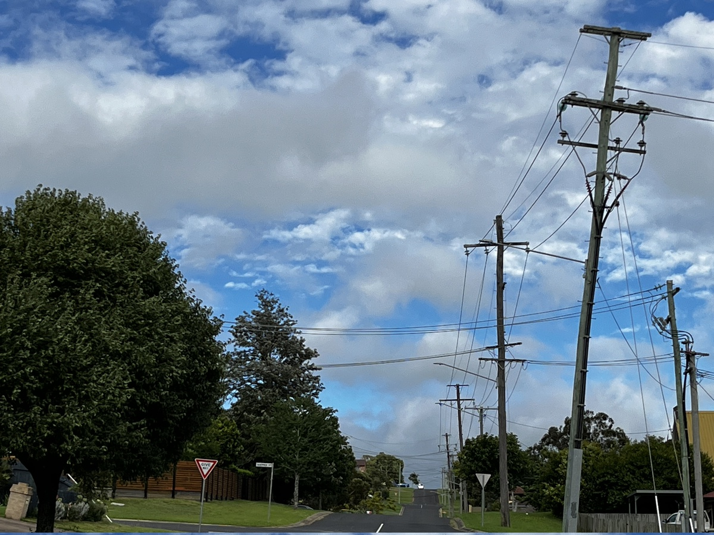
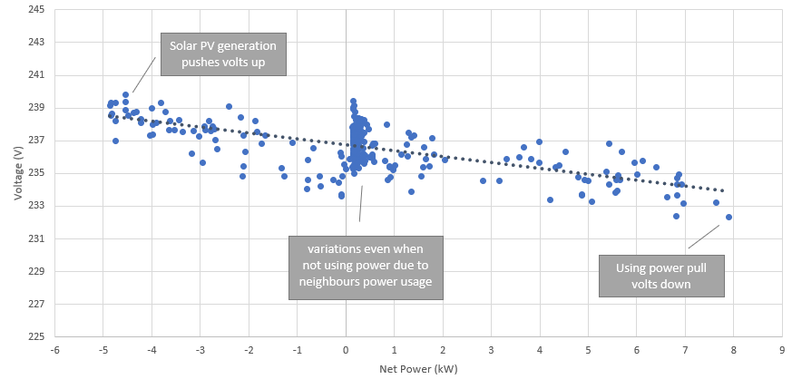
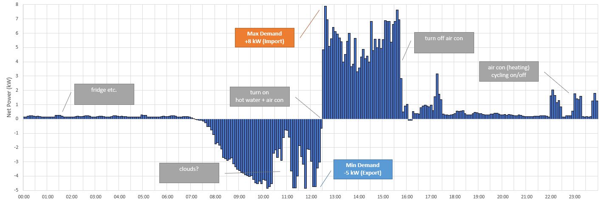
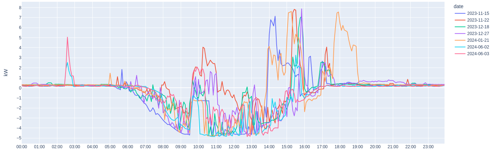

+++
title = 'Power Engineering'
type = 'page'
+++

It can be hard to explain what I do for work without having a basic understanding of a bunch of power engineering concepts. 
So this post is an attempt at that. 
A disclaimer that the below all represents my personal opinions and understandings and does not represent that of my employer or any other organisations.

## Ratings

When you run electricity through things they get hotter - the more energy the hotter it can get. 
Power lines are essentially a bit of a wire strung between two poles. 
Just like any metal, when it gets hot it expands and cause the wire to get longer and 'sag'. 
There are rules about how low they can get by sagging before they are a safety issue. 
This is to prevent things like trucks or cars hitting them, or someone being able to come into contact with it some other way if it's not near a road.

Eventually, if you went way above the rating the wires would melt and fall to the ground. 
So there is a maximum amount of power that can safely flow through the lines before they have a safety issue, which is called the rating. 
As ratings are due to the wire heating up, they can change throughout the year based on weather conditions (it's colder on a winter night, then a summer evening and so they can handle more energy). 

Transformers and other electrical equipment are often full of oil and if the oil gets too hot it can catch fire or arc, and so transformers also have a maximum amount of power they can handle. 
One good thing about thermal ratings is that generally things can take a while to heat up (maybe a few hours) so very short periods going slightly above the maximum value can be okay. 

If the power being used is getting close to the rating, you either need to reduce the power being used or put in bigger wires or transformers that can handle more heat. 

## Protection

To prevent wires falling to the ground, or transformers catching fire, there are things called protection devices that will turn the power off before this happens.
Other safety issues, like a power line falling to the ground or a lightning strike, will generally produce a fault current that is much higher then the rating and will cause the protection to trip the power off.
Generally the protection thresholds are set slightly lower then the rating, so that power will trip off before things get damaged or there are safety concerns. 

Things that aren't faults can cause large spikes in power though, ([like in the UK where everyone turns their kettle on at half time of a football match][uktea]). 
So the protection limit needs to be set such that it does not turn off the power for actual loads, but does for any faults.

[uktea]: https://www.reuters.com/article/world/us/england-brews-up-sufficient-power-for-world-cup-tea-time-surge-idUSKBN0E92G1/

The circuit breakers in your house switchboard does the same thing, which is why sometimes the safety switch will trip when using an dodgy iron. 
Or if you have two many appliances running on a circuit at the same time it will exceed the breaker's rating and trip.

Another way to avoid turning off the power unnecessarily is something called an 'auto-reclose'.
This is when a fault is detected and the protection device gives it a few seconds to try and go away by itself. 
An example would be a lightning strike or tree branch falling on a line. 
The hope is that if you wait a few seconds and try to turn the power back on everything might have fixed itself. 
Lightning only lasts a split-second and in the case of the tree branch it would have caught fire and fallen away. 
That's why sometimes in storms the lights will flicker off and on a few times, but hopefully the power stays on. 
If the fault is still detected after a few reclose attempts, it is probably something more serious (like a fallen line) and so it needs to be turned off permanently until someone can physically make the area safe and fix the problem. 

## Power Quality

Another thing that can limit how much power can flow through the grid is power quality.

To explain electricity, water pipes are often used as an analogy. 
For voltage, this is analogous to the water pressure.  Similar to how you do not want water pressure to be too strong or weak when having a shower, there is a sweet spot. In order to prevent damage to equipment it needs to be kept in a certain range - if the voltage gets too high or low it can [cause damage to appliances](https://ro.uow.edu.au/test2021/4993/). In particular, high volts will make things run slightly hotter and therefore not last as long. If you look at the label on a phone charger for example, it will say what voltage range it can work with (probably 100-240 V). In Australia, the preferred voltage range that power should be supplied to your house is 225-244 V. 

Below is an example of the voltage at our house throughout the day and how it changes based on how much power we are using at the time.
It also varies when we aren't using any power, as your neighbours are all sharing the same network and so they can also impact it.

Generating power (exporting solar) pushes the voltage up, and consuming power brings the voltage down. Looking at my peak day example above, the voltage started at about 236 V. When the solar came on it pushed the voltage up 4 V to 240 V and then when the air con came on it dropped 8 V to 232 V (and the solar was still helping to push it up). The relationship between power and voltage can depend on where in the network the power is coming from - the transformer is right out the front of my house and the further from the transformer your house is the bigger the impact on the voltage, so it didn't vary that much. So sometimes the hosting capacity will be limited not by a thermal rating but by the power being so high (or low) that it causes voltages to be outside the preferred range and starting to cause damage to appliances.

## Demand and Diversity

In my switchboard, the main safety switch has a rating of 63 A. 
But adding up how much some (not even all) of the appliances in our house can use, gives a total power of 111 A.

| Appliance                      | Amperes | kilo Watts |
| ------------------------------ | ------- | ---------- |
| Air Con                        | 25      | 5.8        |
| Oven                           | 22      | 5.1        |
| Hot Water System               | 15      | 3.5        |
| Induction Cooktop (Main Plate) | 15      | 3.5        |
| Induction Cooktop (2nd plate)  | 8       | 1.8        |
| Clothes Dryer                  | 10      | 2.3        |
| Kettle                         | 9       | 2.1        |
| Toaster                        | 4       | 0.9        |
| TV                             | 1       | 0.2        |
| Computer                       | 1       | 0.2        |
| Chest Freezer                  | 1       | 0.2        |
| *Total*                        | *111*   | *25.6*     |

This possible because of something called diversity - where hopefully you are not running every single load in your house at the exact same time.

In a [another post](https://alex.guinman.id.au/posts/2023/energy-usage/), I did some analysis of our home energy usage. If you look at my usage over the course of a year, you can see that for most of the year we use barely any power (<1 kW). In daytime we are mostly exporting power to the grid up to the 5 kW size of our rooftop solar. For a very small percentage of the year we are using 4-8 kW if the air conditioning is particularly working hard. 

The below chart is called a load duration curve and shows what percentage of the year was at a given power flow. 
The highest part of the curve is called the maximum demand. 
The lowest part of the curve is called is called the minimum demand (in my case it is negative since we are exporting solar). 

A good example of these rare extremes was when we came home from holidays on a cold winter day at about lunch time. 
The hot water had been turned off while we were away and pretty much the only power being used was the fridge and chest freezer. 
We went from a power flow of -5 kW exporting from the solar to importing 8 kW from the grid when I turned on the hot water and started blasting the air conditioning to warm up the house (which means we were actually using about 13 kW as some was fed by the solar). 
If we had needed to cook some lunch on the induction cook top and oven at the same time (which is up to 8 kW in short bursts) we would probably have tripped off the power to the house. 
Or, if we had an electric car and wanted to charge it after our trip (another 3 - 8 kW depending on charging speed) that would have put it over the limit also.

Luckily, it's rare that everything wwould run at the same time like this though. 
Even on hot days when you might run the air-con all day, in reality it's turning on and off throughout the day. 
Air-con has a thermostat and so will only turn on when the room temperature is above whatever it is set to.
The rest of the time the air-con is turned off. 
It is the same for fridges, hot water etc they just turn on and off throughout the day as needed to get the temperature right. 
The expected After-Diversity Maximum Demand (ADMD) for Queensland households is 5 kVA [^eadmd] - which means whilst people might use more then that for very short periods, on average the most houses use at any one time (on  average) is 5 kVA even on really hot days. 
Unfortunately, there is no such diversity for solar because generally if the sun is shining for you (or cloudy), it is for all your neighbours as well and always at the same time of the day. 

[^eadmd]: According to the [Ergon Energy Developers Handbook][ergonadmd]
[ergonadmd]: https://www.ergon.com.au/__data/assets/pdf_file/0016/1020490/Developers-Handbook-Developers-Design-and-Construct-Work-14340283.pdf

Looking at 10 peaky days for our house, you can see the time of the load peaks varies pretty wildly (but not so much for solar generation).

For all of Queensland, the maximum demand usually occurs on really hot summer days when everyone is using their air conditioning at the same time. 
In colder places like Toowoomba it might be a winter morning peak with everyone running heating. 
The minimum demand is usually when all the rooftop solar is generating (no clouds) but nobody is using any power - generally Spring and Autumn long weekends (nobody is at work), when temperatures are pleasant (so no air con), but there is plenty of sun.

Diversity means that you don't see sudden spikes like you would for a single house as you get higher up in the grid. 
Looking at the state wide load duration curve for Queensland in the [Powerlink TAPR][tapr], the peaks are only for a small amount of the year. 
The minimum demand occurs much more often then maximum demand, since solar is less diverse, and is getting lower (and for longer) each year as more people install solar. 

[tapr]: https://www.powerlink.com.au/sites/default/files/2023-10/TAPR%202023%20Chapter%203.pdf

## Energy Transition

The Australian Energy Market Operator (AEMO) forecasts in their [Integrated System Plan][aemoisp] a large increase in rooftop solar, batteries and EV charging in the next few decades. The amount of solar has been [doubling every 3 years][solarboom]. 
[Electic Vechile (EV) sales][evsales] are increasing at a similar rate, and an EV fast charger basically doubles the capacity a normal house uses (32 A or 7.3 kW), so is pretty significant.

[evsales]: https://electricvehiclecouncil.com.au/wp-content/uploads/2024/03/EVC-Australian-EV-Industry-Recap-2023.pdf
[aemoisp]: https://aemo.com.au/-/media/files/major-publications/isp/2024/2024-integrated-system-plan-isp.pdf?la=en
[solarboom]: https://www.abc.net.au/news/2024-12-18/survey-of-the-worlds-solar-shows-global-boom/104006096

One solution to support this would be to upgrade the ratings of the grid to support this by doubling the amount of transformers and substations - but this would cost billions of dollars. A significantly cheaper option is to instead just make sure that car charging soaks up all the solar power, and does not happen at the same time as air conditioning. Like with the pandemic, we want to 'flatten the curve'. 

## Device Control

Occasionally, power need to be switched off because there is not enough generation, like when [a power station suddenly goes offline](https://www.abc.net.au/news/2021-06-02/qld-cs-energy-releases-photo-of-damaged-callide-power-station/100186330). On the flip side, generation might need to be turned off if nobody is using any load to make use of it - [this video gives a good example](https://www.youtube.com/watch?v=8UmsfXWzvEA). In Australia, this is done by AEMO issuing something called a [Lack of Reserve Notice (LOR)][LOR] or [Minimum System Load (MSL)][MSL] Notice.

[LOR]: https://aemo.com.au/-/media/files/learn/fact-sheets/lor-fact-sheet.pdf?la=en
[MSL]: https://aemo.com.au/-/media/files/learn/fact-sheets/2024/fact-sheetminimum-system-load.pdf?la=en

The ability to switch circuits on and off on a schedule has been a think since the 50s using something called ripple control.
If you put certain devices (like hot water or pool pumps) on an economy tariff, you get cheaper electricity rates in return for the network operator being able to turn them off for a few hours on days of peak usage.

For hot water systems, nobody really notices if they are turned off for short periods as they are essentially a thermal battery and can store heat. 
In fact, they can be used like a normal battery to soak up solar in the day and then you can use the hot water for showers at night.
All you really care about is that the water is hot when you want to use it.

For most other appliances you do care that you can use it when you want to as they don't act like a battery.
It doesn't make sense to put air conditioning on an economy tariff as hot days is exactly when you want to use it.
There was an improvement to ripple control in 2007 in the form of the AS4755 Demand Response standard. 
It allowed other options other then just turning things off completely. 

- DRM0: disconnect
- DRM1: compressor off
- DRM2: capped to operate at 50%
- DRM3: capped to operate at 75%

But most people [don't really like someone having control][peaksmart] even though it's better for everyone's air con to go to 50% then the power to the street to trip off completely at times of maximum demand. 
A similar problem with solar occurs at times of minimum demand, which is referred to as [emergency backstop][backstop] and also not a very popular idea desite being needed to as an emergency mechanism to a system blackout.

[peaksmart]: https://www.abc.net.au/news/2024-01-31/energex-ergon-peaksmart-air-con-cuts-during-hot-weather/103385474
[backstop]: https://www.abc.net.au/news/2024-12-02/aemo-demands-emergency-backstop-to-switch-off-solar/104670332

## Dynamic Pricing

Why can't this all be solved by or time-of-use tariffs or dynamic prices instead? These definitely can help with the problem but fall short of solving it completely for a couple of reasons.

We are on a time-of-use tariff, and try to do things like pre-cooling the house to avoid needing to run the air-con during the peak period. But if the temperature gets hot enough - we will run the air-con no matter what the price is.
Another way that pricing falls short is that it's generally set a statewide level. There may be little pockets around the state that have a constraint and have an opposing requirement to the statewide one. An example might be that some sort of event is happening that results in a large amount of people visiting a small town (like Roma or Birdsville Races) and despite being a nice sunny day with cheap prices due to lots of solar, the local part of the grid does not have a capacity for everyone to fast charge their EVs simultaneously. 

## Hosting Capacity

The distribution grid hosting capacity is defined as the amount of new generation or consumption that can be accommodated by the grid without adversely impacting the reliability or power quality for other customers or requiring grid upgrades or modifications. 

Anyone who connects to the electricity grid and receives a fixed connection is guaranteed their part of this available capacity forever in a first come, first served (whoever first calls dibs) system. Generally there is a basic connection offer that anyone can apply for that is free upfront (money comes out of power bills later) even if the network requires upgrades to support it. There is also a negotiated process for larger customers who want more then the basic offering where they might need to pay some of the upgrade cost upfront if upgrades are required to unlock more capacity. 

According to the [Ergon Connection Policy][ergoncp] the basic fixed offering in urban Queensland is currently 100 A (23 kVA) per phase for loads, and 22 A (5 kVA) per phase for generation (solar).
So if you want more power then this and there is no capacity available, you are required to pay for some of the upgrade costs (which could be very expensive). The reason why the value for loads is higher then generation is due to loads being more diverse then solar as discussed earlier. There is an assumption that not everyone will use all their appliances at the same time, but they will all generate solar at the same time.

[ergoncp]: https://www.ergon.com.au/__data/assets/pdf_file/0018/1009053/Connection-Policy-2020-2025.pdf

In the case of solar, when there is no capacity left there might be an option to connect for free but not be allowed to export to the grid. This is so that people without solar aren't forced to pay for the upgrade costs in their bills for those that do, but does still mean they might miss out if they want to add solar later. If for example, there was a 100 kW transformer on a street, and everyone can automatically apply for a 5 kW solar system, the first 20 people on the street to install solar are allowed to export indefinitely, but everyone after that is not allowed to export as there is no spare capacity left without installing a new transformer (which is expensive). 

The problem with a fixed hosting capacity number, is that is needs to be conservative and assume the worst-case conditions into the future. It only really applies on minimum demand days, but the rest of the year it may be possible for the grid to handle way more then that. 

## Dynamic Operating Envelopes

If we dynamically calculate the hosting capacity every 5 minutes instead of using a single worst-case figure for the entire year, we unlock heaps of extra capacity for free for ~95% of the time. In theory, calculating this dynamic hosting capacity is relatively easy, it's the real-time rating (factoring in weather conditions) minus the real-time power usage (what power are people using right now). In practice, it's usually not that easy - there isn't real time data for weather and power usage at every point in the network so a bunch of complex calculations and assumptions need to be made to try and work it out. 

Sending the grid limits is a big improvement over direct control over appliances as a customer. Instead of turning of having the network turn off a specific device - a Home Energy Management System (or HEMS) can make these decisions for you. On min demand days, if the grid wants you to stop exporting solar instead of it turning off and wasting generation, you could instead charge your EV or run the air con to pre-cool your house. On max demand days, if the grid wants you to stop importing energy you could power your air con from your battery instead. Or if you do need to turn something off you can make the choice about whether your air con or EV charging is more important at that moment. 

Dynamic Operating Envelopes (DOE) over the internet is one solution to this. Basically the HEMS receives an Import and Export Limit (in kW) every 5 minutes for that site. It works a little bit like a variable speed limit sign on the motorway that might say it's 100 km/h normally but will drop down to 60 km/h if there has been an accident or congestion. 
