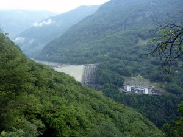
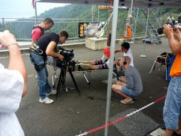
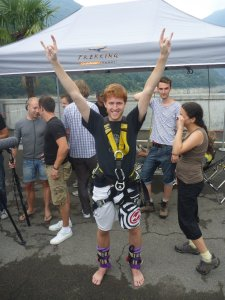
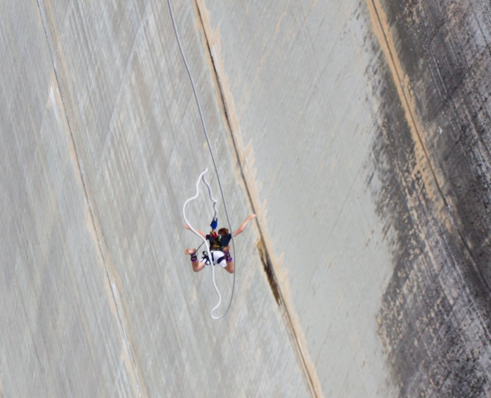
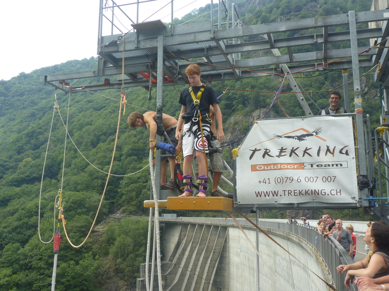
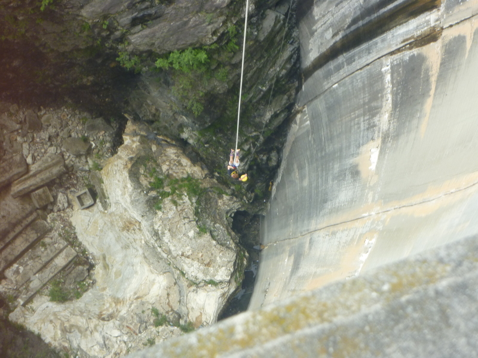

+++
categories = ['Travel']
date = '2010-08-04'
thumbnail = 'posts/2010/007-bungee-jump-verzasca-dam/p10301091.jpg'
slug = '007-bungee-jump-verzasca-dam'
tags = ['IAESTE', 'Switzerland']
title = '007 Bungee Jump - Verzasca Dam'
type = 'post'

+++

On Monday afternoon I did the 007 Bungee Jump off the Verzasca Dam.

We caught a train to Tenero then hiked up towards the Dam. When I first saw it way in the background I thought - that is huge. But once we got close the nerves dissapeared and I was just excited mostly.

We had to wait for a fair while before we could do our jump because there was a film crew filming for a German travel show. But at least we got to see someone do the jump before any of us did it.

It is 220m from the platform to the ground, and the actual jump is like 180m I was told. And it is the same jump as from [the opening scene](http://www.youtube.com/watch?v=eBq8K-Y2B4g) of the movie Goldeneye, hence the name.

I was chatting to the guy at the top of the platform and he had been living in Noosa for a while. He asks everyone how they are feeling and when I told him I wasn't nervous but felt like I should be, he told me it was his first day working there to try and help me out. I assume it was a joke but you never know, I suppose it always has to be your first day once.

It is a looooooong way to the bottom but it didn't feel like it. When I jump at first I just felt shock at not touching anything, then a feeling sort of like you get from the Giant Drop, then by the time I started to enjoy the fact that I was free-falling it was over. I think the freefall is 4 seconds, and it's over way too fast to fully appreciate it. Skydiving next time for sure.

The jerk of the rope was quite a shock and not as smooth as I thought it would be, but doesn't hurt. I then started to think "Oh it's over..." before you bounce back up again and get to experience zero-gravity at the top of the bounce where it feels like you are floating. Definitely the coolest part of the jump in my opinion. The bounce back down again you feel all the blood rush to your head, and then it's pretty much over because the next couple of bounces are way smaller.

Then the guys yell out to pull yourself up (it's surprising how well you can hear them considering how far up they are). And you have to pull on a rope to flip yourself up the right way. That bit was a little bit scary trying to work out which is the right rope to pull while upside down.

Then they lower down a winch cable, pull you up and it's all over.

Definitely an amazing experience, and I would go again. Although it wasn't quite as exhilarating as I thought it would be, and the adrenalin didn't last very long afterwards. After seeing how pumped Adrian still was a few hours after I was expecting it to last longer than 5mins or so, but that's about all it lasted.

Some photos below, but more photos and some videos that other people took on facebook as well.

5 Stars.

(Everyone in Aus should watch the show Review, it started a new series a few weeks ago but I can't watch it from here due to the ABC blocking out people from Switzerland).

Travel show filming and jump

