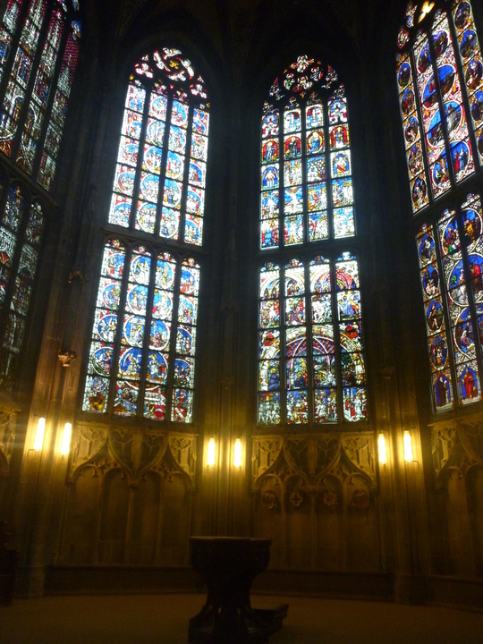
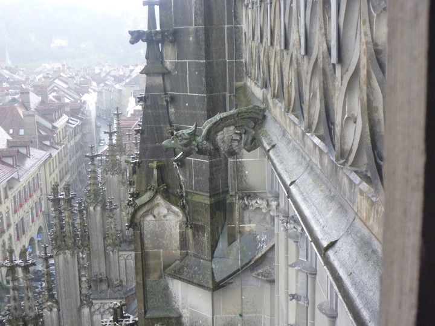

While in Bern, I went inside this amazing looking church, The [Münster of Bern](http://en.wikipedia.org/wiki/M%C3%BCnster_of_Bern). It really looked amazing inside, and was just so huge.

It took me a while to work out how to get up the tower - you had to pay 4CHF then there was a little tiny door that lead up a really skinny staircase that took you to the top - but there was an amazing view of the city from the top.

The staircase was really small, and it was quite high. They added a fair bit of bars on the windows and stuff for safety, but it would have been incredibly scary building the thing.

The photo's don't really give it justice but I'm sure you can imagine what it was like. There are clearer photo's on the wiki page I linked above as well.
