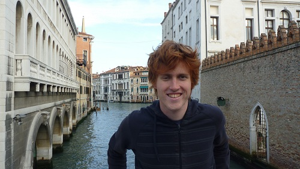
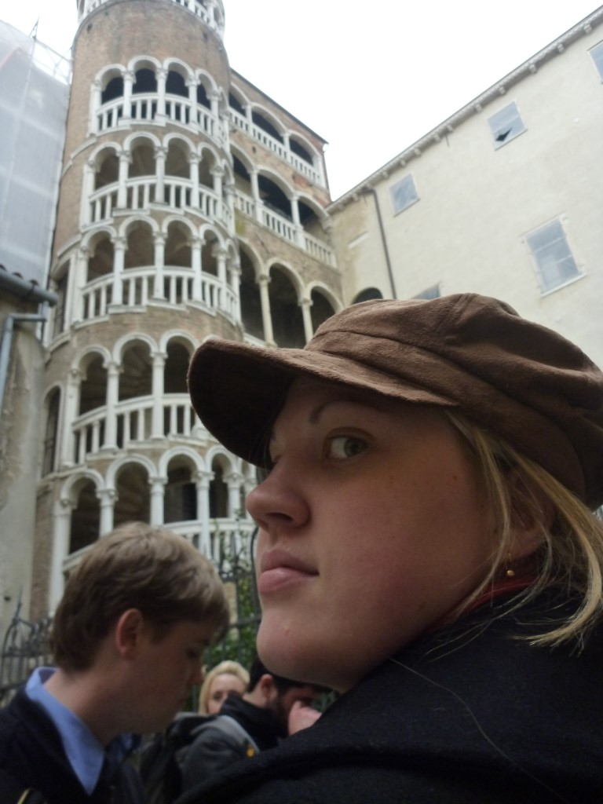

---

date: "2010-11-08 20:58:00+00:00"
slug: euro-trip-venezia
title: Venezia

categories: ["Travel"]
# tags: [""]
---Europe, Italy, Venezia

Coming into Venice was pretty exciting, especially when the train finally got past the mainland and we were on a bridge, heading out to sea and the island of Venice. My first impression wasn't that great to be honest, I expected it to be cooler. The view from the train station wasn't particularly dazzling and it wasn't until a bit later that we got to see places that were more like my expectations.

Getting around Venice sucks. It is in fact, not actually an island, but rather lots of little islands joined together by bridges. So while our Hotel wasn't that far from the train station, it was still an effort to get there. When we finally get to the Hotel we find it closed, with a sign out the front saying that reception is only open until 2pm. It's only 2.10 so we ring the doorbell a few times and eventually someone comes out, lets us in and gives us a key. The hotel itself was great (especially the view out the window of a canal), but the service was ... non-existent.

After dumping our luggage, the stairs weren't so frustrating and we got to explore the city. Unfortunately, there isn't much too it. It's just shops, shops and more shops. Oh and some B&B's and Restaurants. Regardless, it's such a different experience to be somewhere with canals instead of streets so we were content with walking around aimlessly and looking at abandoned buildings that had water lapping against the front doors.

We set out to find a supermarket, but after a lot of looking, we still couldn't find one. We headed back to the train station in the hope there would be one there, and found a shop inside that had some very pricey pasta and pasta sauce, that would need to do. It was Italian pasta at least. We also bought a bottle of "Grappa" (looked like red wine but with some grapes still in the bottle of the bottle) that was 12 euro and 40% alcohol and came in an awesome looking bottle to go with our meal. We asked the cashier what it tasted like, but she was no help as didn't speak English. Another lady told us it tasted nothing like red wine but that it was good.

After cooking up our epic dinner, we discovered that trying the local cuisine isn't always a good thing. The pasta was okay, nothing special, but the Grappa was absolutely disgusting. I managed to finish my glass for the sake of not wasting it, but Rachael couldn't handle more than one sip. Even watering it down didn't help. We talked to some people about it later, and it turns out that while a lot of Italians do drink it straight, most sane people only use it in cooking. Thanks lady at the shop that said it was nice. Rachael wanted to pour it all down the sink, but we ended it up leaving it in the room and told reception they could have it when we checked out.

On DAY 2 we set out to find St. Marco Square, as we had a walking tour there in the afternoon and had no idea where it was. The city is like a maze, and eventually we found it after heading who knows where on the island. Luckily there was lots of cool things to see on the way, such as areas of the island that were flooded because it was high-tide. The actual square itself was flooded too when we found it, and it appeared like the church would be too, but when we went back that afternoon we saw that it was designed a bit better so the entrance was higher than the water level and acted as a barrier to stop it coming in.

We stumbled across a supermarket at last, and got some MUCH cheaper pasta and some wine that was in English and we knew we would like. Rachael was over the trying Italian wine phase until I showed her the prices, at which point she quickly changed her mind. It took ages to get home as the city really is a maze, and there is no such things as shortcuts because most streets come to dead-ends if there isn't a bridge to let you cross at the end, making our attempt at shortcuts into massive detours.

Our attempt at home-cooked Italian cuisine was much better this time, and the pasta was delicious. More walking BACK to the square afterwards for our walking tour made us pretty excited for the opportunity to sit and a Gondola and do nothing. The walking tour was fairly interesting, but there wasn't a whole lot to see besides a cool looking spiral staircase building. We learnt a few things about the island though, most important being that basically nobody lives there anymore, it's just full of tourists. All the locals moved out to neighboring islands and just come in for work.

The gondola ride at the end of our tour was great, it started off boring as we went along for a bit in the sea first, but once we were going through all the little canals it was really cool. We then had to walk back to our hotel yet again, and I think Rachael worked it out later that we did about 16km of walking that day.

[vimeo http://www.vimeo.com/16560337 w=400&h=300]

On DAY 3 we had to walk to the Square yet again to go on a Boat trip to 3 of the surrounding islands. While we were waiting they were setting up for the Venice marathon.

The first island we went to was Murano, where we got to see how glass was made. It was incredible to watch and I had no idea how much skill would be needed to do it. Check out the video of the guy making a horse sculpture.

[vimeo http://www.vimeo.com/16560205 w=400&h=300]

Next stop was to Burano, which is famous for lace making. Unlike glass making, lace is really boring. The island itself was still pretty cool though as all the houses were painted different bright colours. We saw a church tower that was leaning, and discovered that in the absence of having cars, the young hooligans put the fully sick sub-woofers in their boats. It was strange situation in which we heard the doof doof of a Kate Perry song as some young guy drove past in his tinny.

The third island was Torcello, which we had been warned by our walking tour guide the day before was a boring, ugly island... and indeed it was.

When we came back the marathon was on, but we didn't have time to watch as we had to race back the hotel and grab our luggage. Luckily we got back just on 2, and were able to grab our stuff. I still think that it's crazy that there would only be someone there until 2 in the afternoon.

We took our luggage to the train station and paid to have them stored there so we didn't have to carry them around, and set out to find some food. We saw a sign for McDonalds and thought it would be a good place to spend a while without getting kicked out but spent ages looking and never found it. It then started to rain so we went to another restaurant, had some lunch then went back to the train station. It continued to rain and be freezing as we waited a few hours for our train. Our train was meant to leave at 7 but we stayed in the station for a good hour or so due to "technical difficulties" before finally leaving Italy behind and heading onward to Paris.....
