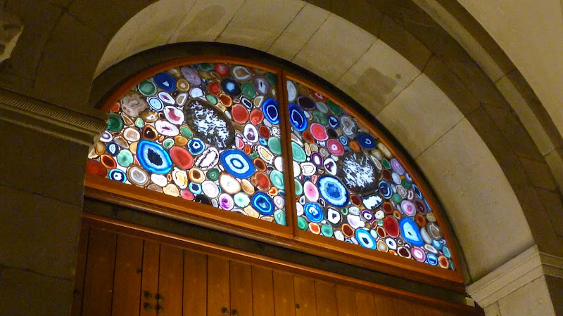

+++
categories = ['Travel']
date = '2010-09-25'
featured_image = 'posts/2010/a-dissapointing-trip-in-to-zurich/church-gems.jpg'
slug = 'a-dissapointing-trip-in-to-zurich'
tags = ['Switzerland', 'Zürich']
title = 'A dissapointing trip in to Zürich'
type = 'post'

+++

Today I went to Zürich with Anthony to [make my own pocketknife](http://www.sackmesserkult.ch/veranstaltungen_e.html) at the Landesmuseum, but when we got there they told us they were totally booked up for the whole day, so we couldn't :(

So we walked around the city in the rain for a bit, but nothing too exciting. There really isn't too much to see in Zürich in comparison to some of the other places around. And especially when it's raining.

The [Grossmünster](https://plus.google.com/110750135298275838032/) did have some cool stained-glass windows though (above). Rather than just using glass they had all these cool gemstone things. It said no photography allowed, but I took some photos anyway. The view from the top of the tower was okay as well, but climbing the tower at Bern and Basel were better.

In the end the rain got to us, so we went home early, forgoing the option of free transport after 7 with the Gleis7 and paying to go home at around 2.