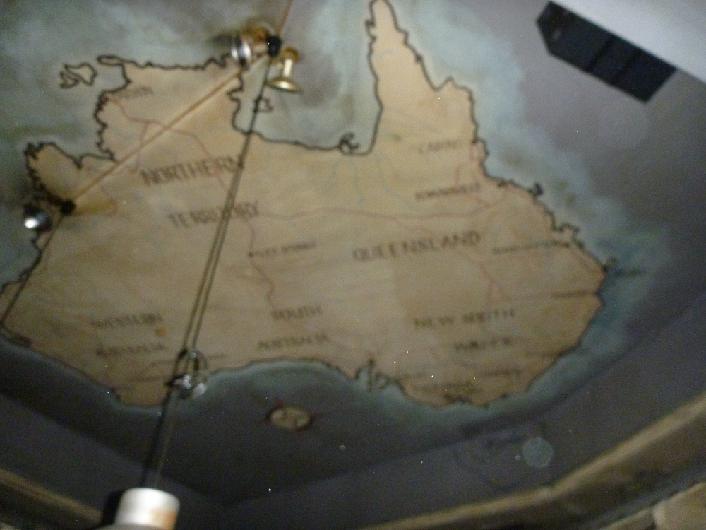

I went to the Australian Outback Bar in Zürich tonight for the IAESTE weekly Meeting. It was both cool and disappointing. Cool in that they didn't just have Fosters, they had Bundy Rum, VB and Coopers. Not cool that it was like 8sFr for a VB and 15sFr for a Rum and Coke. Also their menu had prawns listed as shrimp ...

There was XXXX signs as well, but they didn't sell it, which is false advertising I reckon. Asako got a burger which looked reasonably Australian, despite having no beetroot. I asked her if it tasted like home, and she said that it did, so at least they can be proud of that.

Two of Kirsty's British friends came as well, one of which was a Mumford, as in the cousin of the Mumford & Sons, which is pretty cool.

There was a map of Australia on the ceiling that had Rockhampton shown, so I got to show everyone where it was. They were pretty impressed that it got a mention, as they didn't think it would be important enough to be on a map if it only has a population of 60,000 or so.
