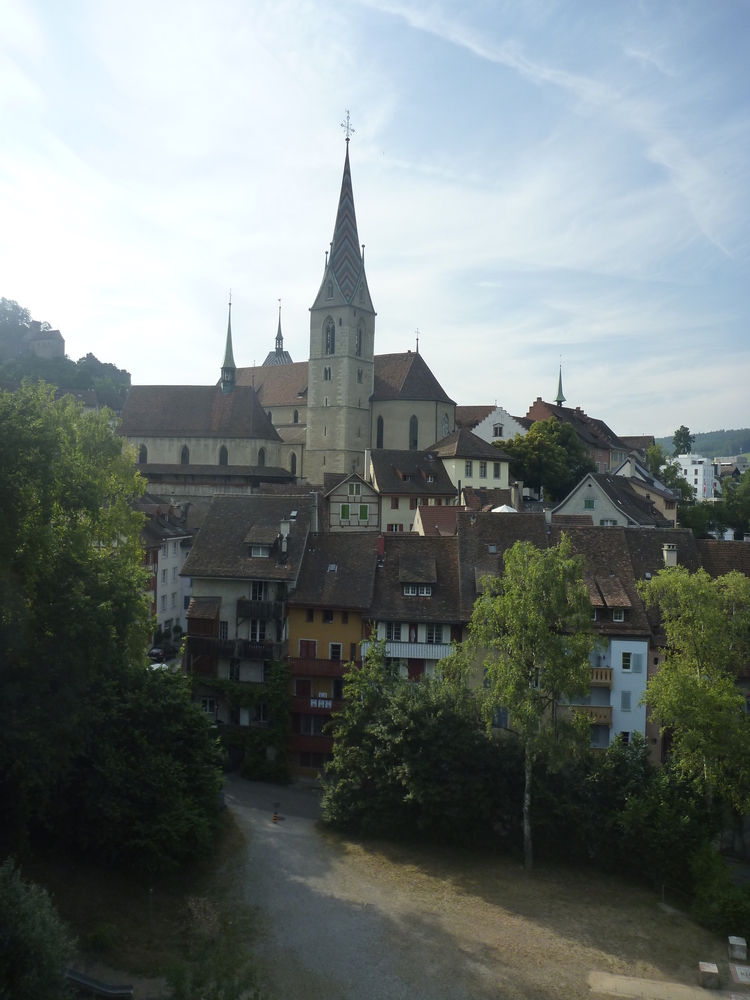
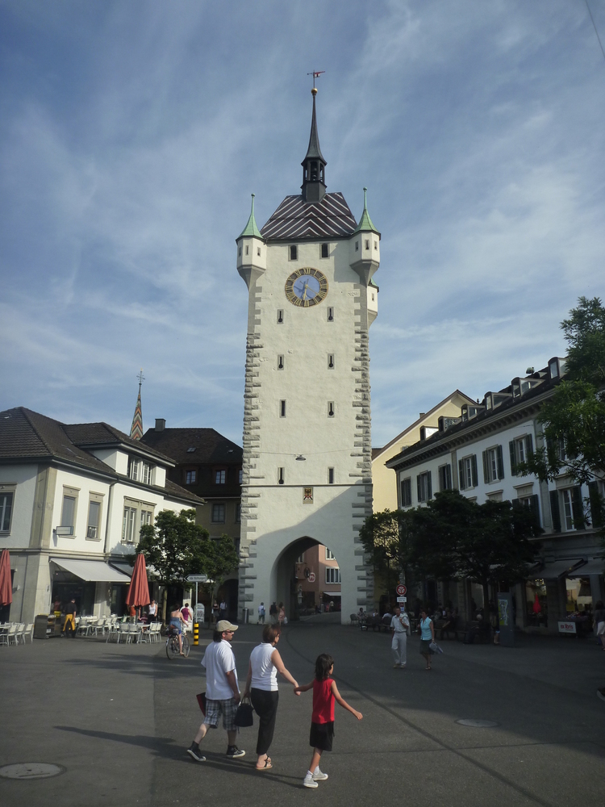
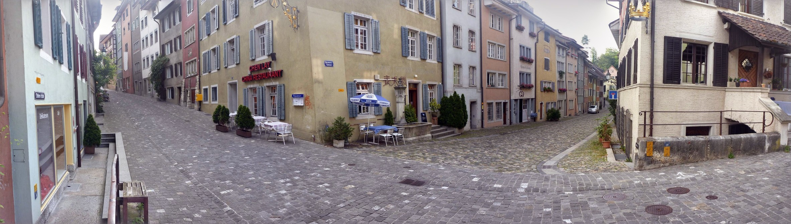
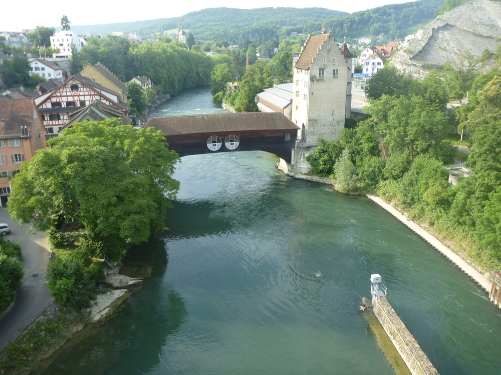
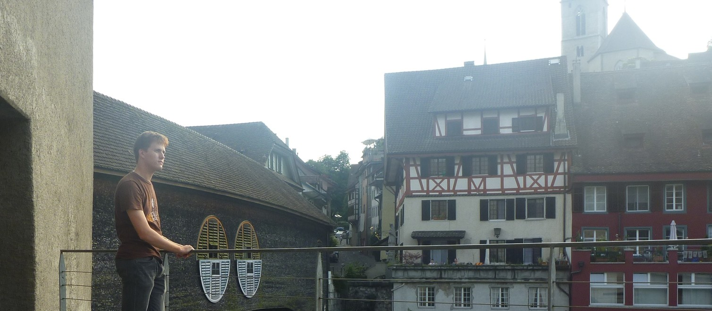

---
categories:
- Travel
type: post
date: '2010-07-03'
featured_image: posts/2010/baden/clocktower.jpg
slug: baden
tags:
- Baden
- Switzerland
title: Baden
---

So after work on Friday I thought I would see what the closest town (Baden) is like.
It is much bigger than Turgi, with a lot of shops and stuff, it even had a McDonalds and Burger King. The buildings there are all look amazing though, and all the streets are cobblestone.

The river passes through here as well, and there was three guys jumping into it then swimming across into a calm section (before being taken away by the current). It looked really fun.

