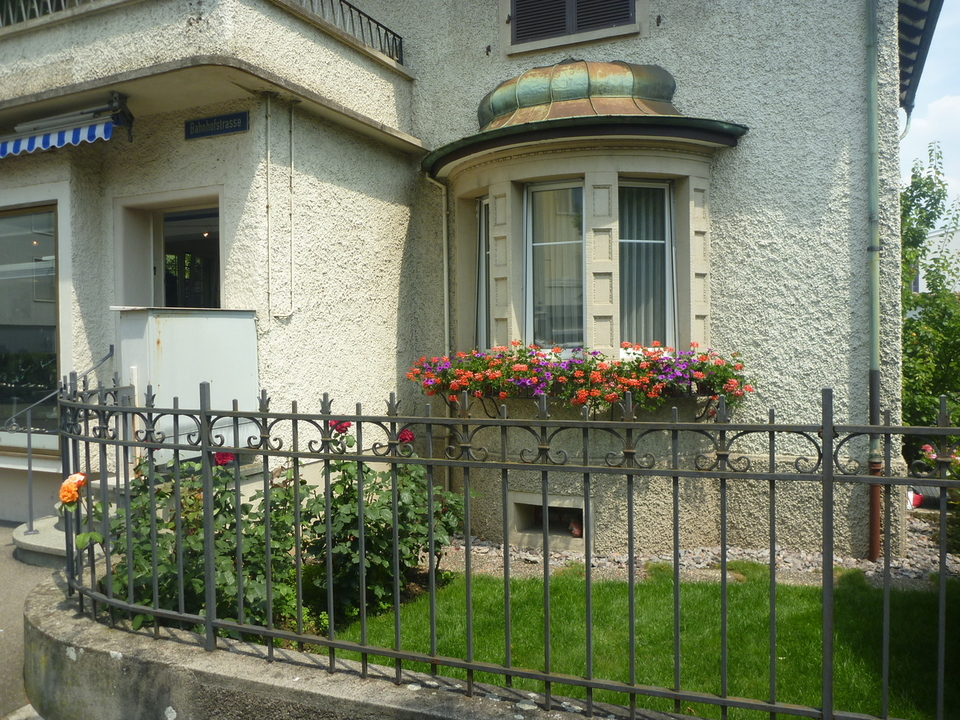
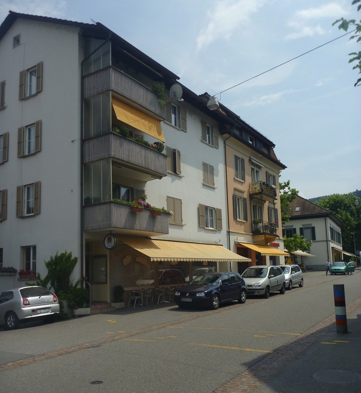
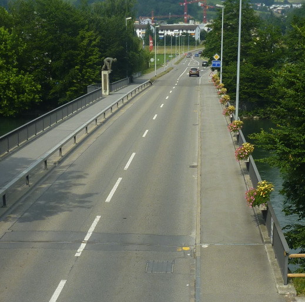

I took lots of photos of the buildings around town today, as they are so differently designed to in Australia. Also everyone seems to be obsessed with their gardens, as there are flowers and well kept gardens for pretty much every single house.

Even this bridge had flower beds on it:

