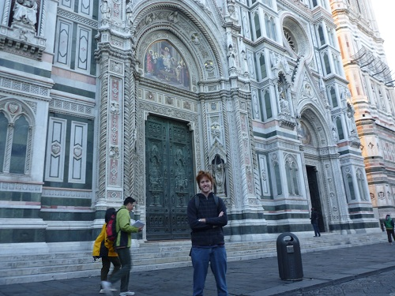
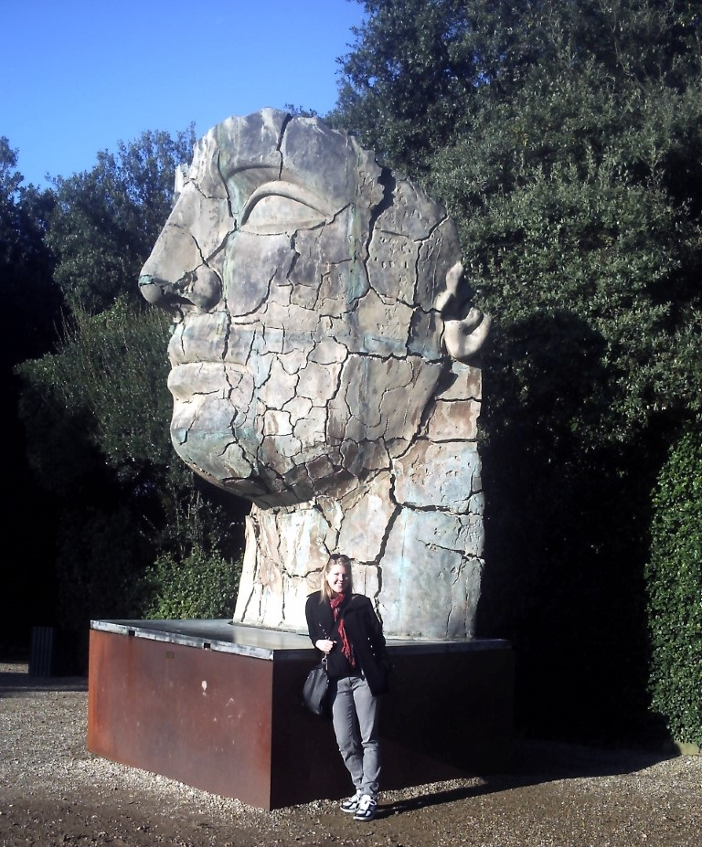
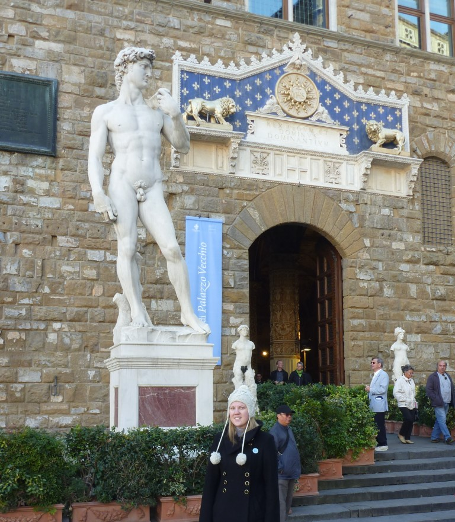
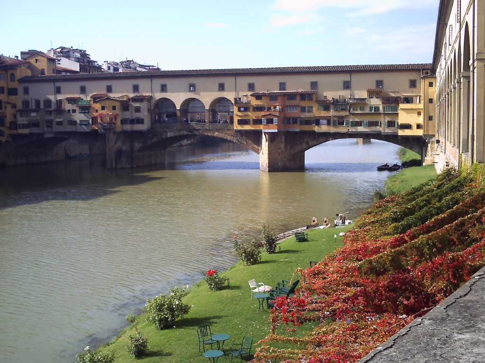
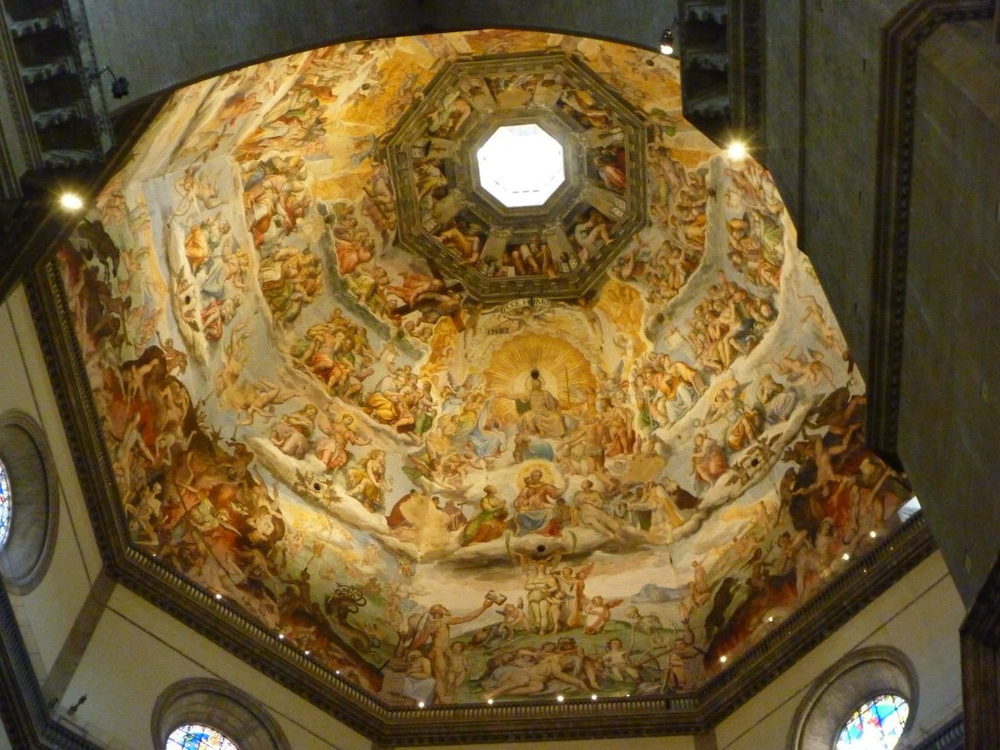
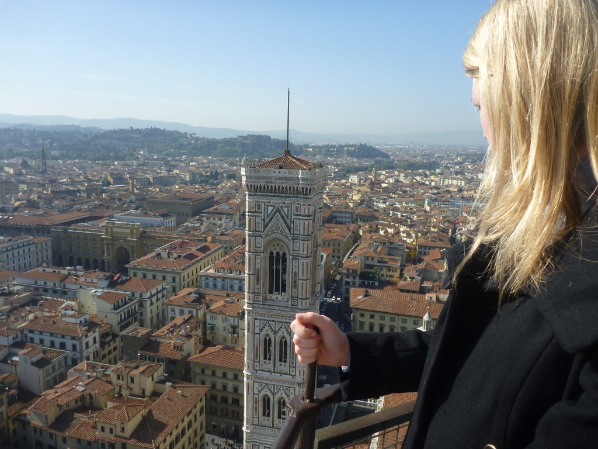

+++
title = "Firenze"
date = "2010-11-07"
slug = "euro-trip-firenze"
type = "post"

[taxonomies]
categories = [ "Travel",]
tags = [ "Europe", "Italy",]

[extra]
image = "posts/2010/euro-trip-firenze/p1040846.jpg"

+++

We start our story of Florence at first with the train journey. We got to meet a diverse range of people during the trip. Immediately opposite Rachael and I was a British couple. I don't think I heard the girl say a word during the whole journey. She sat there for the whole trip with headphones in ear, basically ignoring our existence. The guy was a polar opposite, extremely chatty and engaged us in conversation for the entire trip. They were headed to Venice so that he could compete in the Venice Marathon, and like us, where stopping at Florence on the way. It was a fairly interesting conversation, one point worth mentioning was [a castle he told us](http://www.signonsandiego.com/uniontrib/20060917/news_1t17castle.html) about that is being built in France. Also on the train, was a bishop from Australia, who had been in Rome to see the [canonization of Mary MacKillop](http://www.abc.net.au/news/stories/2010/10/18/3040655.htm). I think the fact that we were Australian's in Rome in that week made him assume we were on a Pilgrimage or something, because he asked if we knew some priest-guy from Rocky (who Rachael actually did). We were also stumped by questions he had about Australian news, which I have only vaguely been keeping up with and Rachael had been busy studying for exams. As such we left a very bad impression of our awareness of current affairs. The countryside we went past was also lovely, so all in all it was a pleasant journey and we were glad to be leaving Rome.

When we arrived in Florence, we immediately agreed that the city was much nicer. The streets were cleaner, less crowded and there was just a generally better atmosphere. Our hostel was much nicer, and directly opposite the massive Cathedral in the centre of the city.

We walked around the city for a bit, and found ourselves at the massive [Boboli Gardens](http://en.wikipedia.org/wiki/Boboli_Gardens). After Rachael eventually convinced me to part with 10 euro to get into the gardens we had a wonderful time exploring the absolutely massive grounds filled with random statues and trees that we had never seen before. There was some that looked like gum trees (but weren't obviously), and we even found olive trees and a tree that had dropped walnuts.

For DAY 2 we had a walking tour booked, which was okay but nothing special. In the morning there was an absolutely freezing wind and so a lot of the tour was spent trying to find a spot in the sun along the way. We saw everything we had seen the day before again, but learnt a little bit of history about them this time. After seeing the replica of the Statue of David for the 2nd time on the tour, we didn't see the need to pay to go inside and see the original when it finished, so we instead decided to pay to climb to the dome of [the Duomo](http://en.wikipedia.org/wiki/Florence_Cathedral).

The painting on the inside of the Dome was amazing, and it was incredible how much detail went into a painting so high off the floor. The parts of the painting in heaven was pretty boring but the drawings of what happened to people in hell was intense and pretty funny.

I think Rachael may have some sort of heart condition, because she was basically dead by the time we got to the top (to be fair it was 463 stairs), but once she had recovered we got to take in the magnificent view of the city. The railing/fence appeared to be a fairly new addition, so whoever built the cathedral was clearly crazy and had a death wish, as it is a long way up. Who knows how many people must have died to build it.

Looking back, there wasn't anything particularly exciting in Florence, but it had a nice atmosphere and cool buildings and we found it to be much more enjoyable than Rome.

The next morning were back at the train station, waiting to head onwards to Venice.......