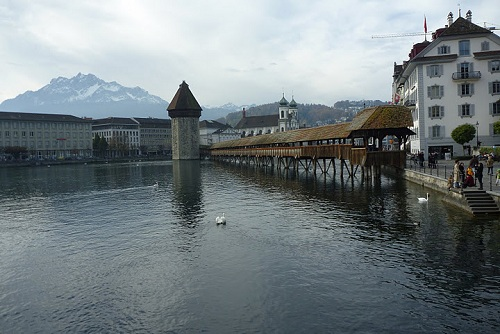
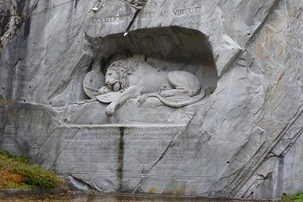

---
categories:
- Travel
date: '2010-11-14'
featured_image: posts/2010/euro-trip-luzern/p1050200.jpg
slug: euro-trip-luzern
tags:
- Europe
- Luzern
- Switzerland
title: Luzern
---

Our trip to Luzern marked Rachael's first journey in a double-decker train, and we got to see some Swiss countryside on the way. I originally had planned for us to go the top of Mt. Pilatus, but when I checked the site in the morning it said the cable cars weren't running, so we gave up on that idea. Also for some reason my bank card wasn't working, so I couldn't get out anymore money so we had to make do with the amount of cash I already had on me.

Rachael was blown away by the snow-capped mountains that surround the city, and I must say they were quiet awesome. Having been in Switzerland for 4 months now, they have lost some of their first impact, but I can still very much appreciate the view. On the train, there was kids with placards saying "Run Daddy, Run" and it turns out that there was another marathon taking place!

We watched the marathon for a bit, as it's quite interesting just how diverse a range of people competed. There were old and young, couples and groups, even a blind guy and a guy in a roman outfit, complete with shield.

I text Petr, who lives in Luzern and he came down to give us a tour of the city. [The Kapellbrücke](http://en.wikipedia.org/wiki/Chapel_Bridge) is the most famous part of the town. What is most interesting was that there was a fire a few years ago, and so now the artwork up top is now just black.

My highlight of the trip was the [Lion Monument](http://en.wikipedia.org/wiki/Lion_Monument). This was a statue that was carved into the side of a cliff. Petr said it is the "saddest statue in the world" according to some actor that he had forgotten the name of. I think it was definitely the coolest statue I have seen so far, better by far then the ones in the Louvre.

After this we went up to the old city wall, where you can climb the towers. Inside the tower you can see the workings of the clock, which involved a massive rock tied to a pendulum. We just so happened to be in the tower at 2:00 when the bell went off, ensuring that we will now go deaf one year earlier. Even more impressive was that daylight savings had just kicked in, and as there was no electric parts on the clock we couldn't work out how it knew how many times to ring. Somebody must have gone round to all the clocks that morning to put them all forward an hour.

We then made our way back to the lake to buy some food and drinks and take in the view. Rachael is a hater of beer so I thought I would get her to try some of the very different tasting varieties available in Europe, which taste wildly different to any beer I have had in Australia, and so I thought she might enjoy them. But be it wheat or tequila, Rachael likes neither. At least she gave it a go.

This basically brings us to the end of the trip. The next day I showed Rachael around Turgi, where I live and work and we walked to the nearby town of Baden, where she got to pat a sheep. Then she had to leave and I had to go back to work. It is a little sad, but at least I still have snow to look forward to... it's getting colder by the day.