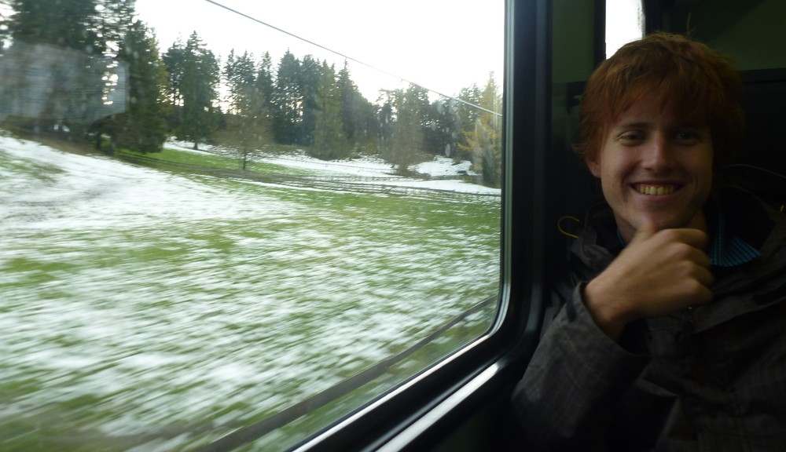
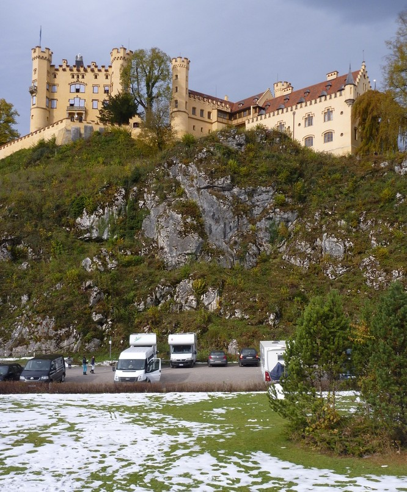
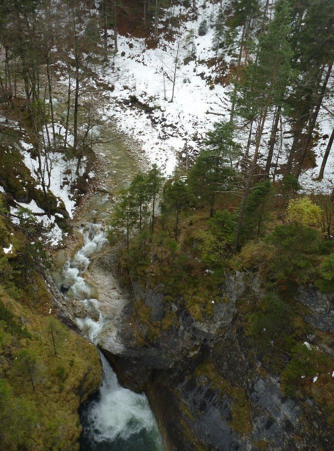
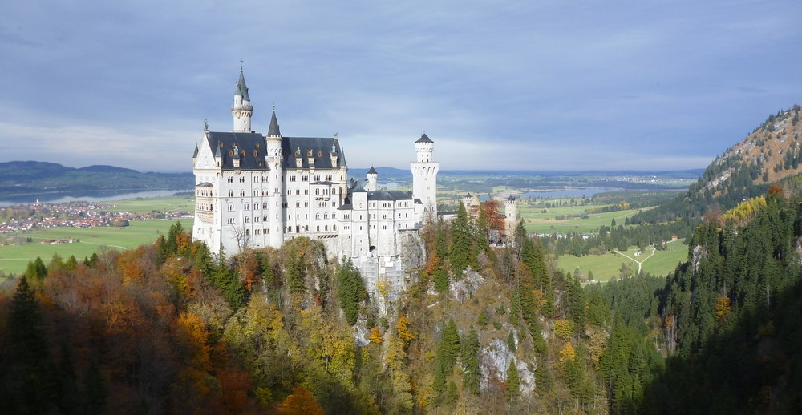
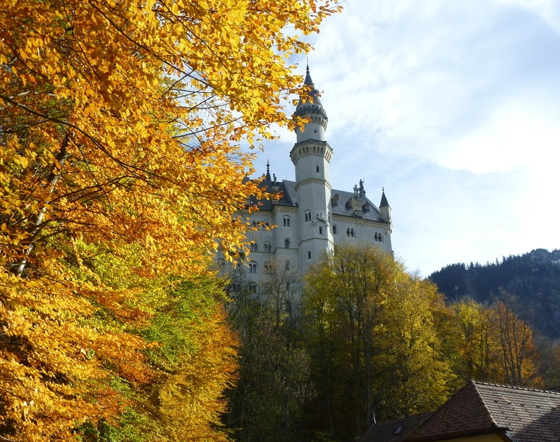
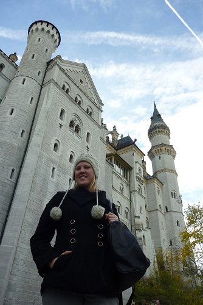

---
categories:
- Travel
type: post
date: '2010-11-13'
featured_image: posts/2010/euro-trip-schloss-neuschwanstein/castle1.jpg
slug: euro-trip-schloss-neuschwanstein
tags:
- Europe
- Castle
- Germany
- Neuschwanstein
title: Schloss Neuschwanstein
---

After a few quick hours of sleep in Munich, we were checking out again. At the train station we waited for the tour to start, and then after seeing a sign for the Neuschwanstein Tour, signed up. Turns out it was the wrong one, and not the Sandeman's one that we had to planned to go on. Our guide was perfectly good though, and in fact probably needed the money more as the other group was much bigger and there was only 2 other people with us.

We went to get our train to Füssen only to find that the train had been cancelled, so instead we had to get a bus. So we got a bus, changed to a train, changed to another train then another train, then another bus until finally we were there only one hour later than planned. The view on the way was great, lots of green countryside and forests with random patches of snow the closer we got.

After the woman at the tourist office was nice enough to let us leave our luggage, we journeyed onward to look up at Hohenschwangau Castle, which was the original royal castle / holiday house.

After Rachael got to play in the snow a bit, and throw some snowballs (strangely she didn't throw any at me, was totally expecting it and would have been fine with it - you missed your chance!) we got a bus up to Marys Bridge. From here we got to see the waterfall and the castle.

The castle was epic in every sense of the word. Ludwig was clearly a crazy maniac, he had a room dedicated to the swan and there was a room that was a man-made cave. It actually felt like you were in a cave and the doors had rocks on the back so you really wouldn't know otherwise. What a nutter. Wikipedia has a good article on the [Neuschwanstein Castle](http://en.wikipedia.org/wiki/Neuschwanstein_Castle).

Because we were an hour late coming in, we didn't get to go down to the lake which was a shame but better than missing our train home. Apparently one of the lakes was the lake that the opera "Swan Lake" is named after.

On the train back to Buchloe heard the various story's of Ludwig's death, because he died under "[Mysterious Circumstances](http://en.wikipedia.org/wiki/Ludwig_II_of_Bavaria#Mysterious_death)". We asked our guide what they do in Buchloe and he said "make supercars". Apparently he was hitch-hiking from Berlin and the CEO of the company picked him up in one of the cars and offered to take him to Munich. He said it's normally like an 8 hours journey, but they did it in 3. No speed limit on the autobahn means they were travelling 300km/h or so for most of the journey.

Our train home was okay, we got to talk to a girl from America that was a screenwriter and was writing a movie. We had a pretty interesting conversation to say the least, and she had a very different personality to anyone I've met before.

Also on the way into Switzerland, two guys from customs came through with a sniffer dog and spent ages going through this lady's bag. He then checked our passports and such and I think Rachael was a little freaked out because she didn't know what was going (they were mostly speaking in German and were in street clothes). We changed trains at Winterthur and met some Aussie students, one of them was doing engineering. The train also started to fill with people coming and going from the clubs in Zürich, as it was a Saturday night which always makes for an interesting train ride. At long last we made it home (or to Switzerland in Rachael's case) and got some sleep before yet more travel the next day. Oh and because I didn't have any food at home except Chocolate, and the shops are closed at that time, we got to have that for tea. Rachael very much approved of the chocolate, but I think not so much about having it as a meal.