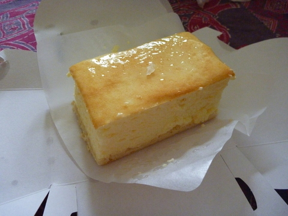
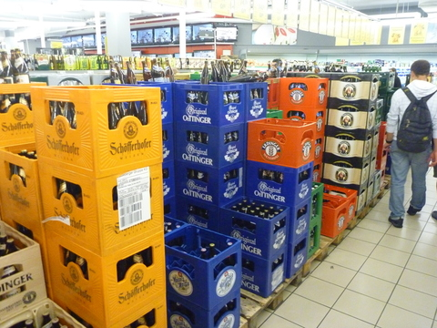
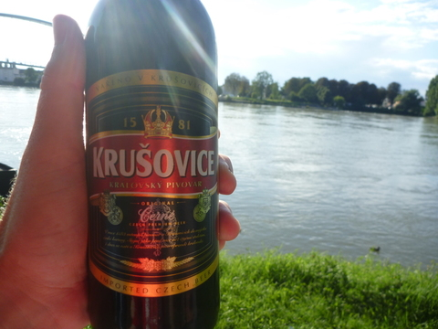
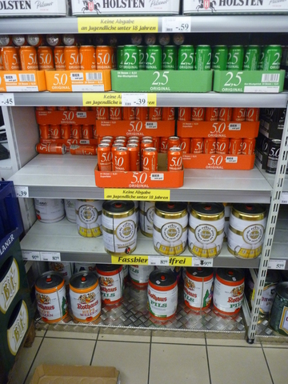
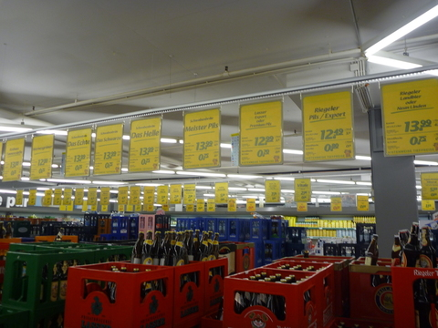
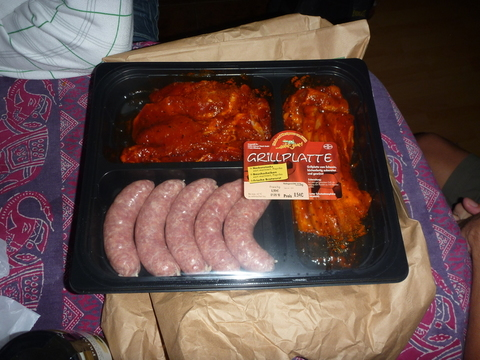
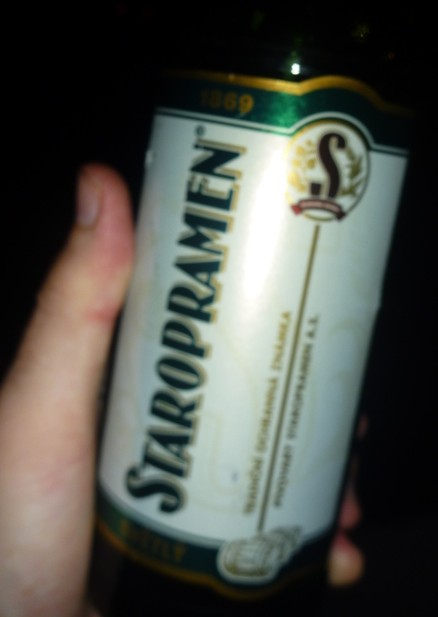

---
categories:
- Travel
type: post
date: '2010-08-29'
featured_image: posts/2010/food-beer/P1030803.jpg
slug: food-beer
tags:
- Basel
- Switzerland
title: Shopping in Germany for Food & Beer
---

Was kind of like a custard slice, but cheese. Quarkkuchen I think it was called

At the shops in Germany....

Drinking a Czech beer at the Rhein

13 Euro for 24 bottles = $18.58 AUD
And they are usually 5% alcohol or more

Meat for the grill...

This was a Czech beer that Petr had brought, was quite nice.

