+++
title = "IAESTE Jura Weekend"
date = "2010-09-14"
slug = "iaeste-jura-weekend"
type = "post"

[taxonomies]
categories = [ "Travel",]
tags = [ "IAESTE", "Switzerland",]

[extra]
image = "posts/2010/iaeste-jura-weekend/P1040064.jpg"

+++

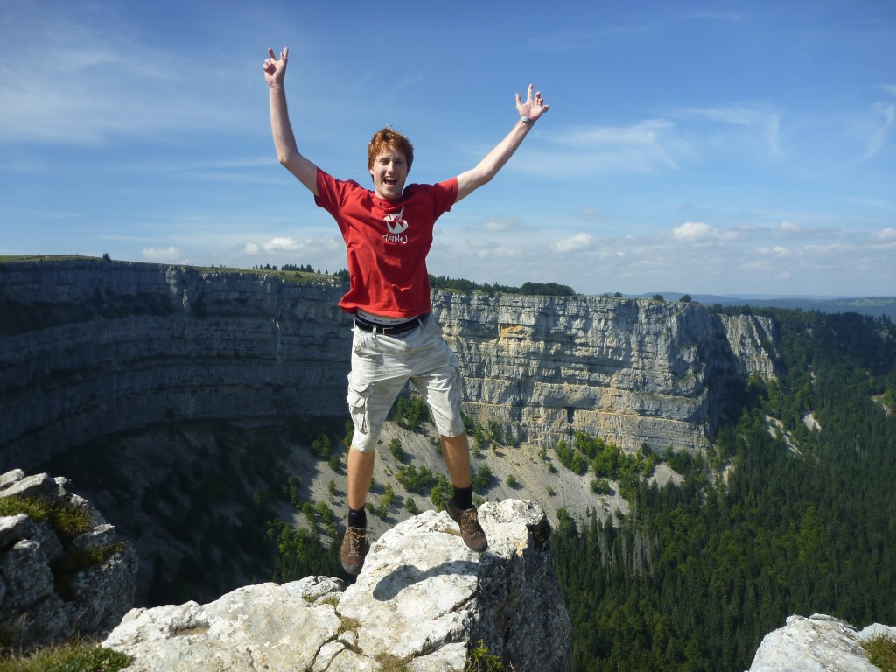

I have been very busy lately with assignments, German lessons and traveling, so haven't had time to update this in a while. On the weekend before last, I went to the Jura region, which is in the French-speaking part of Switzerland.

First up, we went to the underground mills in Le Locle. They were used in the 1800s to make flour, and used the water that flowed through the cave to turn the mill. But for some strange reason Le Locle was built in the way of the river and it would often flood during the spring when the snow melted. So they bought out the mill and closed it down
because they then redirected the river away from the town and it dried it up. The mill was then used as an abattoir and the owners dumped all of the animal waste down into the caves (don't know how that was allowed...). Then about 30 years ago (I think) some crazy historians decided they would take all the dumped waste out and make a museum. I have already forgotten most of the facts the tour guide told us, as it was 2 weeks ago now. There is more info here -
[http://www.lesmoulins.ch/](http://www.lesmoulins.ch/) - but it's in french. It was a fairly interesting tour though.

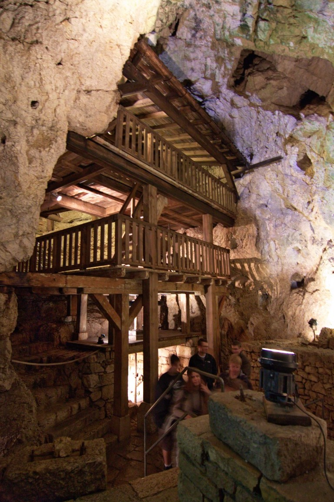

After that, we jumped on a train to ?somewhere? and visited an Absinthe factory. Well on the itinerary it said it was a factory, but it was more like some guy that made lots of it in his basement and sells it. The house alone was pretty cool. It used to be a drug store, and upstairs all the old chemicals and stuff were still there in this really cool, old cabinet. We found things like Cyanide and Chloroform, but the bottles of those two were empty.

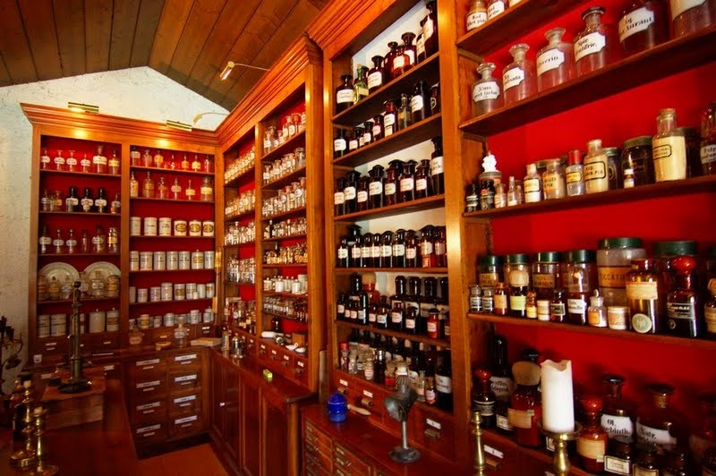

Then downstairs there was boxes with the herbs he uses to make the Absinth. There was 10 herbs, and one secret one that we weren't allowed to see. I didn't realise there was an actual absinthe plant, but there is. Also there was a one plant that you could easily smell straight away that it is what they use to make liquorice.

The guy had been making it for 30 years or something, but it has only been legal for the last 5. Apparently the region was renown for it's underground Absinth brewers, and there are still lots of them around (I guess to avoid tax).

The actual brewing itself was done in this steamer thing (I think with basically pure ethanol), and the end product is 75% alcohol. It is then diluted down to 55%, and the name of the product is Absinthe 55degrees.

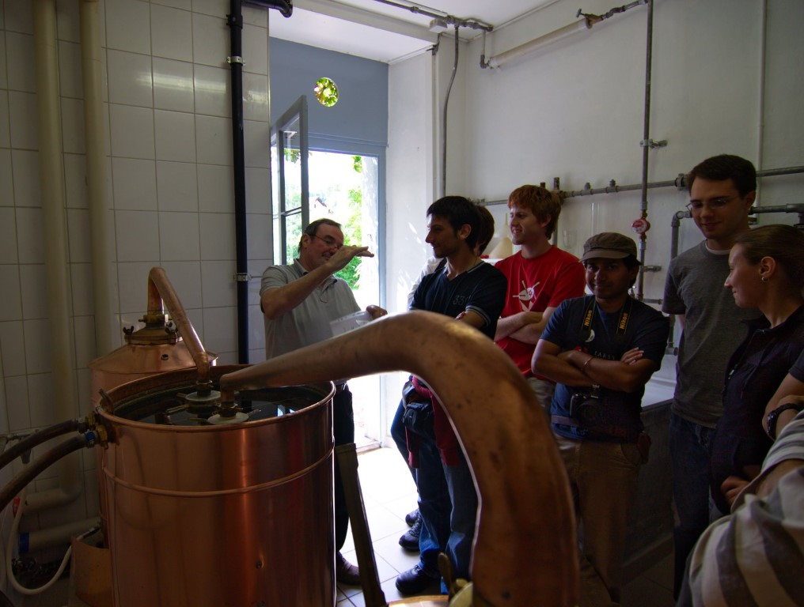

We then had an apèro and got to try some. It was not what I was expecting having had it only as shots. They mix it with water, and it goes all cloudy. It then tastes a bit like liquorice and doesn't burn as much. It is still very strong, but actually tasted like a drink rather than a shot.

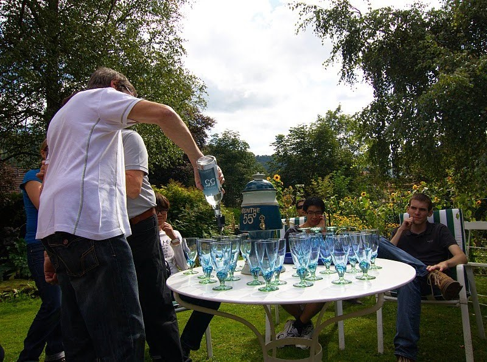

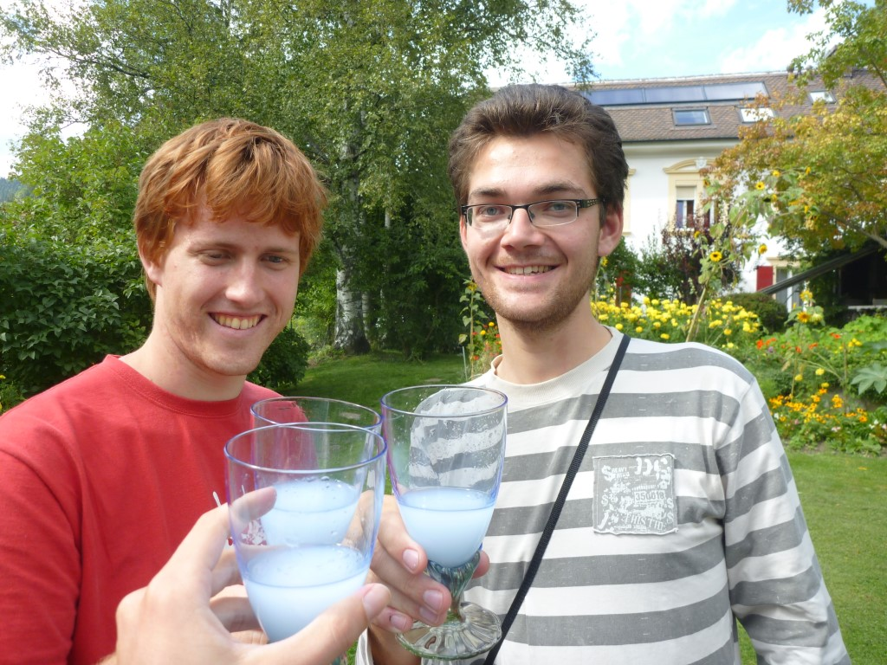

Oh and we were told that the green fairy is a myth. The only difference is food colouring. The stories of hallucinations came about because the company that made the green fairy had a bad batch of really bad quality that was causing people to go a bit crazy. But not in a good way.

From here we went to the hostel by the lake, and had a bit of a BBQ before dinner. The dinner wasn't all that great and the waitress seemed pretty angry that we didn't know french. The french breakfast was pretty basic too, and they have portions that are way too small.

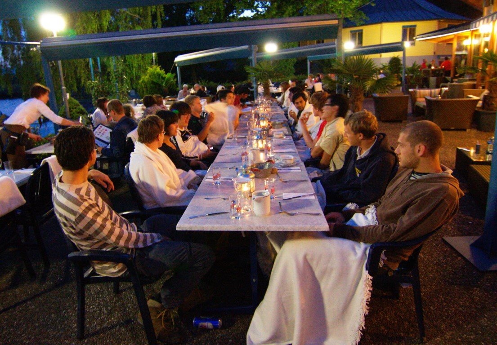

Sunday was the hike up to the Creux-du-Van which was a very steep hike, but an amazing view from the top. Photo's will do a better job of explaining it, so look on the Picasa web album.

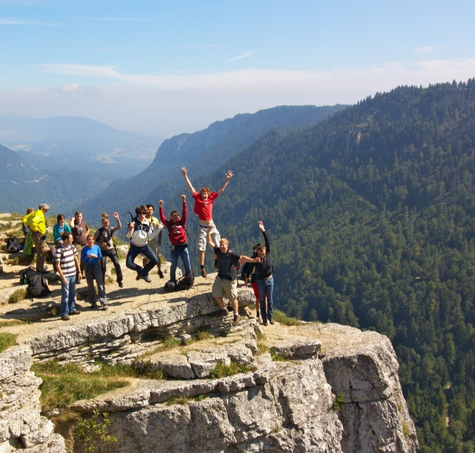

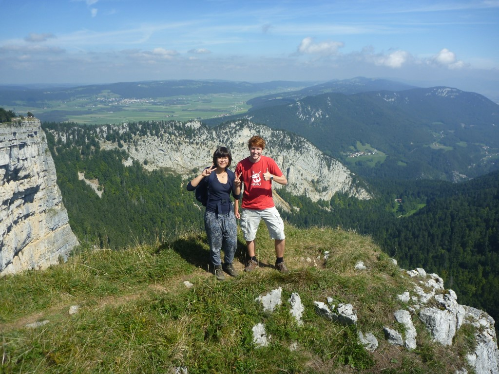

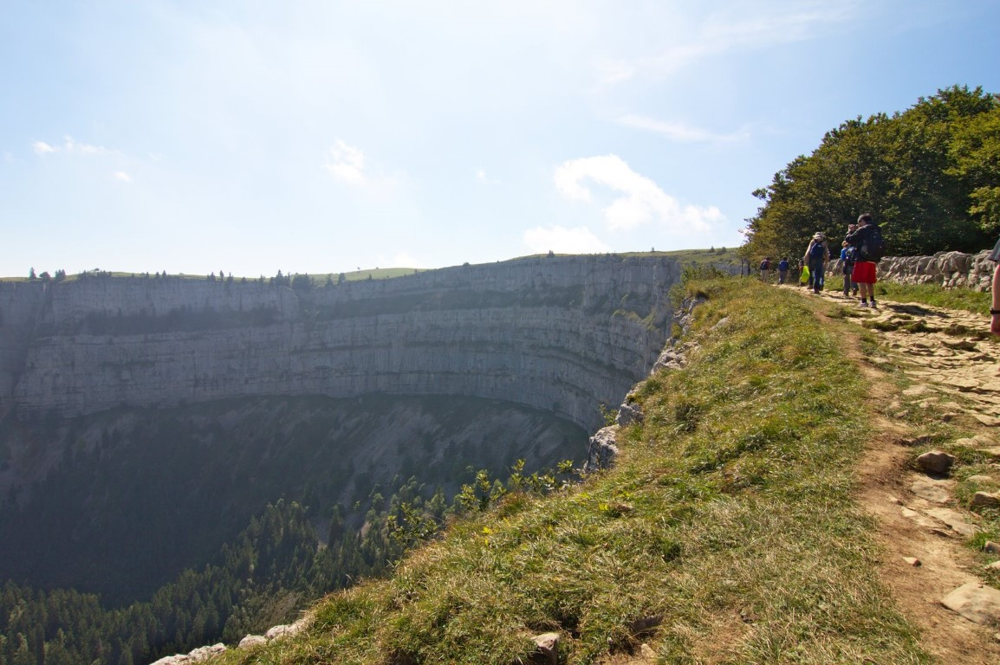

We hiked down to the other side where there was a gorge, and then walked along the creek/river for a few hours to the train station and then went home.

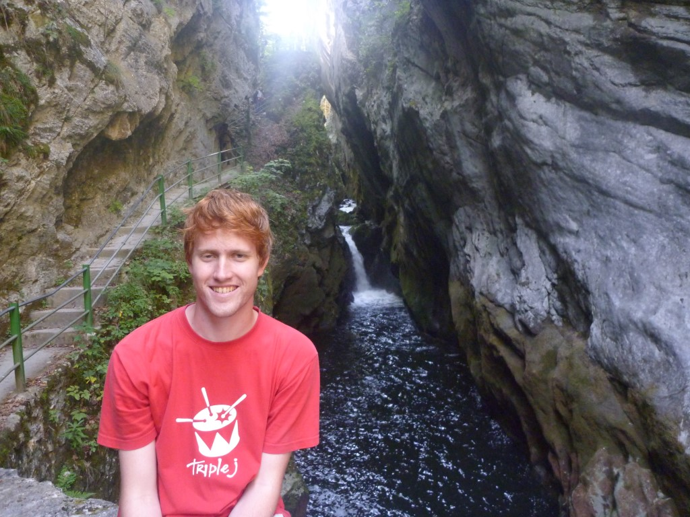

I saw my first Swiss Person give the finger at the train station, as Michael decided to run across the tracks when there was a train coming instead of using the underpass. The train driver was not happy as you can imagine so it was undertanable. Still strange that none of us had seen anyone give the finger until now.

Also funnny was that there was some girls at the other side of the train station dancing, that didn't realise we could see them. When they turned around I waved and they ran away embarrassed. Then they decided they liked the attention after all and came back and continued. I think Petr enjoyed it.

We caught some more delayed trains on the way home, the reputation of always being on time has been wrong nearly every train this last month, SBB needs to pick up there game.