This weekend I went on an IAESTE trip to Lichtenstein. It was a hard decision this weekend whether or not to go to Lichtenstein or stay and go the the street parade in Zurich on Saturday night. In the end I'm glad I went away for the weekend, although the street parade would still have been a sight to see, but I had a great time in Lichtenstein. As we waited for the train to Sargans on Saturday morning, we even saw a few people that were in dressed in costumes for that night.

In our train carriage there was a group of guys having a buck's party, with the groom to be in a cow suit. His friends set him the challenge of climbing into the luggage rack and pulling himself along the entire length of the carriage (we took our bags down so he could do this) and then he had to do a shot at the end.

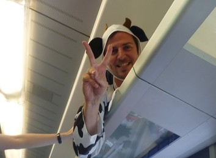

We then got a bus from Sarrgans to Vaduz, Lichtenstein. We went for a walk along the Rhein, which was quite unimpressive, it wasn't a particularly exciting river, but it marks the border between the two countries. We then got a bus up to the town of Malbun which was much more scenic. From here we went for a hike (well Steven and I) up a small creek that fell had been lined with logs, and kind of looked like a staircase.

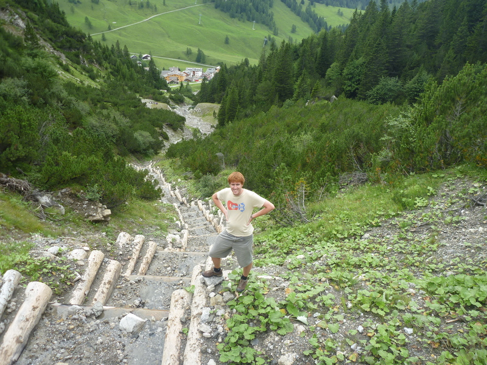

We went to a falcon show in the afternoon where a man showed us many huge birds, and explained interesting facts about them in German. He did translate some to English for us though when he brought them over towards our table. One falcon in particular was huge (15kg), and it was cool to see the hawk death strike a fake bird on a string. There was also a raven which once let out went crazy flying onto everyone's table and stealing their food. One table had some ice cream which it ate and had ice cream on it's beak which looked hilarious.

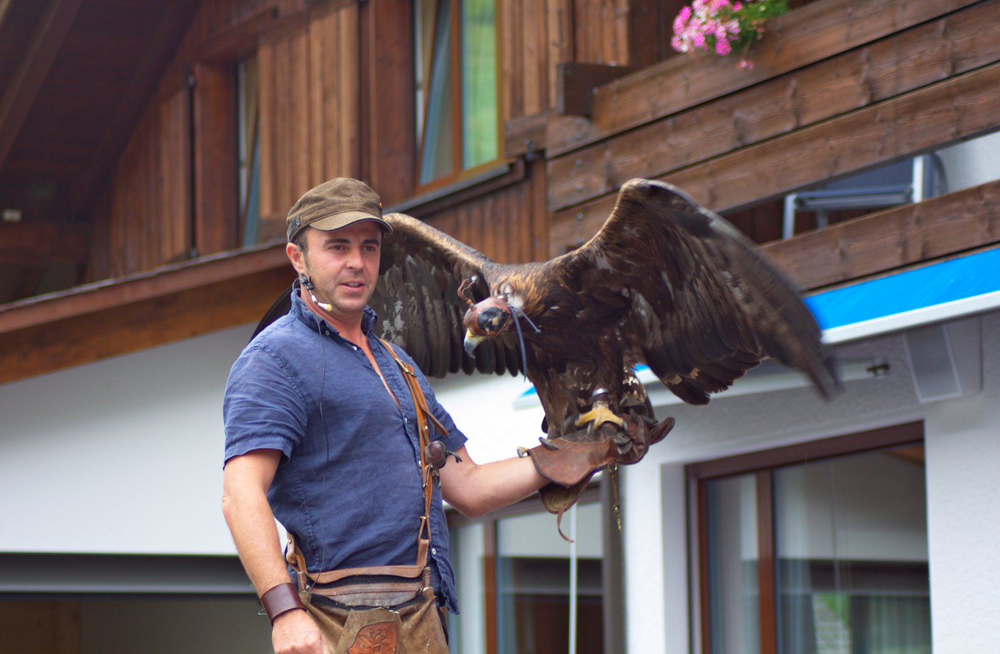

We then went for another hike, but at this stage some fog had appeared so we couldn't see much which was a shame. I sure the view would have been spectacular but it just looked like cloud to us.

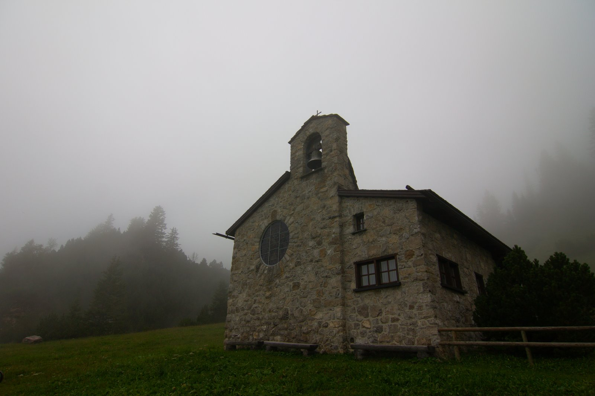

We then got a bus back to the city, ran back along the river to the hostel, went to dinner at a restaurant, then decided we should make our own street parade. So we found a service station to buy some beer then explored the streets of Vaduz. We found a band that was playing (no doubt because of the festival the next day) that sounded descent. I think every song they played was in English, but the banter was in Swiss-German. As the night went on we knew more and more songs. They were actually really good and had various singers throughout the night who were all very good. A girl came round and gave out sparklers, which we lit and then got told we were children and that we were supposed to wait for "the song". So she gave us new ones to hold in the air during some song later on.

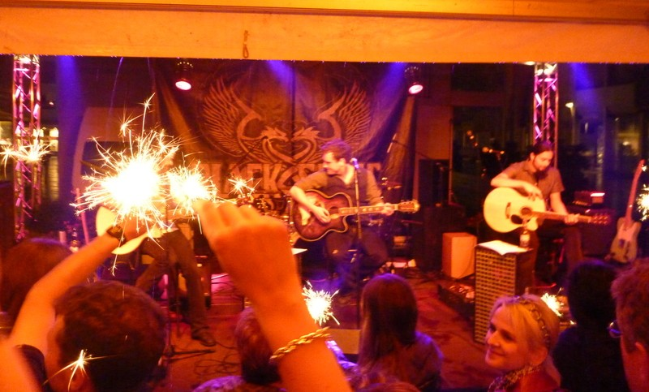

Sunday was Lichtenstein's national holiday, and the prince holds an aperitif in his garden that is open to the public. First there was some sort of mass on a field by [Vaduz Castle](http://en.wikipedia.org/wiki/Vaduz_Castle). It was kind of eerie at one stage when they all chanted the Lord's prayer or something in German. People all speaking in unison in a foreign language felt like we had stumbled upon some sort of cult ritual.

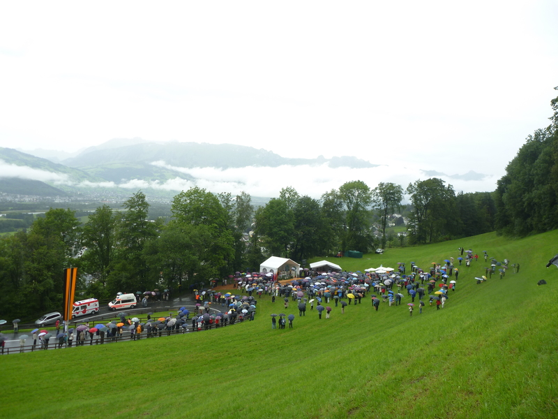

After the mass, the prince's son gave some speech about politics and stuff and then they all marched up to the castle. Also the band played God Save The Queen at the end which was just strange because they aren't part of the Commonwealth.

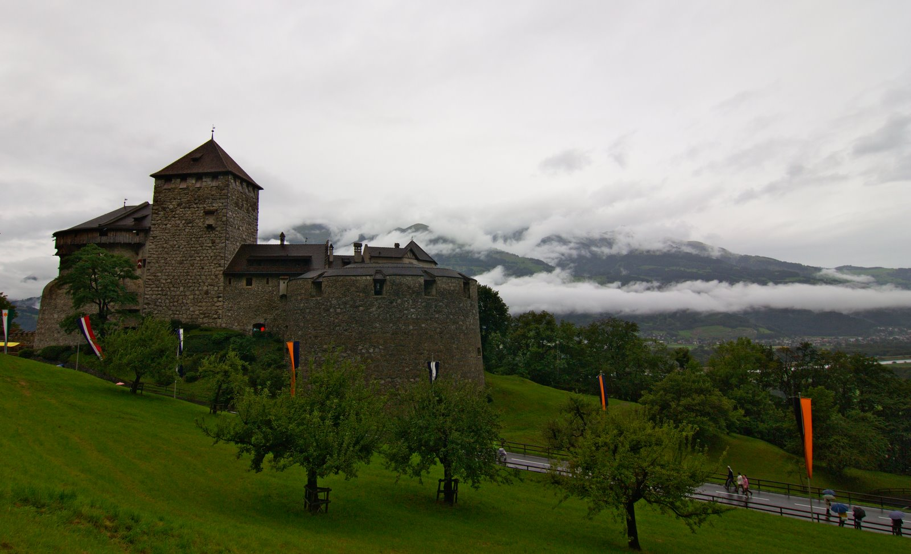

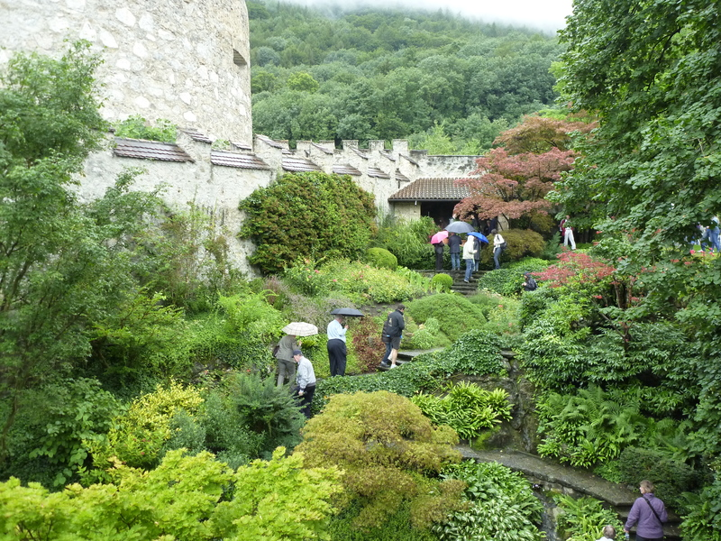

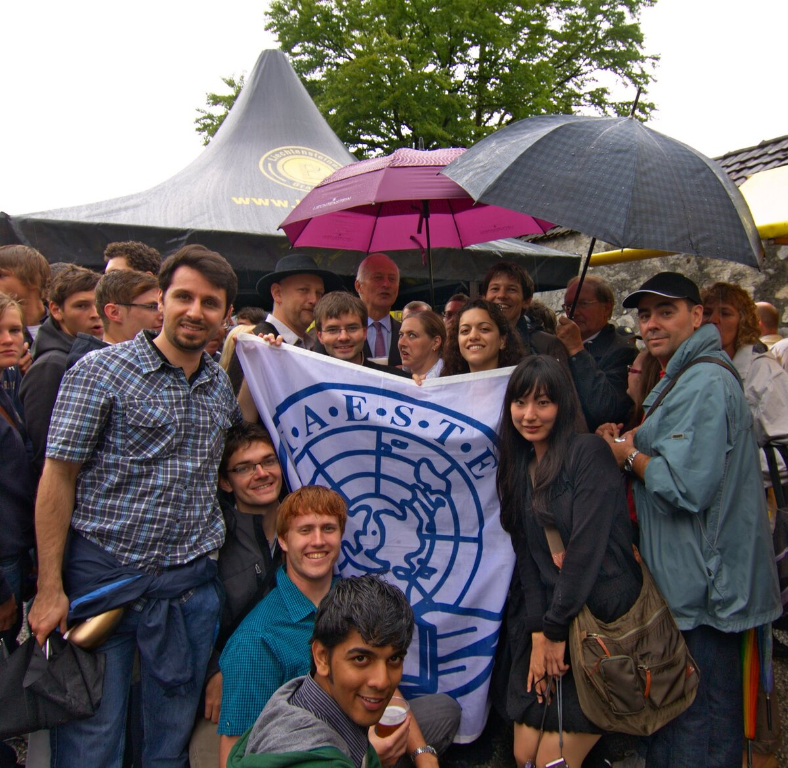

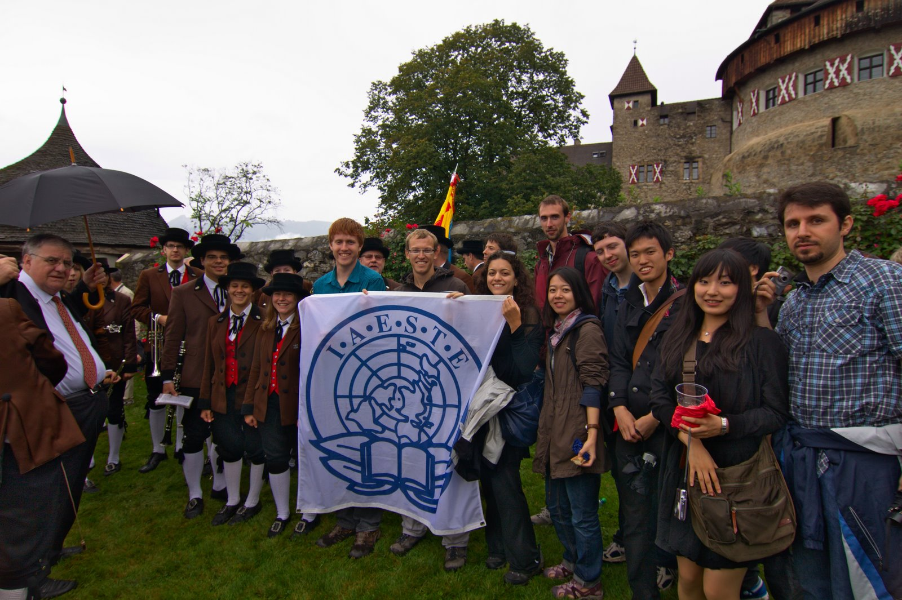

The aperitif was awesome. There was free food and beer, and we got got to explore the garden of the castle. Also we met the Princess, the Prince and the Prince's son and got photos of them all with us and the IAESTE flag. They seemed like a nice family and it was cool that they spend the morning talking to everyone. I also got to have a go of an alpine horn, which they had set up on a hill.

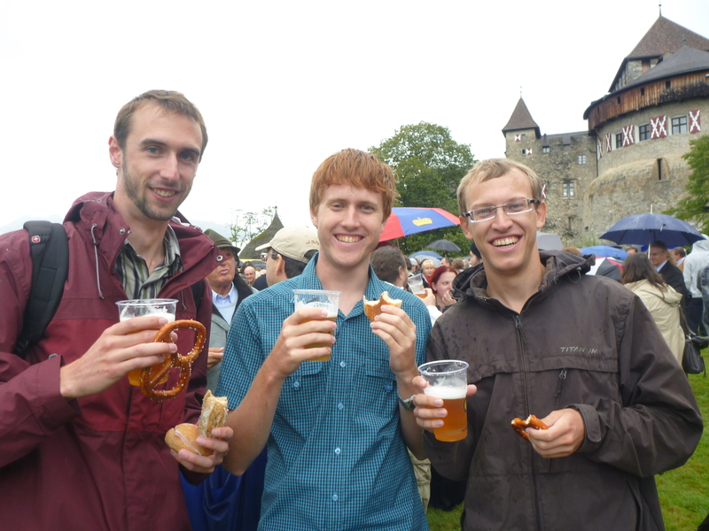

We then walked down the mountain to the city, where there is a festival for the national holiday. All museums and buses are free on the day. I learnt that I don't understand modern "art" as some of the stuff in the museum was just silly and anyone could do it. There was a cool quilt thing though that was a map of the world with each country shown as the national flag. But mostly it was silly things like a pile of coal, or a canvas that someone had put a stripe of black paint on with a paint roller.

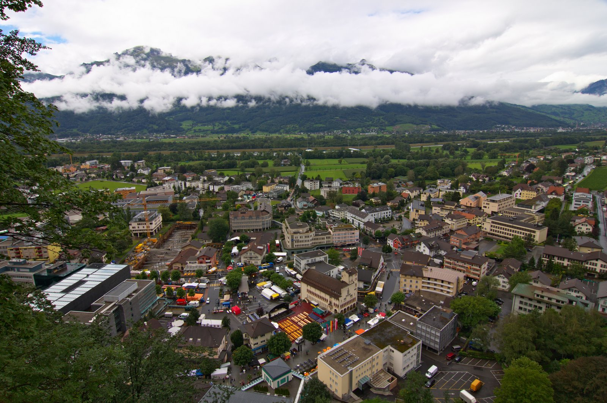

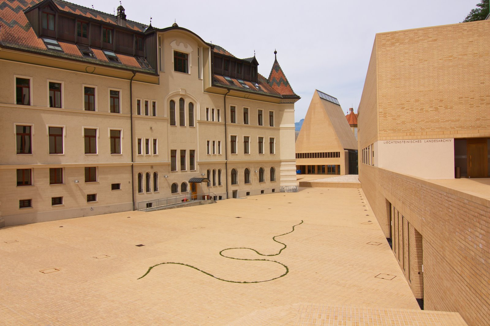

The bands and entertainment didn't start until like 6.30, and about 5.30 it started to rain and got very miserable so we decided just to head home, as nothing particularly exciting was happening.

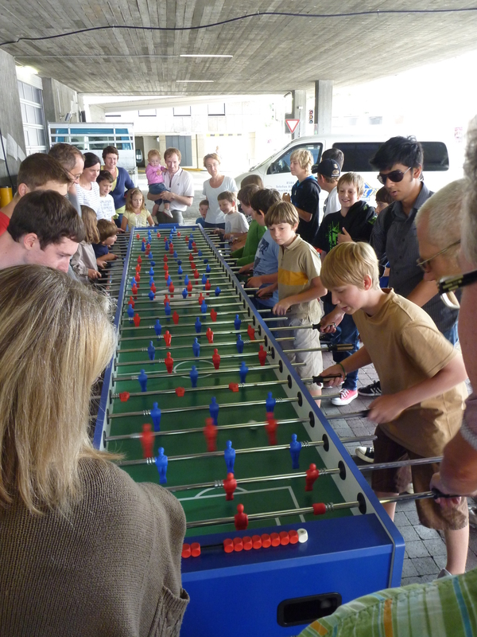

All in all it was a fun weekend, and it's not every day you get to meet royalty.
