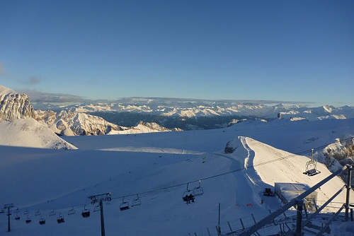
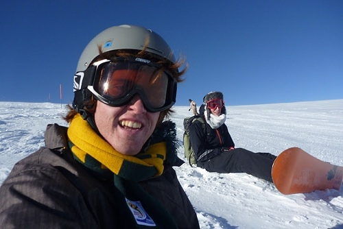
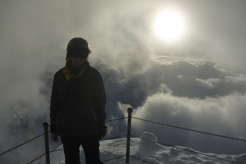

---
categories:
- Travel
type: post
date: '2010-12-14'
featured_image: posts/2010/iaeste-ski-weekend/p1050930.jpg
slug: iaeste-ski-weekend
tags:
- IAESTE
- Switzerland
title: IAESTE Ski Weekend
---

So this weekend was the much-anticipated IAESTE Ski Weekend.

After finishing work on Friday, I went to Karla's Goodbye Apero for a little while and then had to get a train to Les Diablerets. The journey takes 3 hours and 40 minutes, and after each subsequent train change there were more and more IAESTE peeps. At about 10 we finally got to our destination, and upon arriving to the chalet we got some Glühwein, or rather Vin Chaud because we were in the French-speaking part. It tasted different to the one I had in Zürich but it was also really nice.

On Thursday night I had not got much sleep because I went to the work Christmas party in Zürich, and Friday night we stayed up late as well, considering we had to get up early the next day. I think our room was one of the first to go to bed at about 1, and I could still hear music blaring when I went to sleep. The best thing about staying in a chalet and not a hostel like all the other weekends was that we were allowed to make us much noise as we wanted.

On Saturday morning we split up, and those without their own gear had to go to the rental store. I was convinced into renting a helmet for the weekend by the fact that everyone else had one, unlike in Davos where Maciek and I went without.

We had to get a bus from the town up to the gondola, and then headed up to the glacier. I had a pretty horrible morning as the board felt weird for some reason and I was uncomfortable with the turns. After lunch I realised that my bindings were a bit loose, and thought that maybe it was that, but wasn't really sure how to fix them or where to get the tools, so I soldiered on.

Before lunch we had stayed close to the restaraunt. There was only one really short red (blue) run and to use another run you had to walk (or get lots of speed to get past the flat part) over to the T-bars. After lunch we walked across, but I did two more runs and decided that it wasn't me that sucked and that it was definitely the bindings. So then I had to hike back again to the restaraunt and was able to find a table where they had tools and tighten my bindings. It was instantly better, and so I was pretty annoyed that the rental company was such a failure and didn't tighten them properly.

I went back over to the t-bar section again and did a long blue run which was insanely fun. The resort was fairly small and was basically all blue (green) runs because the black runs were closed. But even so, I found it much better than Davos as the snow was softer and the runs more interesting. There was a bank of fresh snow on the sides of this run which allowed you to get air and land in fresh powder. I landed some of my attempts at jumps and failed hard on others but only got to do one run before it was basically time to head back up to catch the Gondola.

At the flat section where you needed to un-clip, they had dog sleds, and at the end of the day the dogs pulled the sled up this massively steep hill back up to the restaurant - which was pretty crazy to see.

Back at the chalet, we had Fondue for dinner. The punishment for dropping the bread into the cheese was that you had to go out into the snow and make a snow angel. But nobody did that, so either nobody dropped it (unlikely) or they didn't follow the rules.

The chalet had really small ceilings (as seems to be the case all over Switzerland) and I hit my head several times. But not as bad as Curran, who bumped his head so hard that he started bleeding and had to go to the doctor because he got a concussion. After that I was much more careful and didn't hit my head once.

After dinner we had a trivia night, with drinking games in-between rounds. I had not seen a few of the games before, so I can enlighten everyone when I return with lots of new games.

Since my bindings were tight now, Sunday was probably my most enjoyable day on snowboarding to date. The weather was really good (for most of the day) and the snow was reasonably fresh and so pretty soft. I headed straight over to the slope from the afternoon before, and this time managed to *mostly* land a 180 air. I say mostly because I landed it but didn't stay upright for long afterwards. It was a good thing that I rented a helmet because my second attempt ended even worse.

Things got more adventurous from there and I went to the Terrain Park with an English guy called Pete. Unlike the previous run, the terrain park was not soft snow and hurt a fair bit when I fell. The jumps weren't too scary though and I managed to get a fair bit of air off them although didn't try any tricks.

I decided to have a go at the grind rail, and got about half way along before jumping off. On the 2nd run, I did a wider rail and was able to make it all the way to the end and do a jump off the end. This made me a bit too cocky though I think, as I tried the thin one again immediately after it and failed epicly. Again I was glad I had rented the helmet as I hit my head pretty hard on the ice.

Then later still, I did another epic stack. I hit the biggest jump with tonnes of speed and without meaning to attempted to do a backflip - or at least that's what I was told it looked like by Pete. I basically landed on my back so it I landed pretty hard and got the wind knocked out of me a bit. After a short breather I was okay, see the video below for footage that I took directly after (in the middle of the video somewhere). I had planned on doing the rail again but didn't want to try it with the camera in my hand. We went back one more time though and I successfully made it to the end of the grind rail again, again landing the jump off the end.



We went back to the nice soft runs after that and tried doing Indie grabs. All and all it was an epic day, and was a much better ski resort than Davos. The one problem that I had was that the T-bars were so long and steep that it was really quite painful by the time you go to the top of them.

At the end of the day we went back to the chalet for some hot soup and then started the long train journey home.