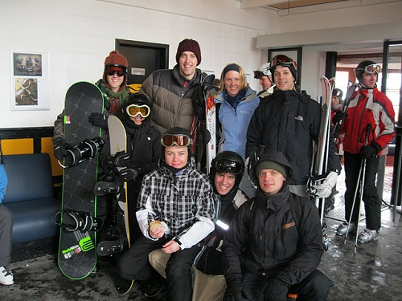
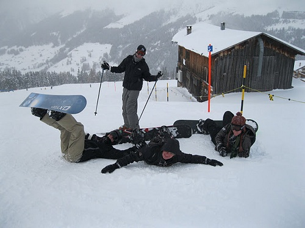

---
categories:
- Travel
type: post
date: '2010-11-30'
featured_image: posts/2010/jakobshorn/skiing-022.jpg
slug: jakobshorn
tags:
- Jakobshorn
- Snowboarding
- Switzerland
title: Jakobshorn
---

On Sunday my housemates and I went on a roadtrip to Jakobshorn in Davos. When we got to Davos we went to the rental store and I got a brand spanking new Snowboard for the day. After we had our gear we headed up a cable car, up another cable car, and then finally we were at the top of Jakobshorn (2590m).

Switzerland is a bit different to Aus/NZ - they have a different colour scheme. Blue is Leicht (easy), Red is Mittelschwer (Intermediate) and Black is Schwer (Difficult). They don't use shapes either, just the colours. So there was no double black diamonds to be conquered.

But everyone was fairly inexperienced (except the Americans on the skis) so we started on the blue run. This run was long but boring. Unlike Perisher and Queenstown, they don't have any trees or anything along the path to make it exciting. Just snow, snow and more snow in all directions. The run was really icy too and very painful to fall on. I didn't fall too much at the start but as I started to get tired in the afternoon I was subjected to more and more pain. Veering off the run (outside the markers) it suddenly turned to powder! Yay, except on a snowboard that means that unless you balance it right you stop moving and fall over. While this doesn't hurt in powder, I soon got very tired of maneuvering out of the powder back to the main path and kept inside the markers from then on. The ice was less fun and more painful but I didn't have enough energy to keep attempting the powder.

One thing that was a huge improvement on past experiences though was the lifts. They had a windshield like plastic front that you can pull down which we dubbed "Climate Control". It was much more enjoyable than being blasted by a freezing wind. They also had benches at the top that you could sit down on and strap in your boots.

After going down the blue a few times we were ready for something different, and did a red and then a black. I must say the black was pretty disappointing. You would expect a black run in the Swiss Alps to be crazy difficult, but as there was no trees anywhere it just means that it was steeper then the other runs. Also it was very icy and hurt a lot the one time that I fell. It is still very early in the season as well, so maybe that is why everything was so icy and painful - I'm still sore today.

The lifts closed quite early and so we got the last cable car back at 4:45 and drove home. It was a great day, but I must say I thought the runs in New Zealand and Perisher were more enjoyable. I am going to Les Diablerets for an IAESTE weekend and staying in a Chalet, so the Swiss Alps still have a chance to prove me wrong. It should be great, and now I've had a bit of a warm-up snowboard hopefully there will be less stacks.

