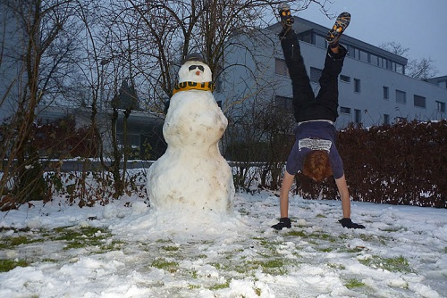

+++
categories = ['Travel']
date = '2010-12-29'
featured_image = 'posts/2010/my-first-snowman/p1060354.jpg'
slug = 'my-first-snowman'
tags = ['Switzerland']
title = 'My First Snowman'
type = 'post'

+++

The other day I tried to make a snowman but the snow was glorious powder and didn't want to stick together. Today it was (according to the Internet) 1°C and the snow was starting to melt a little bit. Now that it was a bit melted I used the last chance I had before it melts away completely to attempt to make one before I go home.

Making a snowman is HARD WORK. The process was pretty simple, just make a ball to start with then roll it around, but once it gets a bit bigger it gets REALLY HEAVY. I wanted to make it life-size so just kept going until it was too heavy to push anymore. I was pretty happy with the base so then I made another for the next part.

Once I had pushed it up to the base, I realised something. This thing was hard to push so it was going to be really hard to lift. Attempting to lift it achieved nothing. I tried a few different things but eventually got it up on a chair... well half of it. If you look at the photos you will see that when I lifted it up the ball broke in half. In any case it was up, and I was pretty happy and exhausted. From then on it was easy again, trying to re-attach the parts that fell off and make it more round looking. You can see in the photo above the final product.

The snow was already starting to melt in the afternoon, so I don't think it will make it through tomorrow. Now the sun is down it's a bit colder again so it least it will make it through the night. If it starts to melt tomorrow I'm not sure if I should wait and see how long it can last or put it out of its misery and kick it's head off. I'm not sure if that's a common thing to do over here but when it was finished I pictured someone stomping on a sandcastle and wondered if they did the same thing with snowmen.