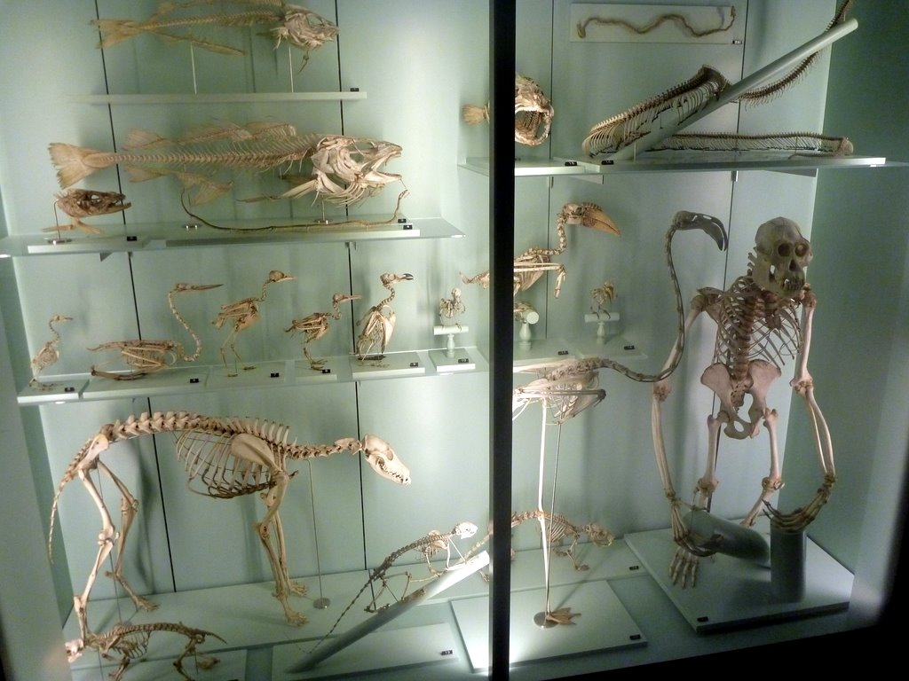
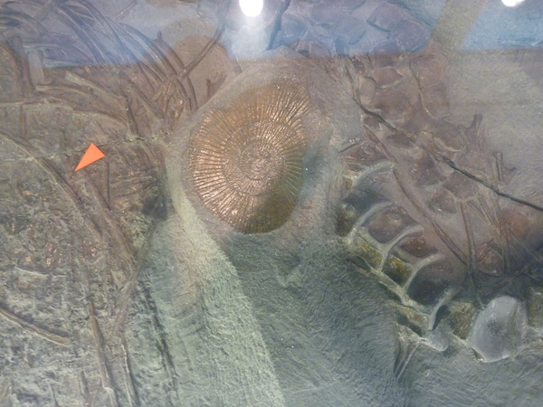
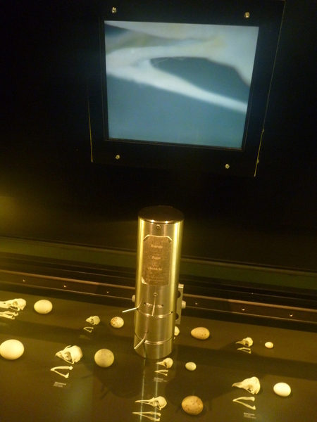
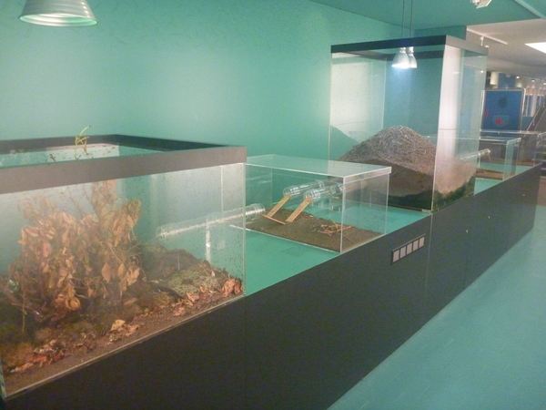
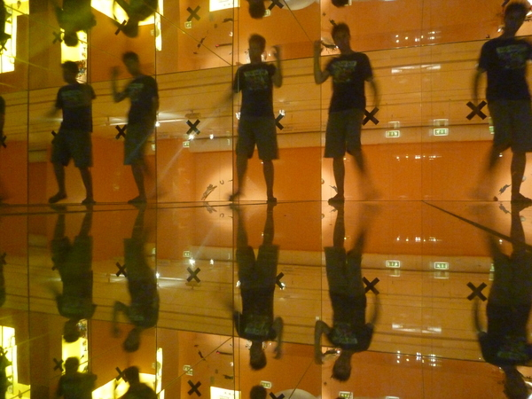

---
categories:
- Travel
date: '2010-07-06'
featured_image: posts/2010/naturhistorisches-museum/P1020029.jpg
slug: naturhistorisches-museum
tags:
- Bern
- Switzerland
title: Naturhistorisches Museum der Burgergemeinde Bern
---

Whilst aimlessly walking around the city, I saw in tiny writing on the door that one building was a museum, so had a mosey inside.

There wasn't anything particularly special in it, but was definitely worth looking around. It was mostly filled with life-like animal displays, which looked like they were stuffed versions of the real thing, but I'm not sure if they all were. It also made it hard to understand what I was looking at sometimes, when all the information was in German.

There was a few cool displays though.

There was a few skeleton's and fossil's which were interesting...

And they had a microscope set up which you could move around and look at these eggs up-close. A really cool idea, but I didn't find them much more interesting when magnified.

They also had a giant ant-farm. I saw 2 that were making a break for it and had escaped, but that's still a pretty good design that only 2 had escaped when all the tops are open. You couldn't really see too well in the nest, and couldn't see any eggs or larvae or anything. There was cabinet underneath that was locked which I assume they can open up and you can look at it on tours or something.

Don't know what this is, but it's a freaking huge, scary-looking bug that could probably take a large chunk out of you.

There was corridor made out of mirrors that was incredibly trippy.

I'm assuming this represents blood diamonds? They had some really cool looking rocks, with some crazy formations.

