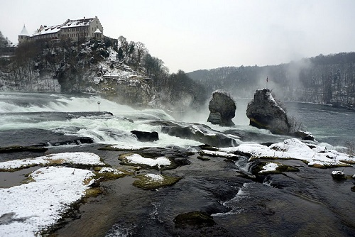
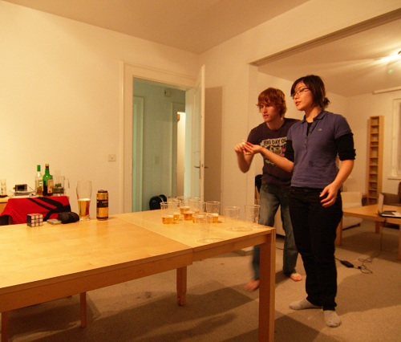
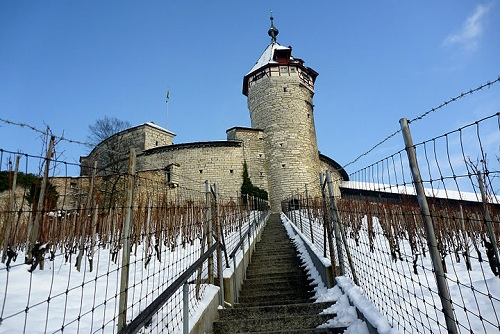

+++
title = "Neuhausen am Rheinfall"
date = "2010-12-05"
slug = "neuhausen-am-rheinfall"
type = "post"

[taxonomies]
tags = [ "Switzerland",]
categories = [ "Travel",]

[extra]
image = "posts/2010/neuhausen-am-rheinfall/p1050814.jpg"

+++

So last night I went to Asako's Fondue party at her house in Neuhausen. We ate lots of cheese and drank lots of beer.

Bram had his [Cantus](http://lists.ee.ethz.ch/p/02-Cantus.pdf) books from a Belgium Party he threw during the week, so we sang some songs and watched some youtube videos for a bit, but then we moved on to Beer Pong.

I've seen Beer Pong several times in American movies, but never actually played it. It started out as a kind of fun game, but then we picked it up a notch and changed it to "Speed Beer Pong" and it became much more fun. All the while cranking some JJJ.

This morning I went and checked out the Rheinfall. It was a pretty impressive sight. I would like to have seen it in the Summer when there was more water, but it was still raging fairly feircly. Also because of the snow, the observation deck was closed. Snow makes everything look cool, and waterfalls are no exception.

The nearby town of Schaffhausen was also cool, and today they were having a Christmas Market. Santa was there with a hooded helper lady and his donkey, and I think he might have been handing out bread to kids. It seemed a bit strange, but it's definitely better than just having someone sit in a shopping centre.

The best part of Schaffhausen was the Munot. It was different to any of the other castle's I have been to, and there was no touristy feel to it. They had some deer living outside the castle as well, one of which had a massive antler. Actually I forgot to mention that when we went to Davos we saw a massive deer with a huge antler walking across a field as we drove past.

There was also a herb garden at the Münster which was covered in snow, so looked like all the other gardens. I think it must be cool in Summer though.

Nothing too exciting to tell, but it was a lovely area and probably one of the best Swiss towns I've been to.