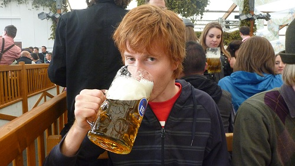
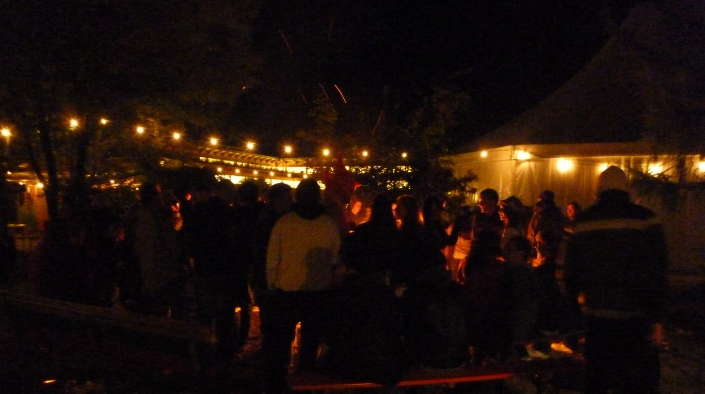
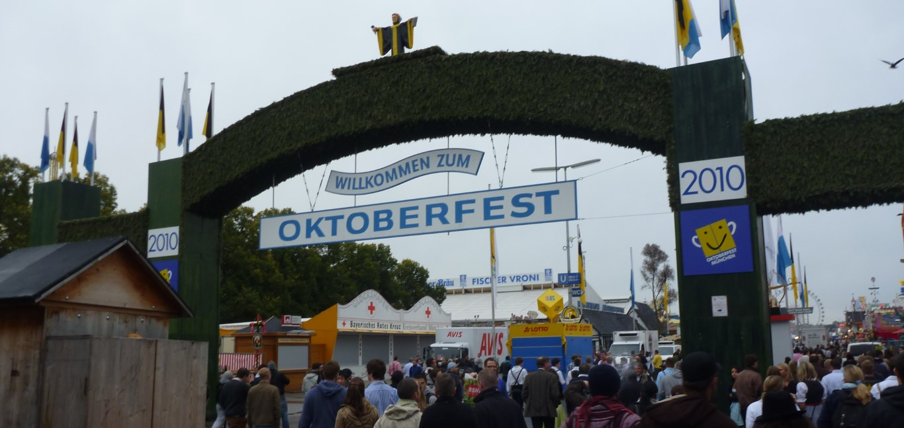
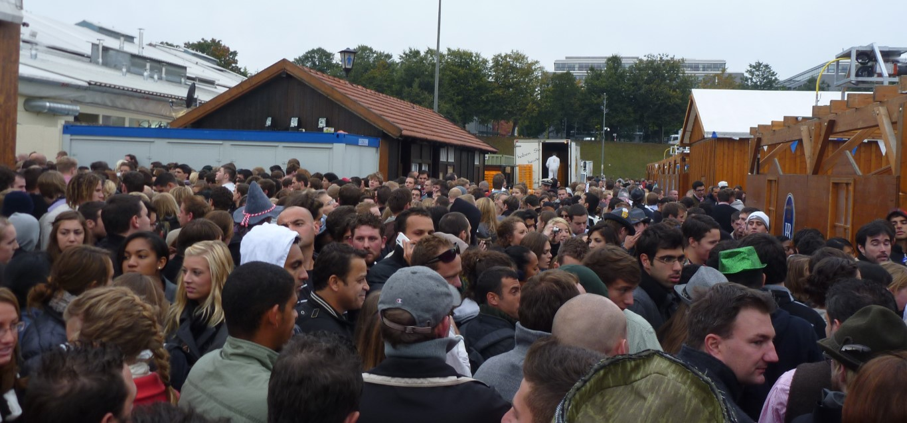
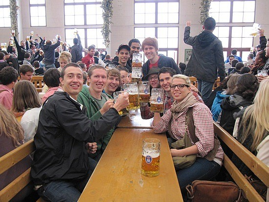
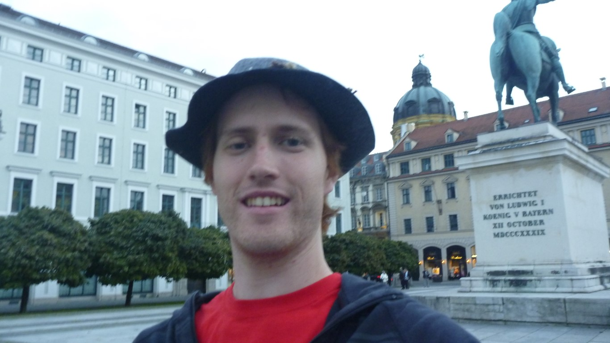
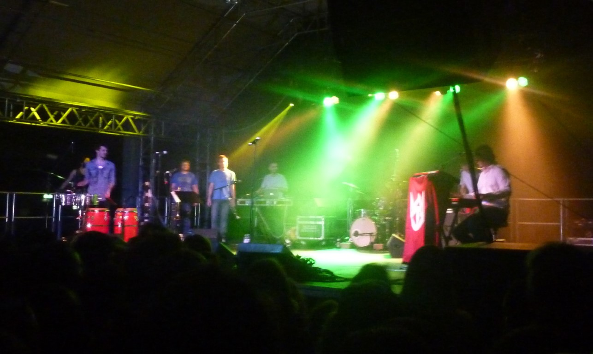
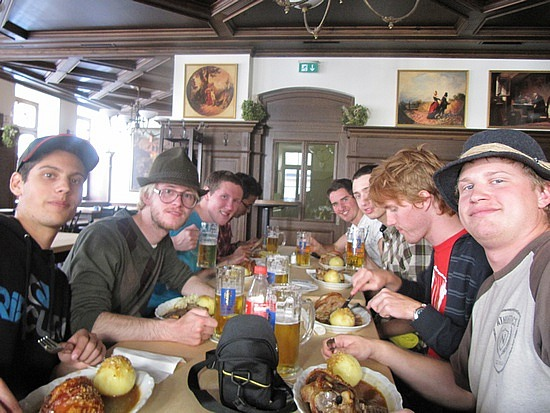
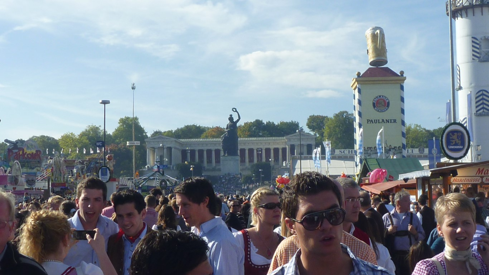

+++
categories = ['Travel']
date = '2010-10-05'
featured_image = 'posts/2010/oktoberfest/p1040660.jpg'
slug = 'oktoberfest'
tags = ['Germany', 'Munich', 'Oktoberfest']
title = 'Oktoberfest'
type = 'post'

+++

## FRIDAY

So the trip to Oktoberfest started with a long train ride from Zürich to München. It went fairly quickly but, as someone brought cards, so we played a Canadian variation of Presidents and Assholes.

At the train station it was clear that we had arrived at Oktoberfest, as people were walking around in [Lederhosen](http://en.wikipedia.org/wiki/Lederhosen) and [Dirndl](http://en.wikipedia.org/wiki/Dirndl) and there was massive Pretzels for sale everywhere. Also a big clue was the fact that many people were staggering around and one guy (who looked to be in his 40's) even fell over when he got on an escalator and only just managed to stand up again before the top.

Eventually (after much waiting around for the rest of the group) we got Tram 17 to [The Tent](https://the-tent.com/). As we walked in it looked really cool, there was a massive bonfire with people chatting and fairy lights hung everywhere and a huge tent with the beds in it. But while it looked cool, trying to get to sleep was another story as when there was so many people in such a big tent you can hear conversations constantly throughout the night. Most of the people staying there seemed to be Australians, and while it was good to hear a familiar accent, it was quite annoying listening to people to talk about the AFL at 1:00am when I had to wake up at 7 to head to the festival. As well as that, the night was absolutely freezing, and I woke up cold through the night despite wearing my jumper to bed, being in a sleeping bag and having a blanket. The morning was just as bad and it was even colder outside.

## SATURDAY

We caught the tram at 7.30 and made our way to the Oktoberfest grounds, where there was already a lot of people heading towards the grounds. We were headed for the [Hofbräu-Festzelt](http://en.wikipedia.org/wiki/Hofbräu-Festzelt) tent, which was basically the first tent as we walked in. Despite getting there a little bit before 8, there was already a massive line. By the time they started letting people in at about 8.30 there was an even bigger line behind us. When they opened the doors it was like a stampede, but we managed to get a table up the top of the tent.

The tent was pretty cool, was basically just a huge hall with tables and tables of people waiting for beer. The first beers arrived at about 9, but our table was one of the last tables to be served so we didn't get our first beer until about 9.40. Inside the tent was great fun, with lots of chanting but mostly just drinking. For some reason people were chanting the tune to Seven Nation Army most of the day, which is just strange because they weren't even singing the lyrics, just the riff. But we didn't get to stay in the tent long, because everyone upstairs got kicked out at about 11, because the tables had been reserved for a big group or something. At this stage we were still waiting for another beer to arrive but it never did. After we got kicked out, we were moved down to the beer garden outside.

The rest of the day was spent talking to various people from all over the world. One guy who was particularly funny was from England, but was pretending to be South African by putting on a pretty bad accent. I had four [Maß](http://en.wikipedia.org/wiki/Maß) (1L Beer Stein) during the day, so from around 3ish when I left the tent my memory isn't super detailed. I started making my way to find The Cat Empire concert that was on that night, and headed into the Oktoberfest grounds. There was a huge big statue which was really impressive, but while I thought it was cool at the time, I didn't take as much notice until we came back the next day. I ventured into town and found a supermarket and bought some food. At this point I didn't even want to go to The Cat Empire anymore, all I wanted to do was sleep. But I knew I would regret it the next day if I didn't go, so from here I randomly found my way to [Feldherrnhalle](http://en.wikipedia.org/wiki/Feldherrnhalle) looked around for a bit at all the cool statues and buildings and then got a bus to Ostbahnof. From here I started trying out my German speaking skills by asking everyone where TonHalle was. Nobody seemed to know where it was, except for one lady who sent me in the general direction, but eventually I found some people that were heading to the concert as well so followed them.

The actual gig itself was epic. Despite having a massive headache by this stage and struggling to keep my eyes open I was that tired, it would put it up there as possibly the best live show I have ever seen. It's a tough call to say whether it was better than Xavier, but I think it just makes it.

The support band Tinpan Orange was pretty good, and Harry Angus played trumpet and keyboard for them (he must be in like 4 bands). The cat empire where everything I expected though, they had so many improvised solos with perfect timing. Harry did this massive scat solo thing that you could tell was all improvised, and you could see how much the band was concentrating to match his timing, which was perfect for every beat. There encore was the Wine Song and the Chariot both of which were also incredible live.

Finding my way home after the gig was horrible. I had a massive headache, didn't know what bus to get and was basically falling asleep as I walked. After staring at a map for a while and still having no idea, I decided to backtrack and head to the Haftbanhof and then get Tram 17.

On Tram 17 I was really struggling to stay awake and started dozing in and out of sleep. The night before, our group had been arguing about whether we hopped off at Romanplatz or the Botanical Gardens. I opened my eyes at one point of my half-sleep and saw I was at Romanplatz, so I quickly jumped of the train because I didn't want to miss my stop. It was actually two stops early, so I had a further 10min walk or so to get to The Tent. But eventually, I made it back and went straight to bed. Unlike the previous night, getting to sleep was no problem and I had the best nights sleep you could imagine.

## SUNDAY

The next day I felt great, but was I no way keen for heading back to the beer tents. No body else was in the mood for more drinking either, so we decided to go on the free walking tour of Munich.

The walking tour was so good, and so much better than just wandering around the city like I have been doing. So many things we saw that we would not have known the significance of otherwise.

We saw the outside of the [Devil's Church](http://en.wikipedia.org/wiki/Munich_Frauenkirche), but couldn't go inside because there was a service on. But, we did get pointed out to us the solid gold brick that was in one of the towers, which was put there to show how lucky it was, as the church was hit by a bomb during the war that bounced off and didn't detonate.

We walked along the route that the Nazi party took when they first tried to seize power and saw the spot where Hitler was shot at. His body guard took 11 bullets, and saved him and now (according to our guide anyway) there is a storm water drain there to signify the spot. To demonstrate how much better having a tour guide is then just wandering around yourself, we were shown a spot on the wall where you could make out where a plaque used to be, but it had been concreted over. I would never have noticed this, but we were told what used to be there.

I found [this site](http://www.scrapbookpages.com/Munich/Feldherrenhalle.html) that explains it, here's a quick excerpt:
"The Bürgerbräukeller was torn down years ago, but tourists can still see where the Nazis put a plaque on the Feldherrenhalle to honor the men who were killed there by the police. During the Nazi era, Munich residents were required to do a Nazi salute as they passed the plaque, which has since been removed. Those who did not want to give a salute to the fallen heroes would use Viscardigasse, a back alley which was nicknamed "Evaders' Alley."

We also walked down Evader's Alley, where the stone's had been painted gold to recognise the people that stood up to the Nazi's. If the guards saw you walk down this street then they would send you off to a concentration camp because they knew you opposed them.

But the most interesting two stories were these:
The opera house was the first building ever to have a sprinkler system in case of a fire, but as it was the first time someone had invented it, they didn't think about what would happen if there was a fire in winter, when all the water was frozen. So when a fire broke out, they went to use it and it didn't work so they had to come up with a Plan B. So they ordered everyone to stand in a chain and pass down kegs of beer from the Hofbräuhaus down the street to poor on the fire. I should point out at this point that most of the breweries in Germany are owned by the government. But the problem with the plan was that out of the 120 or so kegs that were passed down only 20 made it to the fire. So the opera house burnt down. The king was pretty angry about the townspeople stealing his beer AND his opera house burning down, so he raised the price of beer as punishment and to pay for the damages. Except they all get angry about that and had a mini revolution, and so the tax was dropped. And now in Germany beer is classed as "food" for tax purposes so basically they don't charge any tax. But then again the government owns all the beer anyway, so you kind of do.

And now for what I thought was the coolest story. For the last stop on our tour we went to see Munich's [Maypole](http://en.wikipedia.org/wiki/Maypole#Germany_and_Austria). It wasn't particularly exciting, but we were told that if you steal a maypole (these things are huge) you can hold it up to ransom to the town, and dictate the terms of it's return. Found some more info on stealing them [here](http://www.lewrockwell.com/barnhart/barnhart11.html). People would steal the maypole of another town and then demand they throw them a party before they will give it back, or demand a certain amount of beer.

But the really cool part of the story is this: "the theft in broad daylight of the Viktualienmarkt's maypole in 1964. As a ransom, the brothers Schorsch und Valentin Bauer demanded, and received, the lifelong right to a box at the Oktoberfest, since which time Box 7 in the Augustiner tent has been called the Maibaumräuber (maypole thieves) box." And not only that but they demanded free beer for life as well which they get.

After the tour we went to the Augistiner pub for lunch and got a [Schweinshaxe](http://en.wikipedia.org/wiki/Schweinshaxe) (Pork-knuckle) and [Kartoffelknödel](http://en.wikipedia.org/wiki/Knödel) (Potato Dumpling) to eat and an Augistiner "Oktoberfest" beer. I hadn't tried either of these foods before, but they were both amazing. Especially the Schweinshaxe which was basically just a huge chunk of pork with crackling and fat throughout. The beer was less enjoyable, as I think my body was still processing the one's from the day before.

After some food, we headed back to Oktoberfest. This was a very different Oktoberfest to the one I experienced the day before, because this time we walked around outside the tents, and didn't go inside. It was basically exactly the same as the show, but on a truly massive scale. The amount of people there was ridiculous. I managed to get in some photobombing practice, and even some boneheading that might make it on the German news.

We found our way to the hill with the [massive statue](http://en.wikipedia.org/wiki/Bavaria_statue) to sit down for a while, and got to see all the people that had been drinking all morning passed out on the grass. I had found out that morning that most of the Canadians had slept on the hill at about the time when I left to find The Cat Empire concert. I was that tired, that if I hadn't of had a concert to go to, I would have probably done the same.

At one point, a guy at the top of the hill accidentally dropped a mug, and it rolled down the hill, hitting two of the passed out guys on the head on the way down. Even that didn't wake them up. We stayed there for a fair while and just watched various crazy stuff go down around us.

At the end of the day we had a long train home, which was even longer due to the fact that it was delayed by 40mins in Austria. Eventually though I was back in Turgi for a few hours sleep before work the next day.