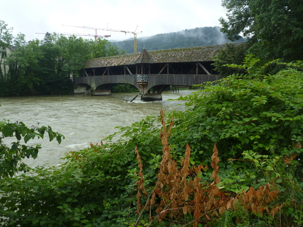
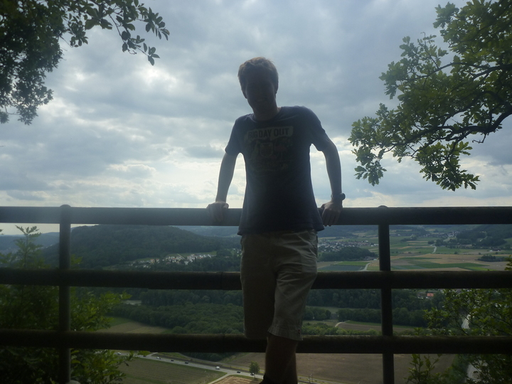
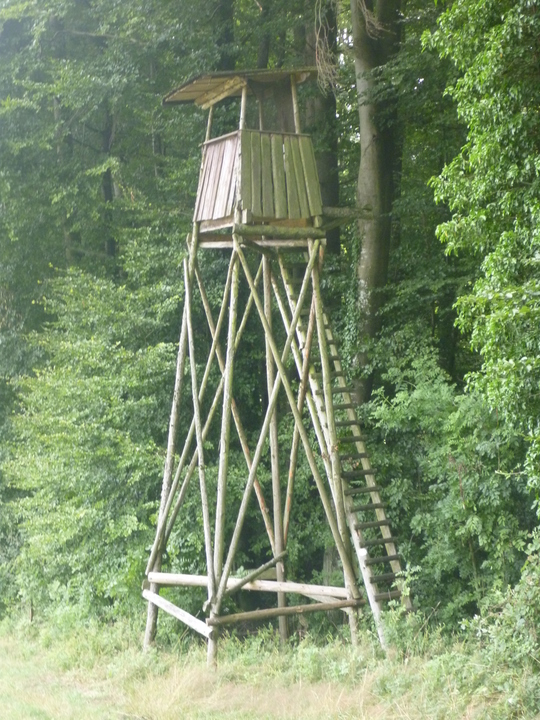
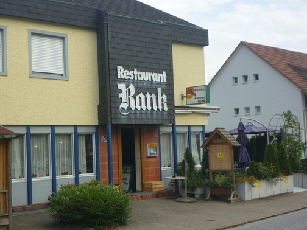

+++
title = "Procrastinating Like A Boss"
date = "2010-07-25"
slug = "procrastinating-like-a-boss"
type = "post"

[taxonomies]
categories = [ "Travel",]
tags = [ "Switzerland",]

[extra]
image = "posts/2010/procrastinating-like-a-boss/P1020706.jpg"

+++

So I had planned to do uni work this weekend, got next to nothing done.

Here's some of the photos that were taken in the name of procrastination.

I went for a walk up the mountain on the opposite side of Turgi this time.

The photo of me standing over a sheer cliff below looks a bit lame
when you can't see the cliff...

