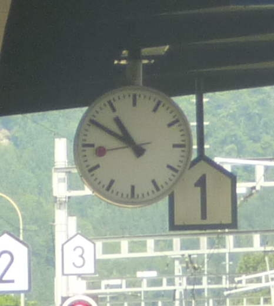

+++
categories = ['Travel']
date = '2010-07-11'
featured_image = 'posts/2010/radio-clocks/swiss_clock.png'
slug = 'radio-clocks'
tags = ['clock', 'Switzerland']
title = 'Radio Clocks'
type = 'post'

+++

One thing that is interesting (was to me anyway) that Trevor told me is that a lot of watches here are synchronized to a pulse transmitted over the radio. He bought one and was going to try and replicate it in Australia by generating a radio signal.

But the cool thing was that he claimed that the clocks at the train station have the second hand speed up for the last 5 seconds, then wait at the top of the minute until the pulse, before they move again. So essentially they clock stops until it gets the radio signal, so they are always synchronized.

So when I was at the train station I had a look and it's true. Here's a video if you weren't bored by this already and stopped reading.

_Edit: Changed to public YouTube link, as I took my video down._

[Video](https://www.youtube.com/watch?v=lJs2R0tX_Zk)

Oh and that's church bells you can hear in the background. They love them here, you hear them almost constantly. I actually paid attention yesterday and they were ringing from 7pm to 7.15pm like they are in that video, not just on the hour.