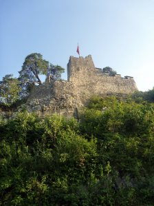

+++
title = "Ruine Stein"
date = "2010-07-14"
slug = "ruine-stein"
type = "post"

[taxonomies]
categories = [ "Travel",]
tags = [ "Switzerland",]

[extra]
image = "posts/2010/ruine-stein/p1020439-7646211.jpg"

+++

I was in Baden and noticed a cool castle-y looking thing on the top of the hill near the train station. I think it's the ruins of an old castle, or maybe just a lookout tower or something.