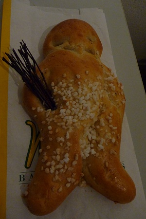

+++
title = "Saint Nicholas Day"
date = "2010-12-06"
slug = "saint-nicholas-day"
type = "post"

[taxonomies]
categories = [ "Travel",]
tags = [ "Switzerland",]

[extra]
image = "posts/2010/saint-nicholas-day/p1050907.jpg"

+++

So apparently today is [Saint Nicholas Day](http://en.wikipedia.org/wiki/Saint_Nicholas#Germany), and so at work we all got given an edible version of him.