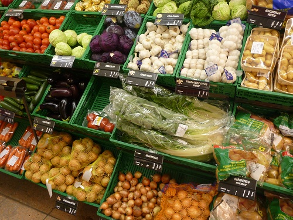

---
categories:
- Travel
type: post
date: '2010-12-19'
featured_image: posts/2010/swiss-food-prices/p1030269.jpg
slug: swiss-food-prices
tags:
- Switzerland
title: Swiss Food Prices
---

So a while back while talking to mum I said that meat was really expensive. She asked me how much it was per kilo for mince and I gave her a number off the top of my head - which she decided wasn't expensive at all. But since I have a horrible memory and probably was way off with the number, I have gathered here some prices of random stuff in Switzerland for comparative purposes.

Oh and in case you were wondering, 1sFr = $1.04AUD.

These Prices are from my local shop SPAR (IGA equivalent):

Banana's 2.95sFr/kg
Gala Apple's 4.60sFr/kg
Potato's 4.20sFr/kg

Pasta 1.15sFr for 1kg (Cheapest one - there are ones much more expensive than this)
Yogurt 1.95sFr for 500g
Eggs (Euro not Swiss) 2.50sFr for 10
Napoletana Pasta Sauce 3.20sFr for 400g
Home Brand Piccante Pasta Sauce 2.95sFr for 490g
Garlic Bread 1.70sFr
Home Brand Frozen Pizza (Ham & Mushroom) 3.90sFr for 375g
Home Brand Corn Flakes 1.75sFr for 500g
Milk 1.45sFr for 1L

For some reason the largest Milk you can get is 1L. They don't have 3L bottles. Also they aren't called "Full-Cream" or Lite or anything like that. They are named by the fat content, so you can get either 1.5, 2.5 or 3.5% milch.

Sausages 15-24sFr/kg
Chicken Breast 34sFr/kg
Chicken Nuggets 24.58sFr/kg
Salami 36sFr/kg

These are prices from the Coop in Baden (Woolworths/Coles Equivalent)

Banana's 2.85sFr/kg
Gala Apple's 2.40sFr/kg
Milk 1.40sFr for 1L

Coop Milch Chocolate 2.90sFr / 400g
Coop Nuss Chocolate 3.80sFr / 400g

The Home Brand chocolate from Migros and Coop are actually quite good. Toblerone and Lindt are just expensive here as in Australia and taste the same.

Also, prices for alcohol are surprisingly cheap:
15sFr for the cheapest scotch at Aldi (Muirhead's Blue Seal - 700ml)
10fr for a 10-pack of Feldschlösschen (cheap beer)
And I remember seeing Jameson Whiskey (18 Year Old) for about 30sFr.

I found another post that explains [How much cheaper are prices in Germany?](http://www.onebigyodel.com/2010/10/dear-frau-how-much-cheaper-are-prices.html) compared to Switzerland.

These prices are all just random ones I wrote down, so I'm sure you can find things cheaper or dearer in other places. Also take-away stuff here is MUCH more expensive than at the supermarket. For example Switzerland is the [3rd most expensive place to buy a Big Mac](http://en.wikipedia.org/wiki/Big_Mac_Index#Figures) and I remember seeing in Baden that a 6-inch subway was about $10.

So take these numbers as you will, I just wanted to have them written down so that when I say "Food is so expensive" to someone and they ask "How expensive?" I can answer with something better than "really expensive".