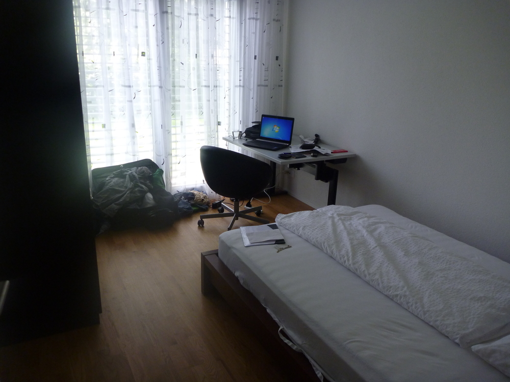
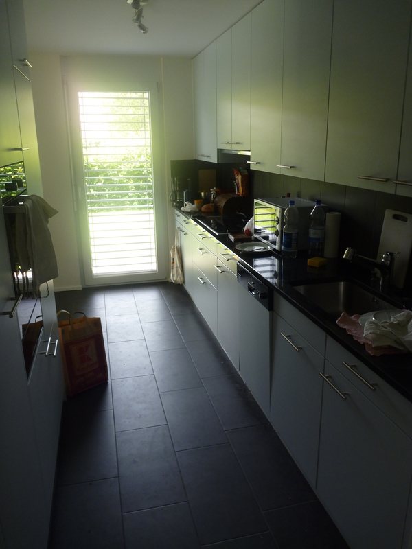
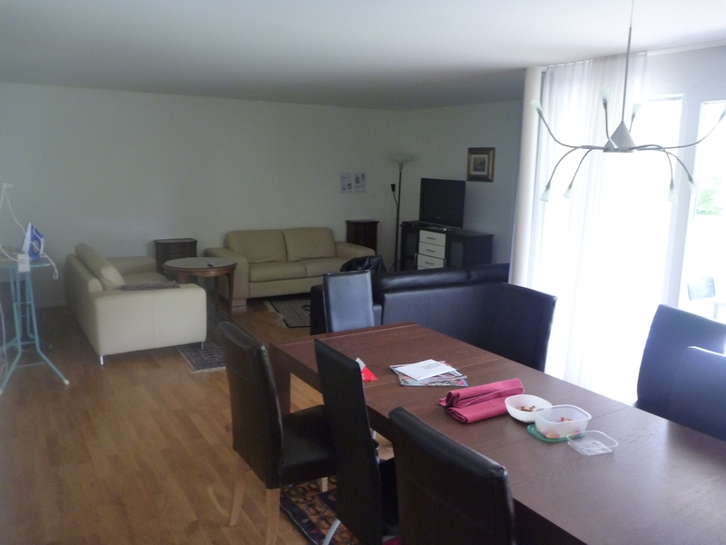
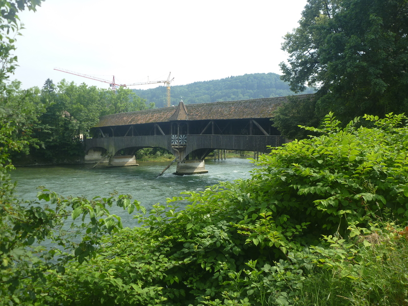
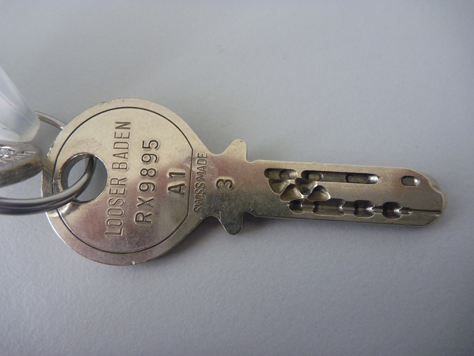

I'm staying at a 4 bedroom apartment at: [Spinnereistrasse 4, CH-5300 Turgi](https://goo.gl/maps/dyhCfB9MG2F2)

I'm sharing with 3 other people, a guy from Poland, a girl from Germany and a guy from Czech Republic. When I first arrived there was a guy from Germany here too (Jan), but he was only staying the weekend.

The apartment is pretty sweet, a photo of my room is above. And then there is 2 bathrooms and a shared kitchen/living room:

And outside is pretty cool too, there is a little deck sort of thing and backyard:

From the apartment it's just a short walk to work, across this cool bridge:

Oh and the key for the apartment is the most intense key I have ever seen:

