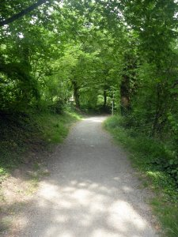
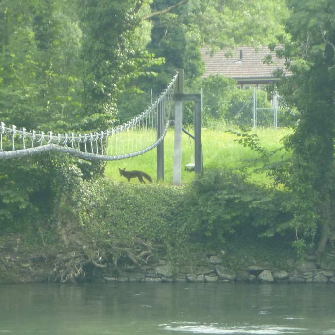

+++
categories = ['Travel']
date = '2010-07-02'
thumbnail = 'posts/2010/the-limmat-river/p1010788-754453.jpg'
slug = 'the-limmat-river'
tags = ['Switzerland']
title = 'The Limmat River'
type = 'post'

+++

[The Limmat](http://en.wikipedia.org/wiki/Limmat) is the river between my apartment and work.

There's a pretty cool walking path along it which I took some photos of yesterday.

There was this cable thing spanning the river which I took a photo of, and as I took it a fox (pretty sure it was a fox anyway) appeared out of nowhere.

