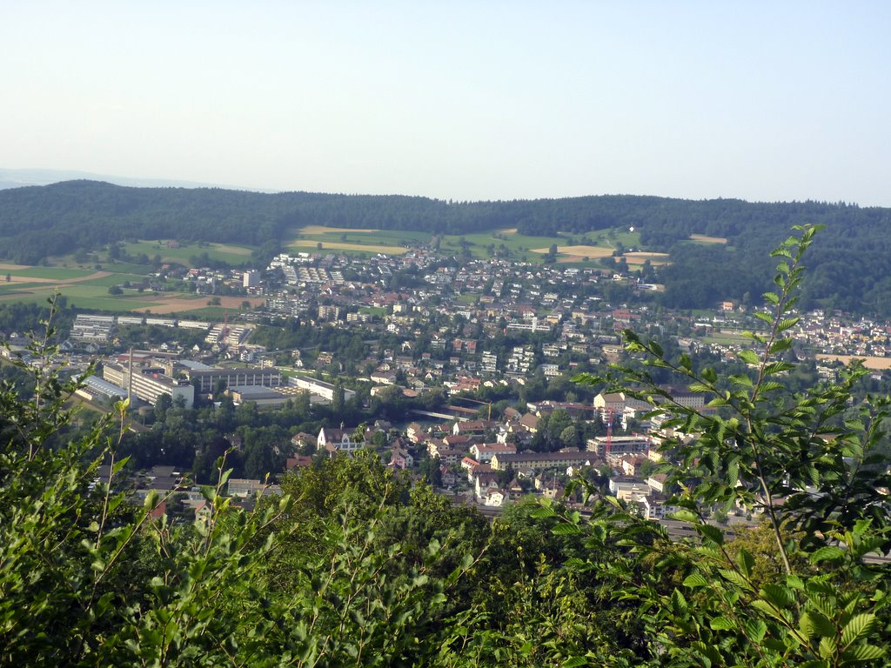
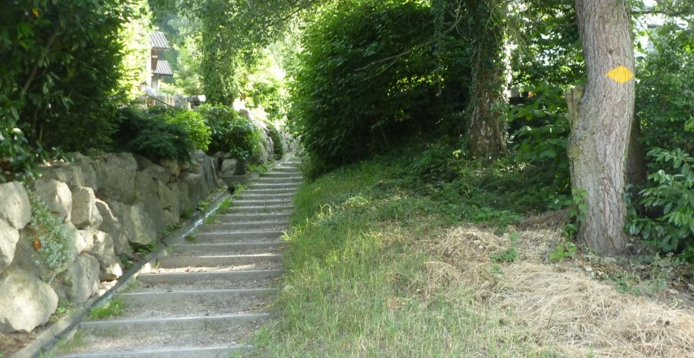
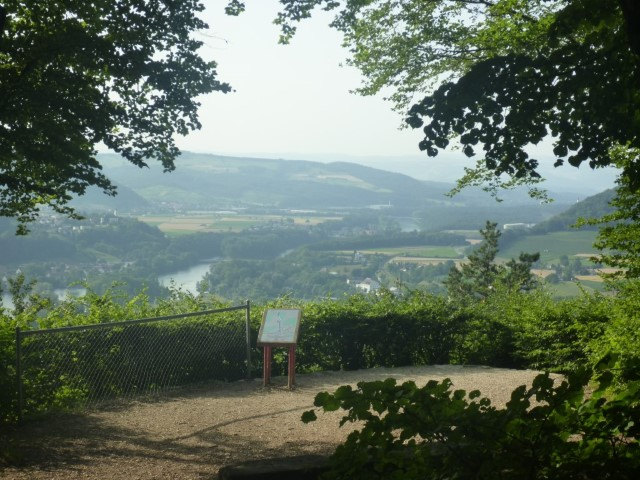
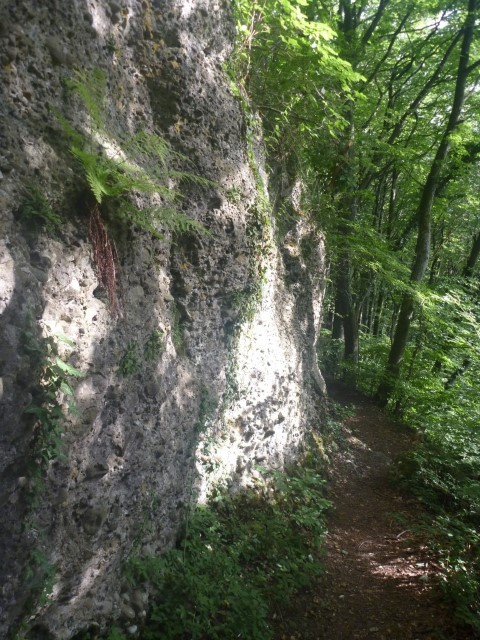
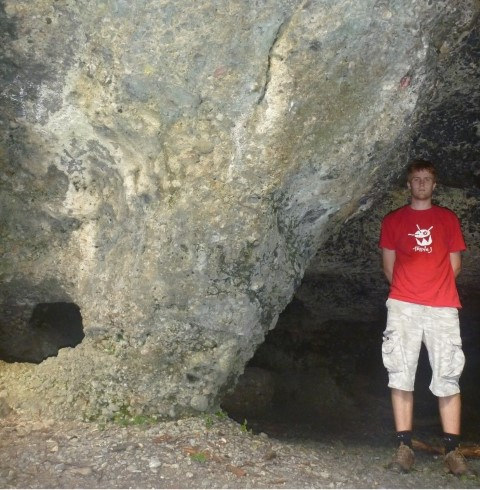

---
categories:
- Travel
date: '2010-07-11'
featured_image: posts/2010/wanderweg/p1020293-7743501.jpg
slug: wanderweg
tags:
- Switzerland
title: Wanderweg
---

I've seen enough signs since being here to work out that Wanderweg means that there is a walking path this way, or the yellow diamond painted on to a tree like in the next photo. Just used google translate and the word actually translates to "trail" but I got the idea.

So next weekend I am doing a Rafting/Hiking weekend and it said that you need to bring hiking shoes, so yesterday I went in to the closest big shopping centre in Spreitenbach to buy some. That's actually the town I ended up at after walking home after Zurich Fest.

So after I bought some I decided I go for a walk up the mountain behind Turgi, as I noticed a Wanderweg sign at the train station pointing that way.

It was actually a really hard climb, quite steep and a very narrow path. It was quite a hot day too, so it wasn't easy going. The view from the top was quite good though, as you could see all of Turgi and Brugg and see the Limmat river.

There was also some weird rocks formation things along the way, with a really big one up the top that was like a cave. Here's the pictures anyways so you can look for yourself.

