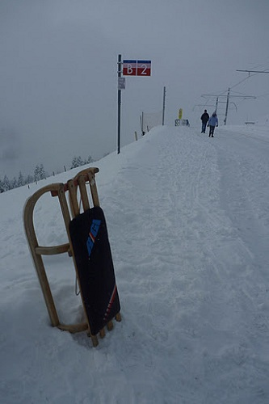
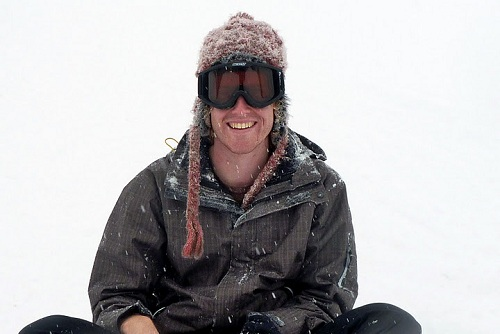

---
categories:
- Travel
date: '2010-12-27'
featured_image: posts/2010/weihnachten-in-der-schweiz/p1060216.jpg
slug: weihnachten-in-der-schweiz
tags:
- Christmas
- Sledding
- Switzerland
title: Weihnachten in der Schweiz
---

Christmas in Switzerland did not feel like Christmas at all to me. That is not to say it wasn't a great day - just that I didn't do anything particularly Christmas-y. Or more specifically without having a meal with the rellies it doesn't feel like a real Christmas.

But I did have an interesting day. I went with Roderick to Mt. Rigi, near Luzern, to try Schlitteln (sledding) for the first time. The weather wasn't great and there was hardly any visibility - but at least it was a white Christmas.

Sledding was quite scary at first. Neither of us were really sure how to turn or break, and combined with the fact that the track was both steep and windy had us slightly concerned. Eventually we decided the best way to stop and turn was to simply dig your feet into the snow. I was wearing just normal shoes and socks so am very surprised that my feet didn't fall off. They were basically submerged in snow for the entire day.

Once we stopped trying to lean to turn and used our feet, it was much more fun, although still difficult. The snow was perfect, fairly icy on the main track but glorious powder if you strayed just a little. It meant that it was possible to get some good speed but when I failed to turn and continued off the track, I landed in soft powder.

Christmas lunch was a measly hamburger which I bought at the restaurant at the top of the mountain, but having a Glühwein did have some Christmas feeling to it.

For the last run of the day I accidentally led us on to a ski run, which was incredible fun although at one stage we did have to traipse through metre deep powder. This wasn't as fun as it sounds as there was zero visibility so we had no idea where we were going and my shoes filled up yet again with snow. Once we made it back onto some firmer snow the run was insane.

I took some videos which I will put up probably once I have gotten back to Australia. All in all, it was a very different Christmas.

