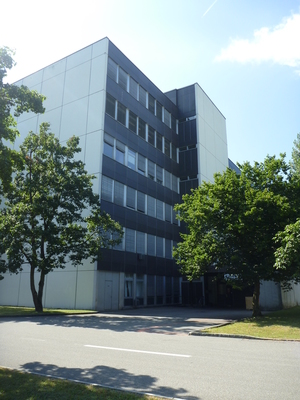
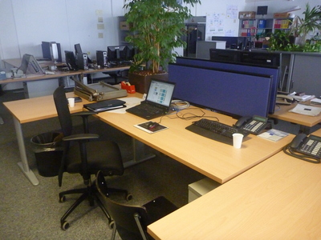
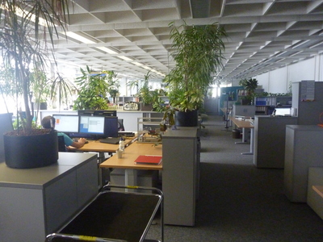

+++
categories = ['Travel']
date = '2010-07-07'
featured_image = 'posts/2010/working-at-abb/p1020234.jpg'
slug = 'working-at-abb'
tags = ['Switzerland']
title = 'Working at ABB'
type = 'post'

+++

So some people weren't sure if I'd actually started work yet, so thought I would do a post about where I'm working. I started on Thursday 1 July and finish on the 31 December.

So far I have mostly been reading about Simulink and the project I will be working on and settling in. Tomorrow and Friday I am doing a training course.

Work itself seems like it will be very interesting and should be fun. ABB's official language is English, so most of the documentation and stuff is in English - but they have German keyboards with the z and y keys swapped around which keeps stuffing me up, and most of the signage and news and stuff up around the office is in German.

As English is the official language, everybody speaks it pretty well, although most people seem to talk in German when they can, but will speak in English when talking to me.

I work in the third floor of this building (although I will be working in the lab later on).

The office has *actual* plants in it, not plastic ones like Ergon. And I'm promised that I will get some dual screen monitor action soon for my laptop.

At 12.30 everybody goes to lunch at the ABB restaurant. The menu is in German, but they have the meals on display so you can see what they look like. They have a different menu each day, [and put it on the net](http://aubruecke.sv-group.ch/de.html).

So far the meals have been pretty nice, there was one that was pretty average. At least I get to try a different meal each day, and they are different to what you would probably get in Australia. Meat over here is expensive as, so there isn't much actual meat in the meals :(

