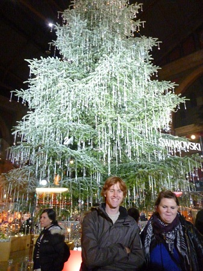

+++
categories = ['Travel']
date = '2010-11-26'
featured_image = 'posts/2010/zurich-2/p1050509.jpg'
slug = 'zurich-2'
tags = ['Christmas', 'Switzerland', 'Zürich']
title = 'Zürich Christmas Markets'
type = 'post'

+++

So my cousin Kate was in town, so I went in to Zürich to say hello on Wednesday.

In the train station now they have a giant Swarovski Christmas tree and some markets were open. Besides this, Zürich was as dull as usual, but it was good to have a chat to Kate. When I came back into Turgi I saw they now have Christmas lights up in the main street, which was pretty cool.

Thursday the 25th November marked one month until Christmas! They now have a Christmas tree at the restraunt at work and a big one at the train station in Turgi. And they have started playing Christmas songs on the radio at the Spar.

I went back into Zürich to see Kate again and the turning on of the Christmas lights in Zürich. The lights looked awesome. I didn't actually see them get turned on, but Kate said there was a pretty underwhelming marching band and it wasn't that exciting. The lights look awesome though. The Christmas Markets were open and they were selling all kinds of Christmas ornaments and other cool stuff. It was all really expensive though.

All the other times I've been to Zürich it has been pretty dull, but the white Chritmas vibe was incredible. There were people singing carols, Christmas trees and lights everywhere. We went to a stall and got some mulled wine with honey. I wasn't expecting it to like it, and just wanted to give it a try, but it turned out to be really nice.

We went to the IAESTE weekly meeting for a bit, then I had to go home and get some sleep before work the next day. As we were about to leave it got really cold and was starting to rain. By the time we got to the train station it got a bit colder still - enough for it to start to snow! By the time I got to Turgi it was snowing fairly heavily - although it was still a bit watery. It was by far the best walk home from the train station watching it snow with the Christmas lights all up in the street.

This morning everything was covered in snow. Not very good snow, it is very patchy and icy, but the walk to work was incredible. Everything looks cooler with snow on it.