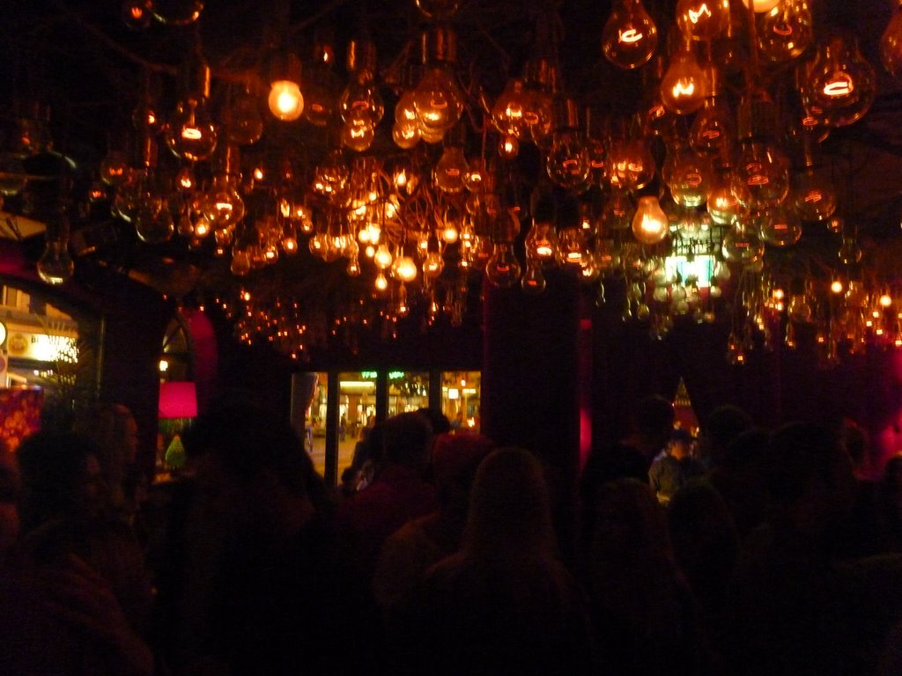

---
categories:
- Travel
date: '2010-07-24'
featured_image: p1020663-7232401.jpg
slug: zurich
tags:
- Switzerland
- Zürich
title: Zürich
---

Went out to some pubs in Zürich last night.

Had a very expensive rum cocktail which was nothing on just normal plain rum, some relatively cheap beers, and found some Famous Grouss, but was talked into buying a rum and orange juice thing which was okay. But I took a photo of the grous for Mr Hooper and Tommy P. The drinks were real expensive but, even for clubs.

The pub where we got the beers was really cool, had lightbulbs everywhere on the roof, played good music (Little Yellow Spider for example) and had a cool vibe.

Then we experienced some Swiss culture (I was out with a german and swiss guy) and bought a cheeseburger from McDonalds.