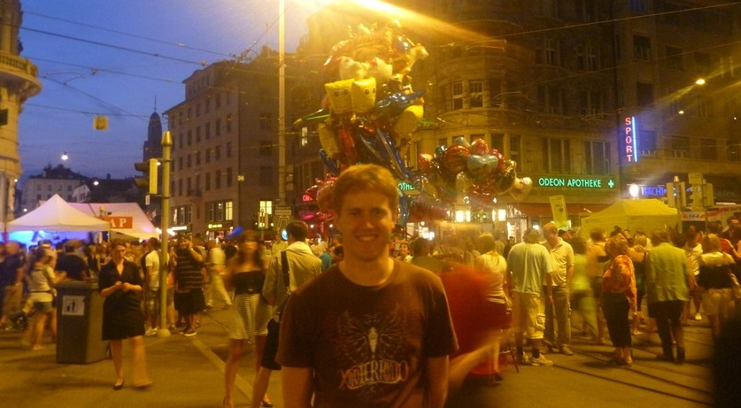
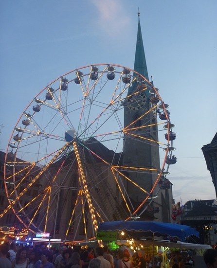
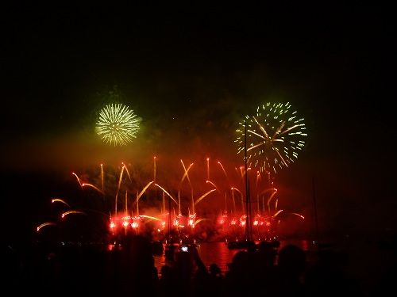

---
categories:
- Travel
date: '2010-07-03'
featured_image: p1010928.jpg
slug: zurifascht-2010
tags:
- Switzerland
- Zürich
title: Zürifäscht 2010
---

After Baden, I headed into Zürich for Zürifäscht, which I had no idea what it was but was something to do. Basically it was like Fire in the Sky in Rockhampton, but much, much better.

I heard about it through IAESTE (International Association for the Exchange of Students for Technical Experience ) who organised my visa, and put on trips and stuff for everyone over here on a placement.

On the train I met three people in IAESTE by chance, one guy from England had even done German lessons with Quinny back when he was over here. So followed them into town and met up with some more IAESTE people, and hung out with them for the night, they were all fairly rad. Most of them are doing electrical engineering as well, so it's sort of like a multinational EUS.

Another crazy thing I didn't realise about Switzerland is there is no law against drinking in public, so people were cracking 6-packs on the train left right and center, and everyone was drinking in the streets. Didn't seem to cause any issues though, and even though there was millions of people in the streets everyone seemed to be having a good
time and I didn't see any fights or anyone acting like a dickhead, which is amazing. Zürich is a beautiful city, as I'm sure you can tell from the photos below.

One more thing that is taking some getting used to is how long the daylight lasts. Being summer, I think the days lasts for 15 hours or something ridiculous. Basically I hadn't seen night time here until last night. I woke up at 6 and the sun was up and it didn't get dark until about 10 at night. Most of the photos below were taken after 9pm and it still felt like late afternoon.

The actual fireworks themselves were so much better than anything I had seen in the past. Unlike in Australia, they didn't just set them off randomly, it went for 30mins and was synched to music. I'll try and put up a video soon.

After a massive walk through crowded streets back to the train station, there was two choices for a train that I could make out. A commuter train at 1.24 or an express train to Baden at 2.06. I didn't really want to wait around for an hour for the express train, so got the commuter train, not knowing at night time they don't go all the way along the line. So the train I got stopped about half way to Turgi, at Otelfinen, which was the last train of the night until 6am the next day, so I was stuck there.

I was pretty tired and didn't want to have to wait till morning, so started walking to Baden, hoping I would get there in time to get another train. Without really knowing where I was going, I headed in the general direction along some Swiss Countryside. At one stage I was walking past all these crops and saw two foxes run across the road. [This](http://maps.google.com.au/maps?f=d&source=s_d&saddr=Otelfingen+Station,+Switzerland&daddr=Killwangen-Spreitenbach&hl=en&geocode=FeMa1AIds_t_ACmj1aP9TA2QRzHqIVV9SdyVdQ%3BFXzG0wIdknl_ACmrz6dzmhKQRzGICdZA82QOdw&mra=mr&dirflg=w&sll=47.444285,8.38068&sspn=0.02705,0.084543&ie=UTF8&ll=47.446897,8.390808&spn=0.054098,0.169086&z=13) is where I actually ended up walking, which would have taken me 52mins according to google. Then luckily at the station I ended up at randomly there was a train to Turgi leaving about 2mins after I rocked up so I caught that home.