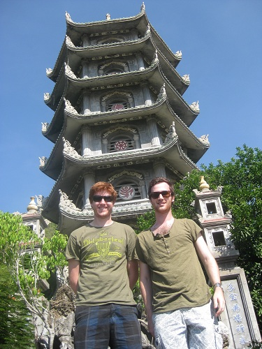
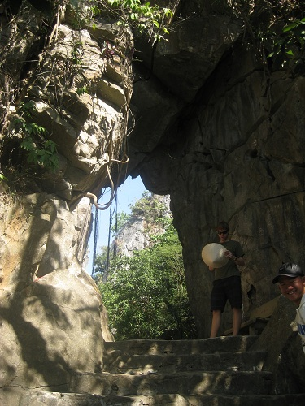
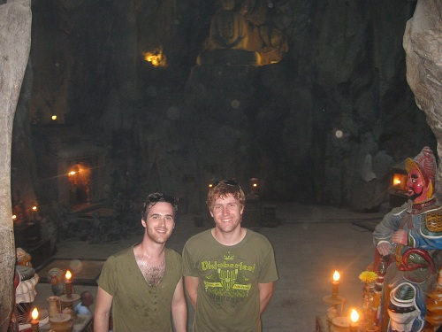
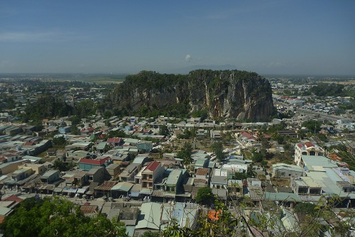
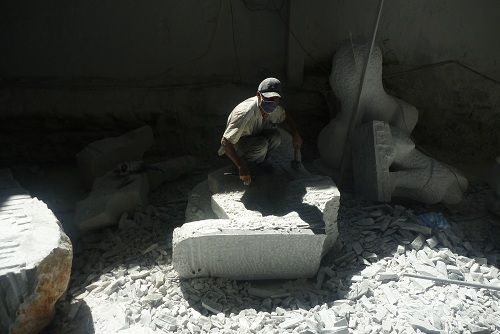
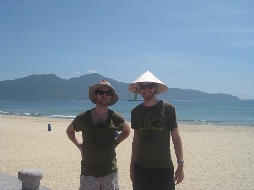
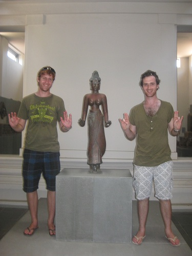
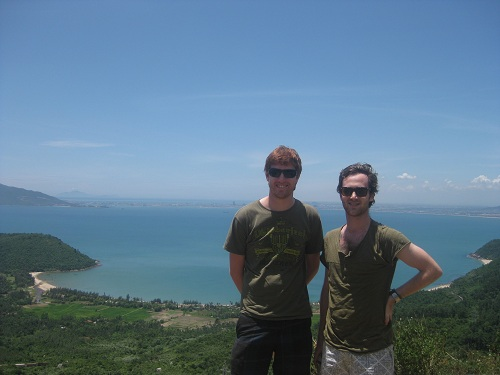

+++
categories = ['Travel']
date = '2011-07-27'
thumbnail = 'posts/2011/hai-van-pass/img_1921.jpg'
slug = 'hai-van-pass'
tags = ['Vietnam']
title = 'Hai Van Pass'
type = 'post'

+++

Our next destination was to be Hue, but this time we got to take the scenic route rather than fly.

First up, we were taken to the marble mountains which had a massive stone staircase to the top, at which there was various temples and Buddhist shrines.

There was a massive cave which was used in the war to hide from the American troops. There was a hole in the ceiling where it had been bombed during the war.

There was lots of tourists at the mountains, but unlike the places we had been previously, a lot of them were Vietnamese. Lots of families asked us to get photos with them. It was as if we were celebrities - very weird.

At the base of the mountain were various stores at which marble sculptures were sold. They used to use marble from the mountains, but now it is imported. The sculptures were very impressive and the amount of work that must go into them is insane.

We stopped quickly at China Beach for a photo. It was scorching hot on that day, so we tried not to stay in the sun too long and left pretty quickly.

We stopped at a museum at which there was various Hindu statues. These were taken from various ancient temples and yet it was all there with no security. It was a pretty different experience to say the Louvre where everything is behind glass.

To get to Hue from Danang we travelled along the Hoi Van Pass, which had a magnificent view but was a pretty dangerous road. We overtook a petrol tanker at one stage around a blind corner and nearly hit a bus.

After that, the road to Hue was quite uneventful. We were pretty sad to be leaving our tour guide and driver behind, as they had been super friendly guys and great to have with us.

