images: 2011-08-02-halong-bay/P1080464.jpg

We got a bus from Hanoi to Halong, and were joined by some other travellers, most of which were from Australia except for 3 people from New Zealand. Our guide Viet informed us that if we were lucky we might still be able to stay the night on the bay, and that they were making some calls, but that it was up to the government as they had closed the bay to all boats as a safety precaution.

We visited some rice paddies and another marble factory on the way.

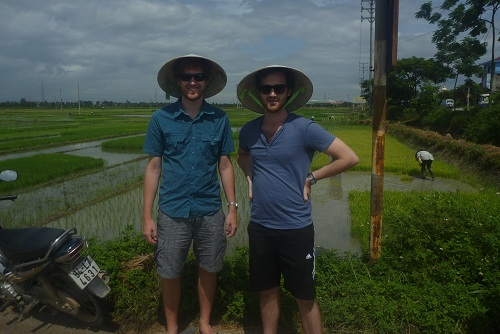

It started to pour rain while we were at the marble factory and so we didn't have high hopes of being allowed on the boat, but our guide gave us good news when we were back on the bus that we would not only be allowed out on the boat, but they we would be staying the night.

We arrived in Halong to find that the weather was perfect.
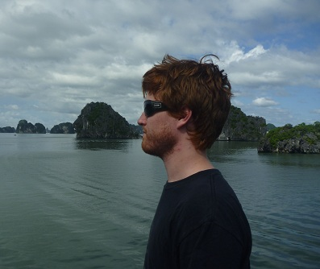

In the afternoon we got to go inside a small cave that opened up inside one of the islands. We were told that there was monkeys living on the island, but we didn't see any. Then in the afternoon, we got to go for a swim - jumping off the boat into the water. I had two attempts at a front flip - both of which ended in immense pain from me doing a backflop.

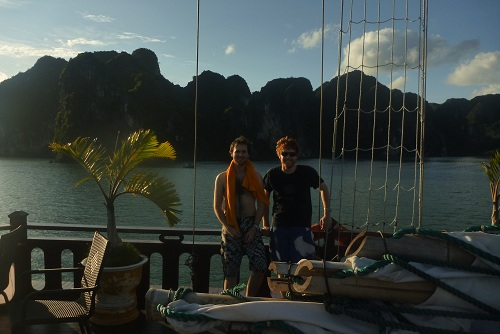

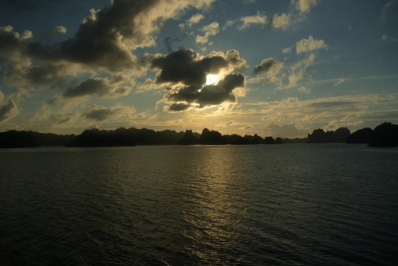

The food was excellent, we got course after course of delicious seafood. At night we stayed up on deck drinking beer and talking to the ship crew and the captain even challenged me to a game of chess. The crew was really young and cool to talk to.

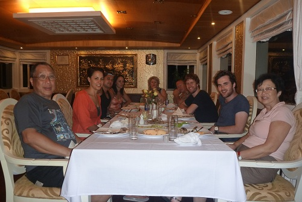

The following day we anchored at a beach, and found a track that took us to the top of the island from which there was a magnificent view - probably one of the highlights of the whole trip for me.

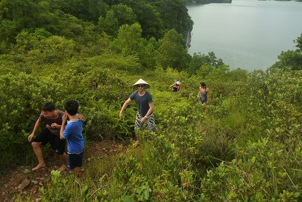

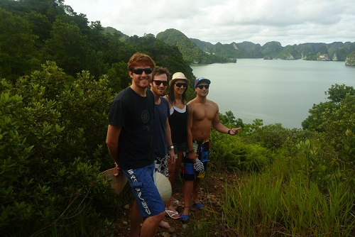

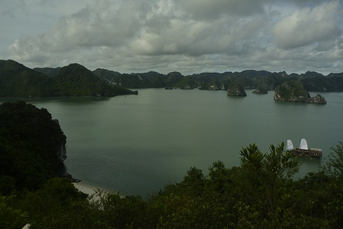

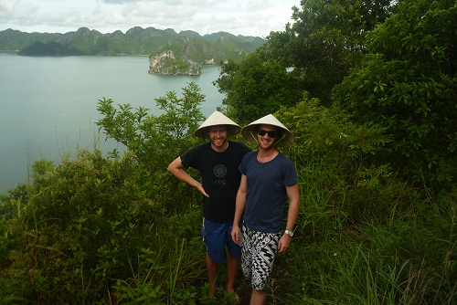

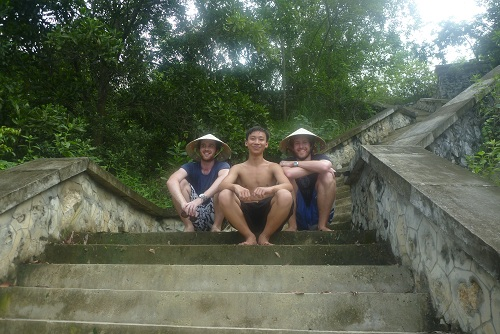

When we were back on the mainland and on our way home, Viet informed us that they never actually did open the bay back up to boats and that in fact they had basically bribed the port authority to allow us to go out. It was super dodgy and so they hadn't told us in advance in case it made us worried. It explained why there was so little boats out on the water. It made the trip even more special as we basically had the bay all to ourselves with the exception of the local fisherman that lived out on the water. I don't think many people would have had the same experience, and when we talked to the guys that went the week before us, they told us of how there had been tonnes of boats on the water with people coming up to your boat peddling goods.

The bus ride back to Hanoi was fairly uneventful, with the exception of some really intense near-misses with oncoming traffic and some cows that were wandering on the road.
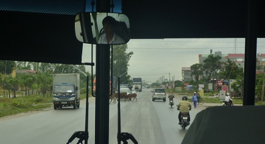

On our last night we went to dinner with our kiwi buddies, and had some awesome Prawn Hot Pot.
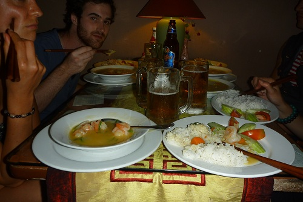

Vietnam was an awesome country, much better than I was expecting and I would love to go back some time and see some more of the rural areas as opposed to the cities.
