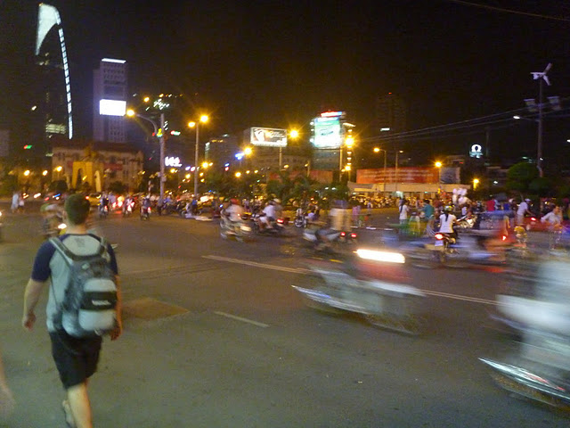
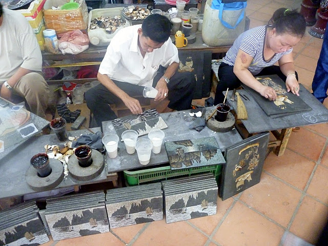
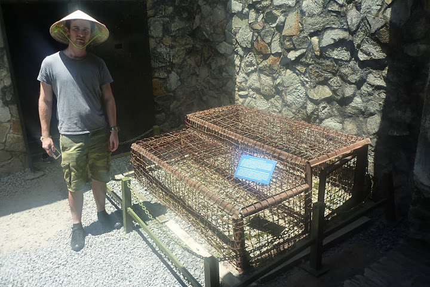
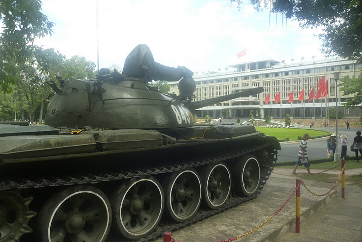

+++
title = "Ho Chi Minh City (Saigon)"
date = "2011-07-23"
slug = "ho-chi-minh-city-saigon"
type = "post"

[taxonomies]
categories = [ "Travel",]
tags = [ "Vietnam",]

[extra]
image = "posts/2011/ho-chi-minh-city-saigon/p1070481.jpg"

+++

We arrived in Saigon to see our driver out the front of the airport with a sign with our names on it, which was a bit of a luxury. However, we had barely even read the sign before he waved at us and walked off, looking back every now and then to make sure we were following. Then he pointed at the taxi pick up zone and disappeared. We were still trying to remember what he looked like when he came back with the car and we got in - it was pretty funny watching Tom trying to make small talk with the guy, as he didn't speak any English and had no idea what we were saying.

The traffic was exactly how we expected it, and yet it wasn't. It's just as busy as you see in videos, but somehow it all just works and for some insane reason I felt just as safe as in the traffic back home. The main difference is the sheer amount of motorbikes on the road, they were everywhere and heading in all directions.

Our hotel was well situated in the middle of the city, and had a pretty schmick lobby. Once we got out of the elevator on our floor, we were greeted by some truly stuffy air, it was probably the stalest air I have ever tasted, even staler then when we leave the beach house locked up and air-tight for a few months. In the room it was a bit better, and we had air-con that cooled us down. We had some complimentary water waiting for us, which was a good reminder that we couldn't go trusting any tap water in Vietnam.

We dumped our bags and then went out to quickly explore the nearby [Bến Thành Markets](http://en.wikipedia.org/wiki/B%E1%BA%BFn_Th%C3%A0nh_Market), which had all kinds of clothes and watches for super cheap prices. There was also some epic looking food, and we saw crab being cooked on a grill in the middle of the street. The night market was literally just people set up stalls in the middle of the street, and motorbikes weaved around us as we looked at all the stalls.

The next day we decided to join a tour of the [Chu Chi Tunnels](http://en.wikipedia.org/wiki/C%E1%BB%A7_Chi_tunnels), which was $12USD including the bus out there. On the way we stopped at a handicapped art factory, where disabled people made beautiful paintings and carvings out of duck shells and Halong Bay clams.

The actual tunnels probably wouldn't have been that exciting by themselves but when you are told the history it was incredible. The tunnels were tiny and yet the Vietcong lived underground in them for years. It would have been horrible. We saw a crater in the ground were a B52 bomb had hit, and got to crawl through the tunnels and see how small it all was.

The next day we went off to see the [American War Remnants Museum](http://en.wikipedia.org/wiki/War_Remnants_Museum_%28Ho_Chi_Minh_City%29). This was pretty horrifying as well. It is full of photos from the war, but worst of all for me was the Agent Orange room, which had mutated foetuses in jars showing how a lot of the babies born in the years after the war were mutated. There was photos and photos of mutated people and it explained why there was so many handicap factories across the country. It had a very anti-American feel to the place, but seemed pretty justified. Below is a tiger cage, which apparently was used to keep up to 7 people in each cage.

We then went to the [Reunification Palace](http://en.wikipedia.org/wiki/Reunification_Palace), where the war was ended which was the old presidential palace. It had some pretty cool rooms, the war room in the basement was quite interesting.

On our last night, we went to see a [Vietnamese Water Puppet Show](http://en.wikipedia.org/wiki/Water_puppets). It was much cooler than I expected. There was a live band that narrated the show - in Vietnamese, we had no idea what was going on but it was pretty impressive regardless.

