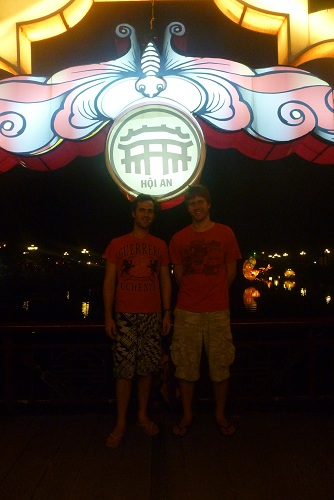

After flying from Saigon, we arrived in Danang International Airport. It was about the size of Rockhampton airport but super dodgy looking for an 'international' airport.

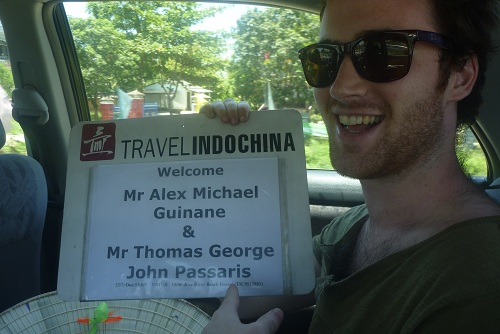

Our driver took us to Hoi An, and on the way we picked up our tour guide (that we did not know that we had paid for). Our guide recommended a place to get some suits made, so we headed there first. We went to a tailor called Blue, and got fitted for our suits. I just wanted a suit, and didn't much care or know what I wanted but the ladies at the shop wanted us to specify everything down to the tiniest detail, even asking us what angle we wanted our pockets to be at.

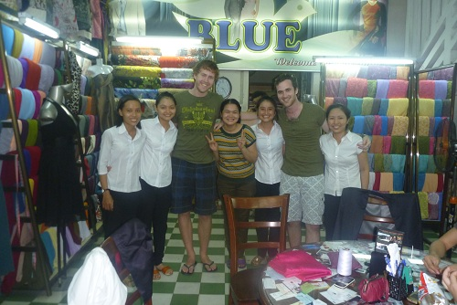

After we chose our materials and got measured up for our suits, we got taken to our resort, the Riverside Beach Resort. It was super impressive and had an awesome view of the river, and right near the beach.

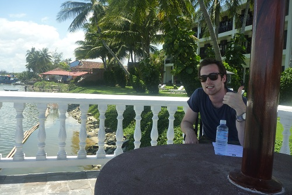

After checking in , we tried to find somewhere to have lunch, and went to a place across the road and got some tiger prawns. Notice the clothes shop within the restaurant. It was here we first discovered the awesome local beer that is Biere Larue.

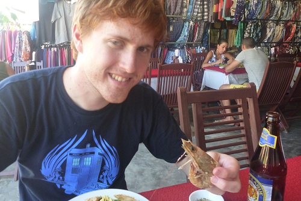

After some lunch we headed down to the beach.

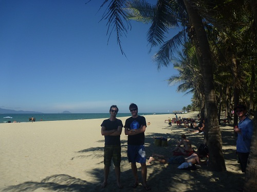

Tom decided in the afternoon that it was time to get food poisoning, so I chose something to read for the resort's library of clearly pirated and photocopied books and enjoyed the view of the river.

The next day, Tom was feeling a little bit better and we had an appointment back in the city for the first fitting of our suits, so we hired some push-bikes for the day (for $5) and went for a ride into town.

The traffic was much calmer than in the city, but we still had to pay close attention to everyone around us, as there was the same disregard for the road rules. Riding bikes was super fun, and we got to see a lot more of the city.

In the afternoon we went for a ride out of town a bit, and had some local kids run after us on our bikes yelling "Hello" over and over. It was pretty special because they seemed genuinely excited to see us and talk to us in English.

At one of the western restaurants we went to, we got Banana Pancakes. I'd never had them before but wanted to see what the fuss was about in the Jack Johnson song.

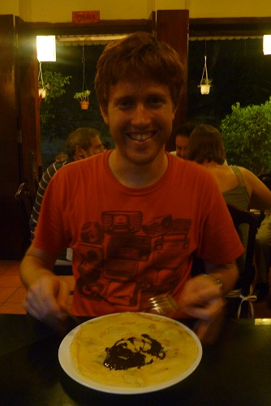

We had signed up for Red Bridge Cooking School, and part of the tour was to visit the local markets. I'm not sure if it's a good thing seeing how unhygienic everything is, but at least we knew everything was fresh.

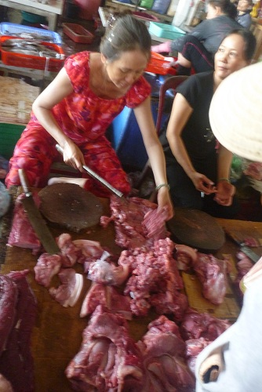

The actual cooking class was excellent. The chef was hilarious, everything was set-up and ready to go and the food tasted amazing.

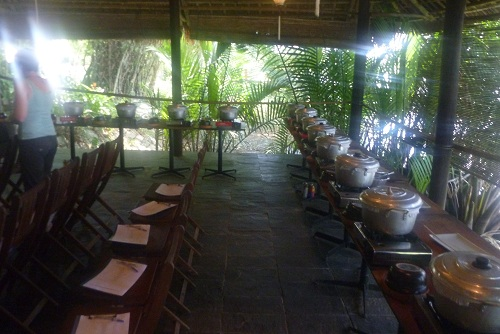

After our cooking class, our guide took us to a local pub, where he shouted us beers that cost about 15c a bottle. We also got to try some sea snail despite being ridiculously bloated from gorging on all the amazing food we cooked earlier.

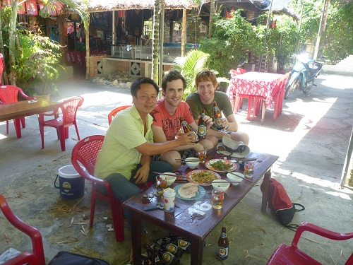

A French tour guide joined us for a drink as well, as it was his birthday. A good time was had.

On the beach there was various jet-ski's in the water that you could hire. It was pretty fun riding along, but they were slower than I expected. Tom said the one's in Australia are much faster and more fun, as these one's had clearly been thrashed.

Exploring the city on our last night, they had lanterns floating down the river, and the whole town seemed to be out and about. It was extremely beautiful.

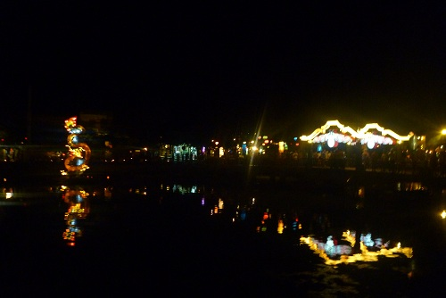

Hoi An was probably one of the highlights of our trip to Vietnam, it's very touristy (especially Australians) but still an authentic and awesome beach town well worth a visit.
