+++
categories = ['Travel']
date = '2011-07-27'
thumbnail = 'posts/2011/hue/p1080207.jpg'
slug = 'hue'
tags = ['Vietnam']
title = 'Hue'
type = 'post'

+++

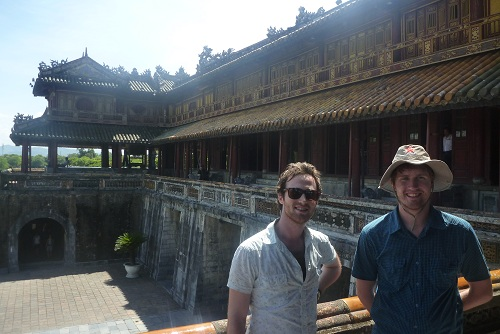

Upon arriving in Hue, we had a quick walk around the city in the afternoon to see what there was to do, and made our way to the markets. They were rank, they really even worse than the one at Hoi An, which is saying a lot. We really couldn't find anything interesting to see, so we booked a tour for the next day to the outlying areas, as we hadn't planned anything and didn't no what else there was to do.

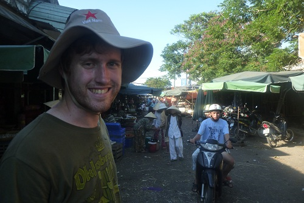

Tom was really keen to get a cheap massage while we were in Vietnam and as we had nothing else planned it seemed the best opportunity. I had never had a professional massage before so was up for it, but we both agreed we didn't want to go to any dodgy places where they might "love you long time", so we just went to the one at the hotel. Turns out it was a bit dodgy after all and we had to make it clear that we weren't looking for 'extras'. There was a Thai dance school there that night performing as well, and they made us (everyone) dance with them for a bit at the end.

The next day we went on our Hue tour. It didn't get off to a great start, as the air-con on the bus was broken and it was another scorcher of a day. First up was the [Minh Mang Tomb](http://www.vietnamtourism.com/hue/e_pages/lt_lminhmang.htm). There was hardly anyone there and it was nice and peaceful compared to everywhere else we had been on this trip. There was a few cool temples but mostly it was just a huge garden.

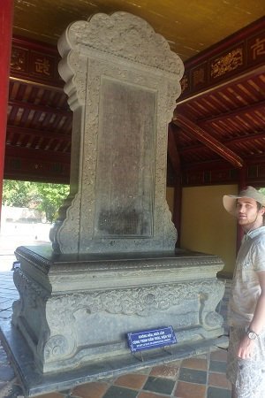
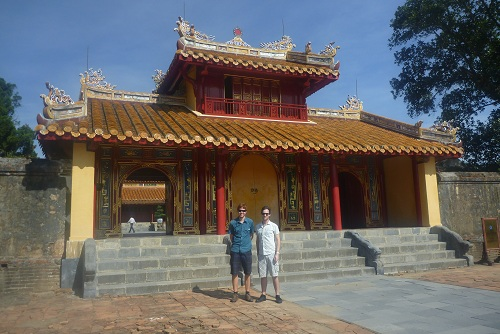
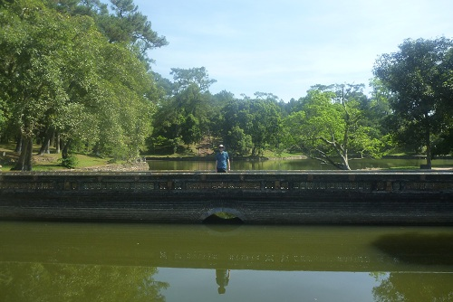

The next tomb, the [Tomb of Khai Dinh](http://en.wikipedia.org/wiki/Tomb_of_Khai_Dinh), was completely different, with no plants at all. There was some cool looking statues and the building had some incredible artwork inside.

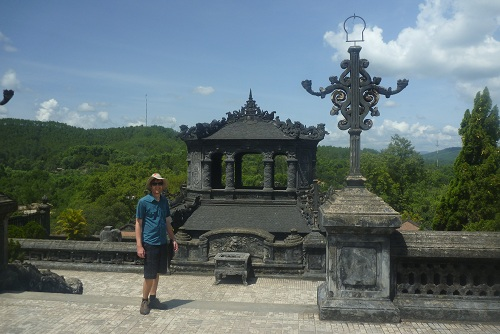
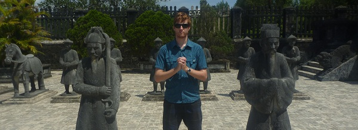

We then went to see a Kung Fu show, which was super impressive. A kid did the break bricks with your head trick, and while he managed it, it clearly hurt like hell as he was rubbing his head for ages afterwards.

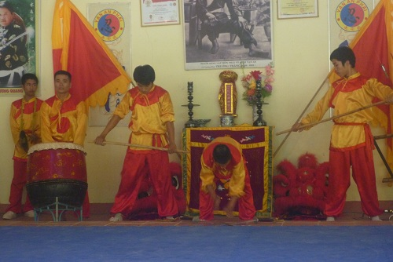

We also went to a village where they make Conical Hats and Incense. There was some paintings there as well, as there is all over Vietnam but I thought this one looked especially cool.

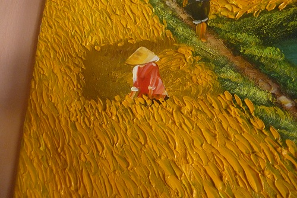

The final tomb ([Tu Duc](http://en.wikipedia.org/wiki/Tu_Duc))we didn't enter, as we were told it was pretty much the same as the Minh Mang Tomb, and so we saved ourselves some money on the entry. Tom had an argument with a local, when he bought a coke and it took ages for the lady to give him change for what would have been about $50. I was pretty sure she was going to pretend that he never gave it to her, was quite amusing but concerning to watch.

In the afternoon, we visited the [Imperial City](http://en.wikipedia.org/wiki/Imperial_City,_Hu%E1%BA%BF) and then the Forbidden City within. It was sad to see how much had been destroyed in the war.

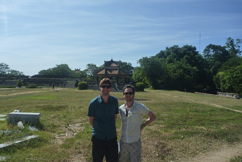

Last stop was the [Thien Mu Pagoda](http://en.wikipedia.org/wiki/Thien_Mu_Pagoda). The highlight of which for Tom and I was that they had the car from the famous image of the [Burning Man](http://en.wikipedia.org/wiki/Thich_Quang_Duc#Self-immolation), as the monk had come from that temple.

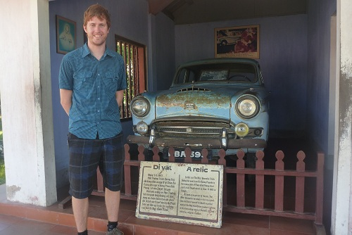

From here we got a boat back down the Perfume River to Hue.

At the end of the day, back at the hotel, Tom was talking to Lily and she asked us how our bike rides went. It was at this point that we realized that we had booked a bike tour for Hue, and that is why we didn't have anything else planned. So we wasted about $25 and missed out on visiting some local villages. Oh well, the day was so hot we were thoroughly relieved that we hadn't spent it riding pushbikes.