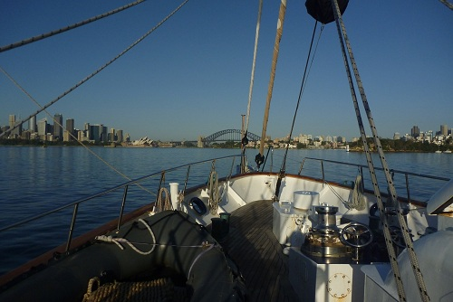

First thing every morning we were woken by a song being played over the loudspeaker. On most days we had to come up on deck and do laps of the ship until everyone was up. Then every morning there is a morning brief.

At morning brief we heard the plan for the day from our Sailmaster Kristy, a quote from Captain Damien, an always long talk from the Navigator Matt about our current position and where we were going, as well as a visit from Nanna (Mick the Engineer in a dress and wig)  who raided the berths for clothes/stuff left on the floor (and not neatly put away in our lockers like they are meant to be) to be shown off to everyone.

Rick was from the navy and on a suitability test, which is pretty much the greatest job interview ever. He started the first half of the journey as a youth crew like us, then about half way switched to a staff role and started running events. Every day nanna would somehow find something of his, even though he made sure it was all put away and even went as far as keeping it hidden in another room (in which case they brought up his Thomas the Tank Engine pillowcase up instead.

Salty Seadog (Watch Office Dion) would then tell us the story behind one of the nautical terms used on the ship and finish with a pirate saying. The explanations from Salty became more and more ellaborate each day, with the rest of the staff dressing up and acting out the stories. The term for the first brief was "SHIT". Swearing was not permitted on board, with the exception of shit, which salty explained why. It was an old nautical term that stood for Store High In Transit, and was used on crates of fertilizer to ensure that they weren't stored below deck where the fumes would make it difficult for people to breathe. Like most of the stories Salty told us, this [isn't actually true](http://en.wikipedia.org/wiki/Shit#Etymology).

After morning brief, nanna would teach us all a new shanty which we would have to copy. Despite being sea-themed they were essentially just nursery rhymes with different words.

In the morning we learnt line skills, and how to handle lines and sheets (ropes) safely and put turns on to the pins and [cleats](http://en.wikipedia.org/wiki/Cleat_(nautical)). Learning the nautical terms for everything on the ship was also something we practiced, so we could beat the other watches at the upcoming rope races.

In the afternoon we did some mainies in the harbour, as we learned how to set and furl the sails and [tack](http://en.wikipedia.org/wiki/Tack_(sailing)) the ship. One of the youth crew was feeling sick so we waited around for her to go ashore and see a doctor before she was came back okay and we finally got to leave the harbour.

As we left the heads it immediately got rougher and some of the girls started to get seasick. As we were preparing to tack the ship someone spotted a whale and so we all stopped what we were doing. Then nobody could see it so we got ready again and just as we were about to heave we saw it again and it did a massive flip right next to the ship. Talking to the crew afterwards they said that they had never seen one do a full 360 degree rotation, nor a whale get so close to the ship, so we were pretty lucky.

Up on deck I had no signs of sea-sickness although I was finding it difficult to walk straight with the rocking of the ship, the lean of the ship was much more than I was expecting it to be (by the end of the trip we found out that the conditions on that first day were excellent and it was nothing). White watch was first up for dinner so we went down below to eat some nachos.  By the time I had got my harness of I was starting to feel a bit nauseous and lining up for food I realised that might not be the best idea and headed back up deck before I spewed. As I stepped off the ladder and the breeze hit my face I felt better instantly.  I didn't much fancy heading back down below so settled on a banana for dinner. Bananas and apples were kept up on deck in lockers and this was at a point where bananas were $18/kg or so so it was pretty lavish. We were told bananas were good to eat when you are seasick, because unlike most foods they taste the same coming up as they do going down. Eating the banana made me sick even though I was up on deck.

Our first watch was that afternoon's dog watch and so we learnt how to steer the ship. Or at least Scott, Elke and I did, the rest of our watch was busy clipped on to the side of the ship being sick.

Being on the helm (steering) was surprisingly difficult. Because the ship is so large and heavy, there is a large delay in turning the wheel and the ship actually turning. There is also a whole new set of nautical speak to learn when working out where to steer, relative to the wind (full-and-by) or on a compass course.  I got to see my first sunset over sea, as eventually we got out far enough that there was nothing else in sight, just water in all directions.

That night was a horrible night's sleep, with the rocking of the boat meaning and the seasickness meaning I didn't really sleep at all. Paul told us the trick to sleeping with seasickness was getting ready for bed as quick as possible and shutting your eyes so you don't become disoriented. This worked as far as I felt much better but the rocking was still to new for me to be able to actually sleep, especially with the changes of watch every few hours. We were on morning watch and so scheduled to be woken at 4am.
