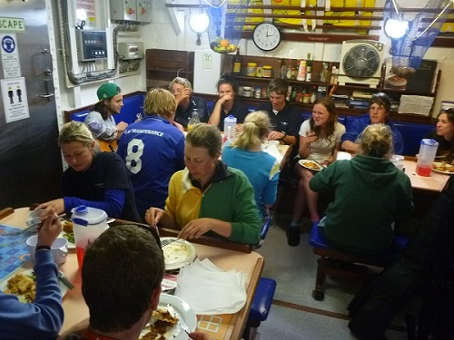
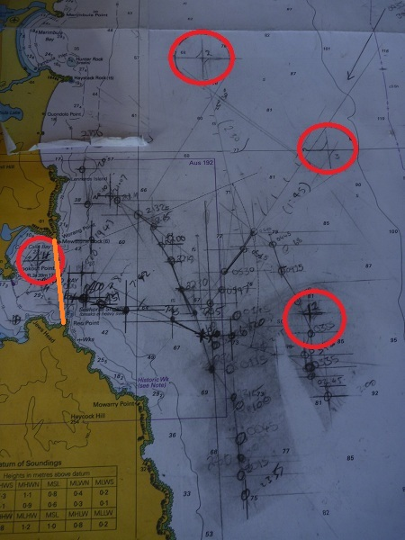
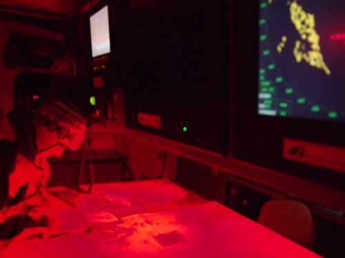

+++
categories = ['Travel']
date = '2011-10-25'
featured_image = 'posts/2011/v1811-day-8/ye_dinner.jpg'
series = ['Young Endeavour']
slug = 'v1811-day-8'
tags = ['NSW', 'Eden', 'Young Endeavour']
title = 'V18/11 - Day 8'
type = 'post'

+++

Day 8 was command day - the day when control of the ship was handed over to us youth crew for 24 hours. At the handover we were given a list of various tasks to complete. From easy ones (don't get sunburnt) to hard one's (our navigation challenge).

One of our first tasks was to get a photo taken with all crew members aloft. I am on the topsail yard (middle), second from the left - next to the other Alex.

One of the tasks assigned was chef. Amy, Scott and Tammy did an excellent job in the galley and lived up to the expectations Squiz had set for an excellent meal. Even the staff were impressed, and said that often the command day meals are less than amazing.

Our major task was our navigation challenge. We were given 4 checkpoints that we had to pass through. We had a start/finish line and had a set time frame (I think it was like 14 hours or something) to pass through all the checkpoints and return to the Twofold Bay finish line. We started out in the afternoon heading for the northern-most checkpoint - but the wind was not on our side and we had to keep tacking the ship to avoid sailing into the mainland. As nighttime fell, we realized people needed sleep and so we would have to change our course to something that required less tacking. That and being able to see the lights on the mainland getting closer and closer while you wait for everyone to get ready to tack is a bit concerning.

My watch, "Munchy Watch", was on first watch and so everyone went down below to bed after we had changed our course for the bottom checkpoint, doing the course in reverse. As watch officer, I was in charge of letting the person on the helm know which bearing to steer and updating our position on the map (below) to ensure we were heading in the right direction (and updating our bearing accordingly if we weren't).

As you can see on the map below, we made good progress at first but had to start steering inland (away from the checkpoint) as we got closer as there was a fishing ship in our path. One of our objectives was to keep 1 knot away from all obstacles, and it got pretty hairy with the fishing ship while still trying to maintain an roughly accurate course.

Towards the end of our watch the wind dropped off completely and was very erratic, making it even more difficult. When we handed over to the next watch, we did a two-watch tack and turned the ship northwards and towards the checkpoint. From there they could continue sailing north to the next two checkpoint before turning back home in the morning to meet our deadline.

We were pretty confident that we would be nearing the finish line when we woke up with a job well done. As you can see on the map though the next two watches didn't go to plan. They just continued sailing south basically due to bad weather and wind.

Kylie on the bridge for morning watch:

The red light ensures you don't lose your night vision but can still read the map.

We did made it back to the bay the next morning before the deadline... with only 2/4 checkpoints completed.