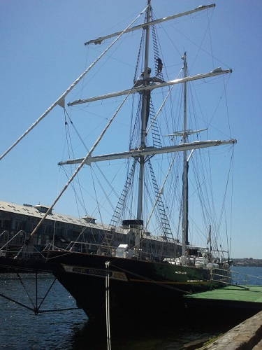
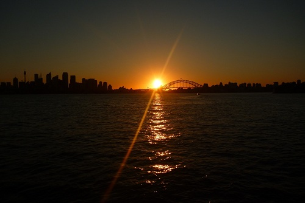

---
categories:
- Travel
type: post
date: '2011-10-18'
featured_image: posts/2011/v1811-day1/2011-10-19-13-07-14.jpg
series:
- Young Endeavour
slug: v1811-day1
tags:
- NSW
- Sydney
- Young Endeavour
title: V18/11 - Day 1
---

I spent the morning exploring Sydney, but after getting very fed up caring a 12kg backpack around decided to head towards the Gardens Point Navy Base early, which was our point of departure. My first impression of the boat was that it was a lot smaller than I was expecting.

Since I was a few hours early, I spent some boring time waiting and eventually ran into Lauren who was also on the youth crew. She ended up traveling to Canberra as well, and so was funnily enough the last person I saw as well as the first.

Eventually more and more people arrived and then we were allowed on board. We were shown where to put our bags down below and then came back up on deck for some speeches by the staff and a farewell to the family watching. Two of the youth crew worked for and had been sponsored by Hungry Jacks and so [the owner](http://en.wikipedia.org/wiki/Jack_Cowin) was on board as well - he would be a very rich man.

It was quite late by the time we actually set sail, or rather left with the ship's engines. We didn't get far though as we were staying in the bay overnight, and so had a magnificent view of the sunset over the Sydney Harbour as we anchored across from Taronga Zoo.

For the journey we were split up into 3 watches (Red, White and Blue) and I was in White Watch. We spent the evening getting to know the other members of our watch, and talking to our Watch Leader Paul about our expectations for the journey and what we wanted to get out of it.

We had dinner as prepared by the ship chef Squiz and it was pretty amazing. The food for the whole trip was excellent and there was usually a few choices as to what meals were on offer each day.

That night we went through the safety for climbing aloft, put on our harnesses and got to climb to the Topgallant [Yard](http://en.wikipedia.org/wiki/Yard_(sailing)) while the ship wasn't moving (the highest one - 33m above the water). As I was one of the first to go, we were sitting on the yard for a fair while waiting for the rest of the watch to climb up, which despite the incredible view wasn't the most relaxing position. Despite finding the climb easy, I was not looking forward to doing it while the ship was moving (although by the time I climbed in rough seas it wasn't an issue).