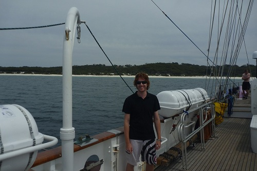
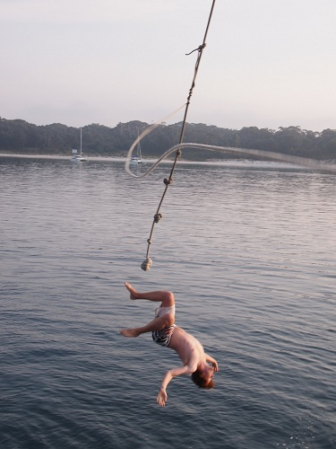

We had the guts shift from 12-4 in the morning. It is difficult to navigate at night when there is no land in sight and lights just come out of nowhere. When you are on watch you have a watch officer (Dion from the staff crew was ours), someone on the helm, lookouts looking for lights/hazards and the rest of the watch is just there in case something needs to happen with the sails. Every hour someone does rounds, checking the ship, recording weather details and going down below to check the generators in the engine room and the fridges.

During our watch we spotted a light in the distance, and so we learned how to tell what kind of ship it was from the lights that they display, and you can also determine which way they are facing to get an idea of their direction. As it got closer we were able to make out more lights and worked out that it was a cargo ship, which we could confirm on the ship's radar.   The radar also informed us we were on a collision course, so we altered our course to avoid them. Dion called them up on the ship radio as well, as they decided that they would change course to avoid us as well, moving back into our path.

It was incredible just how quick it went from being a single speck of light in the distance to a massive ship in front of us, and a real eye opener to how dangerous it would be if you didn't have watches running and people looking out for dangers.

After we handed over the watch, we went back to bed, waking up in the morning as we were coming in to Jervis Bay. [Jervis Bay Territory](http://en.wikipedia.org/wiki/Jervis_Bay_Territory) is a navy training area, and not actually part of NSW. I was not aware that there was another territory besides ACT and NT. The beaches were beautiful with island-white sand that makes that horrible squeaking noise when you walk. We went ashore so that people could "hug a tree", which we were informed was the only proven cure for sea sickness besides death.

Rick was in charge of hosting beach activities, and we had a few games of dodge ball and a round of beach flags. There was another Alex on the boat besides myself, referred to as "Hippy Alex" who showed some incredible moves in the final round of beach flags to get both flags and take out everyone else in the race.

Our lesson for today was "rules of the road" and Dion went into some more detail about who has right of way and what the various lights mean on boats, and explained why we had a [red light on the port side and a green on the starboard](http://en.wikipedia.org/wiki/Port_and_starboard#Right-of-way_for_other_vessels).

In the afternoon we anchored on the other side of the bay, and the crew declared "the pool was open", which meant we were able to use the boat's rope swing and go swimming. Red Watch Leader Guv demonstrated how to do a back-flip off the rope, and I had a failed attempt that was photographed below.

We were told it was much easier to do a normal back-flip just off a flat platform, so I had a go off the bowsprit and nailed it first go after some more pointers from Guv. The trick we were told is to tilt your head back, like you are looking into the sky and continue looking back, which will cause your body to flip automatically as you go. Mick had a go later on where he looked over his shoulder instead, which resulted in a sort of back-flip with a twist, but didn't really work so well.

That night we had a BBQ on the deck for dinner followed by a performance of our 3-way chats. In the morning we were given 2 other crew to team up with and learn various facts about and that night we had to do an introduction of one of the two in the first person, as well as act out charades for their favourite movie. I was with Jake and Kylie, and learned that Jake has broken bones on 8 different occasions and played for the Australian water polo team, and that Kylie wants to chase the endless winter and move to Canada to teach snowboarding. Some people really surprised me in that they gave quite hilarious and entertaining performances when in normal conversations they were completely different people. Other people just had terrible memories.
