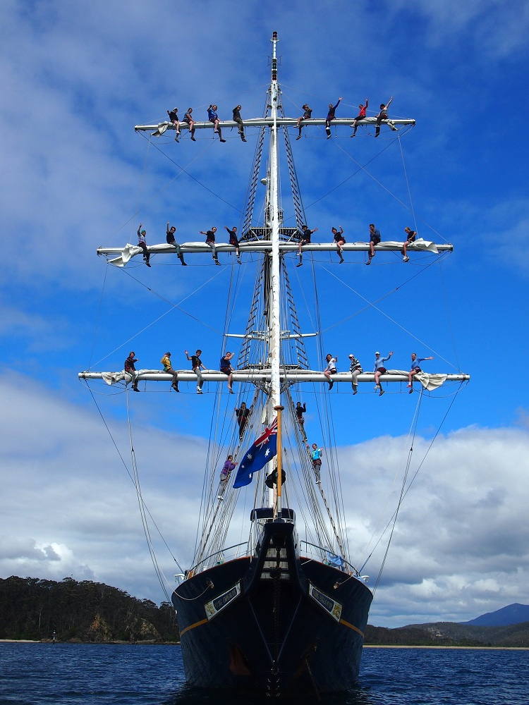
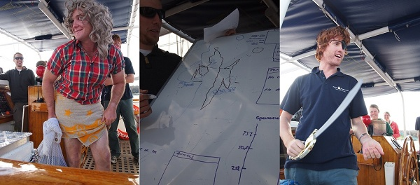
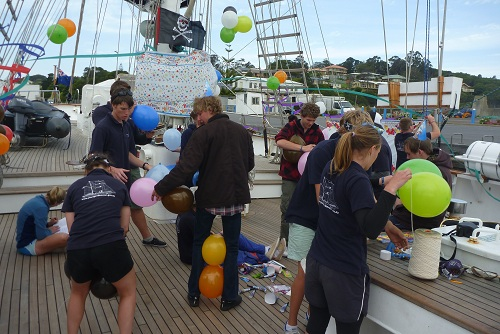

---
categories:
- Travel
type: post
date: '2011-10-26'
featured_image: posts/2011/v1811-day9/pa270812.jpg
series:
- Young Endeavour
slug: v1811-day9
tags:
- NSW
- Eden
- Young Endeavour
title: V18/11 - Day 9
---

As I mentioned earlier, every morning the staff held a morning brief. One of our command day tasks was to host our own. Rick was our Nanna, Ash gave the long winded Nav talk, and I was Salty Seadog with the help of my assistant Emma.

To show of our newly learned knot-tying skills - one task was to build a Hammock that could support the entire youth crew:

When our 24 hours were up, the crew assessed how we had met each task. They deemed all tasks completed - even navigation was awarded since the wind dropped and made it pretty much impossible.

We had a debrief of command day, and went ashore with our watch leaders to discuss whether we had met all the goals we had set ourselves at the start of the journey.

It was Bec's 21st the day after we berthed, so we decided to throw her an early party so she could say she had a birthday party on a multimillion dollar yacht. Emma bought decorations from the IGA while we were ashore.
