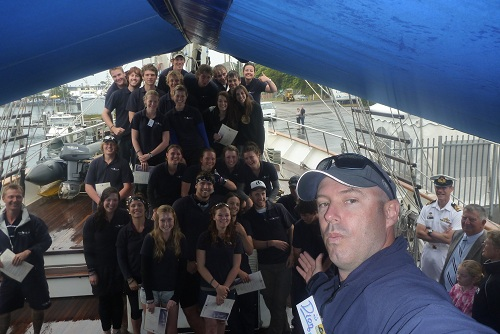

+++
title = "V18/11 - Final Day"
date = "2011-10-29"
slug = "v1811-final-day"
type = "post"

[taxonomies]
categories = [ "Travel",]
tags = [ "NSW", "Young Endeavour",]
series = [ "Young Endeavour",]

[extra]
image = "posts/2011/v1811-final-day/ye_groupshot.jpg"

+++

In the morning we did some harbour furls (neatly rolled up the square sails), then briefly headed out to sea so that we could come back again for all the family members on shore. We stayed up on the yards for the berthing, and fired cannon blasts as is tradition. The tradition being that by having everyone up on the yards, there is nobody to reload the cannons - and since they have already been fired the ship poses no threat.

The Mayor of Eden was there to great us, and we were all given certificates and posed for another group photo (above).

That afternoon was the Eden Whale Festival, which was not as exciting as I was expecting to be but gave something to do to pass the time until my bus ride home the next morning.

As they say, it really was an experience of a lifetime and I had a phenomenal time. I had high expectations going in but I did not to expect it to be as rewarding or enjoyable as it was. The staff were infectiously happy and I got to see a whole new part of Australia and gain a small appreciation for life on the sea. I highly recommend that everyone who has an opportunity to apply do so.

The captain put up [a daily log](https://www.youngendeavour.gov.au/captains-log/sydney) as well, and I found a blog post by another youth crew, [Jess](http://jesscooper.net/2011/11/06/young-endeavour/).