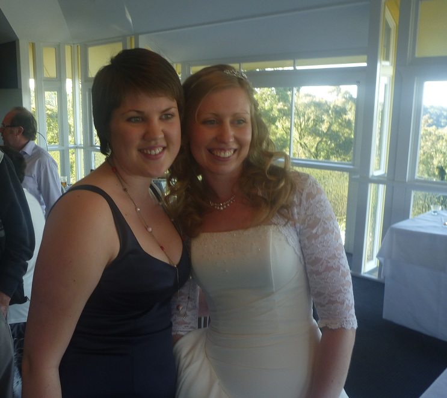

---
categories:
- Misc
date: '2012-08-11'
featured_image: posts/2012/dave-kylies-wedding/wedding1.jpg
slug: dave-kylies-wedding
tags:
- photo booth
- wedding
title: Dave & Kylie's Wedding
---

When you do a Google search for "Dave and Kylie" the top link is their website [Dave and Kylie are getting married](http://www.daveandkylie.com/), so you know it must be an important event.

I haven't really been to a wedding before (not since I was like 10 anyway) and so I was kind of excited for the experience. Kylie works with Rachael at the tissue bank, and Dave is an electrical engineer so you know he must be a top bloke.

The wedding was very lovely, in a non-denominational chapel which didn't have all the Jesus statues being tortured and whatnot. The couple seemed a combination of exceedingly happy and nervous throughout. I was surprised actually at how fast the time went.

The reception was at the Summit Restaurant at Mt Coot-ha and the weather was probably the best that it has been when I've been up there so there was incredible views.

The food was quite good, the staff made sure our wine was always topped to the brim (not sure this is responsible service of alcohol but it was certainly good) and the entertainment was excellent. It was a lone guy with a memory man and he did some incredible covers that were probably better than some like-a-version performances.

They also had a photo-booth which was an awesome idea. It printed one for you to keep and one to go in a scrapbook.

It was an incredibly fun and memorable day for Rachael and I, hopefully it was even better for the bride and groom. Everyone there seemed really nice so Rachael and I felt very privileged to have been invited.