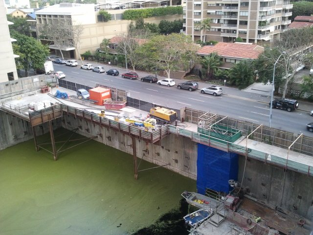

So I was in Brisbane a couple of weeks ago for work, and stayed at the Oaks on Margaret. I stayed there in November last year as well, and the building next door, [234 Margaret St](https://maps.google.com.au/maps?q=234+Margaret+St,+Brisbane&hl=en&ll=-27.471862,153.029106&spn=0.002589,0.005005&sll=-27.471772,153.028736&sspn=0.010357,0.02002&t=h&gl=au&hnear=234+Margaret+St,+Queensland+4000&z=18) was being constructed, but was full of water as a result of the flood at the start of the year. Was pretty cool to see, there was even boats that I am assuming the construction guys use.

So when staying there the other day I took some photos of the basement without water. It's still impressive just how deep a hole they need to dig to build a skyscraper.

