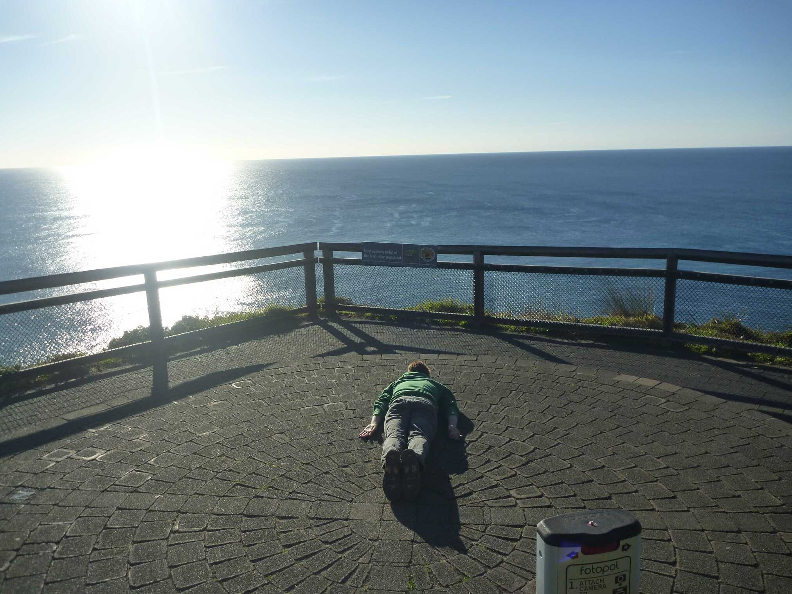
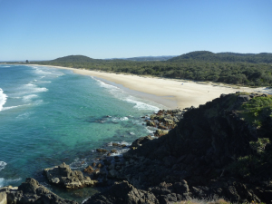
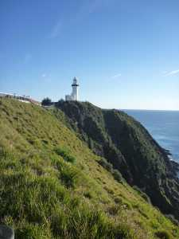
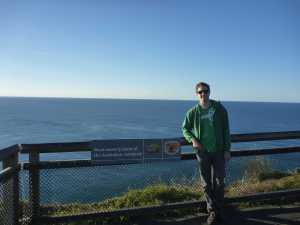

---
categories:
- Travel
type: post
date: '2012-09-13'
featured_image: posts/2012/byron-bay/p1100787.jpg
slug: byron-bay
tags:
- NSW
- Byron Bay
- Lying Down Game
- Whales
title: Byron Bay
---

So after finishing up my rotation in Brisbane, Rachael and I had a few days free to do some travel before moving up to Toowoomba.

The drive down south almost started off slow, with a [major accident](http://www.couriermail.com.au/news/drink-driver-allegedly-behind-tourist-bus-crash-on-the-pacific-highway/story-e6freon6-1226453113271) on the highway, but we managed to use the traffic layer on google maps to take a massive detour that meant we didn't have to wait for hours for it to clear and made it down to the NSW border without wasting too much time. It was our first time driving in NSW and they have a massive amount of speed cameras. They also have wildlife bridges, which I had heard about but didn't know that they had them in Australia.

We stopped at a really nice beach that Tom and I had been to earlier in the year looking for a surf, but didn't actually get out and explore then (since there was no waves). So Rachael and I stopped by for a better look, the water was an incredibly clear blue.

We spent the first night camping at Byron Bay and froze our butts off. We didn't get a chance to check much out the afternoon before because it was hard to get parks, so we went up in the early morning to the lighthouse and most easterly point of the Australian mainland. Since I want to go to the cape at some stage anyway, it would be pretty cool to tick off the other 2 points one day as well.

There were tonnes of whales and dolphins in the water, it was a bit hard to see from up at the lookout but you could see them shooting water up every now and then. There were some people out on kayaks that were really close to a whale and group of dolphins that would have had an incredible view.