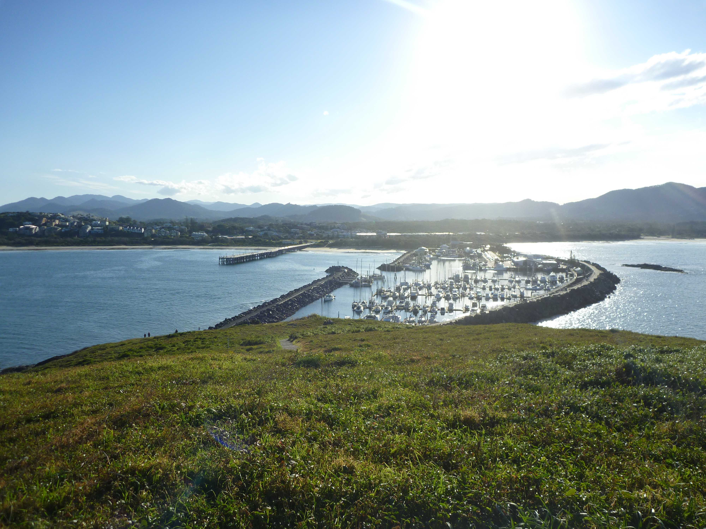

---
categories:
- Travel
date: '2012-09-13'
featured_image: posts/2012/coffs-harbour/p1100861.jpg
slug: coffs-harbour
tags:
- NSW
- Big Banana
- Coffs Harbour
- lennox heads
- mutton bird island
title: Coffs Harbour
---

After Byron, we quickly stopped by Lennox Heads for a squiz, where we also good to see some cool wildlife. There was a group of sea birds swooping an area where you could see fish jumping. There must have been dolphins or something scaring the fish and the birds were taking advantage of it.

From there we pretty much headed straight to our final destination, Coffs Harbour. Rachael really wanted to check it out since she had some work friends that had grown up there that must have given it rave reviews. The town reminded me a bit of Eden and also Yeppoon.

We stopped at the Big Banana for a touristy photo, then headed to the marina. They have joined the marina up to Mutton bird Island, which is a nesting ground for Mutton birds. They had rat traps everywhere, which I am assuming only became a problem once they joined it up to the mainland - not sure how smart that was even though it was good for us to be able to walk out. There wasn't many birds there but it was a nice walk.

After freezing the night before we looked around for a cheap room, but eventually decided to camp again after looking at prices. Camping was pretty expensive as it was considering it's $30 for a bit of grass for the night. Luckily it was nowhere near as cold that night. We had planned to stay for 2 nights, but since we had seen most things the day before and the weather didn't look like it was going to improve we pretty much just drove back.