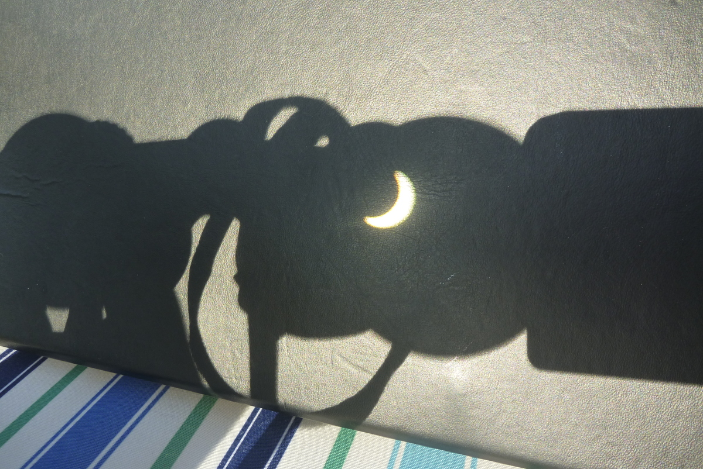

I've always thought it would be cool to see a solar eclipse. I knew about the one in Cairns for a few years now and had intended to head up, but what with not knowing where I would be working couldn't book travel. And since we are going to Fiji early next year, and there is no airport in Toowoomba, it wasn't worth trying to get time off work to drive up, and Rachael definitely couldn't.

In any case it was still semi exciting to see the partial one from down here in Toowoomba. Attempts to photograph it with my camera failed, but I eventually worked out you could see the eclipse in the halo of the photos from my phone camera.

Since it was only partial, it didn't get very dark here. It did dim slightly and the sky had a weird tinge to it like it looked like a few weeks ago when there were bush fires and lots of smoke in the air. There was no temperature drops or birds going quite.

I also tried out using the binoculars in reverse, which was a pretty good way to check how much was covered but you still couldn't see much.

Was a cool experience, a bit bummed I didn't get to experience the totality though. Maybe we can visit Indonesia in 2016.
