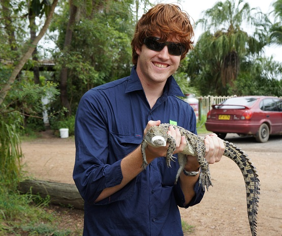
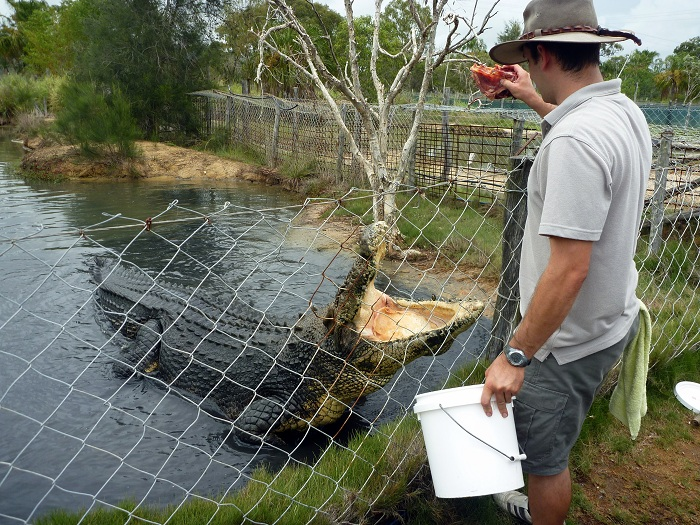
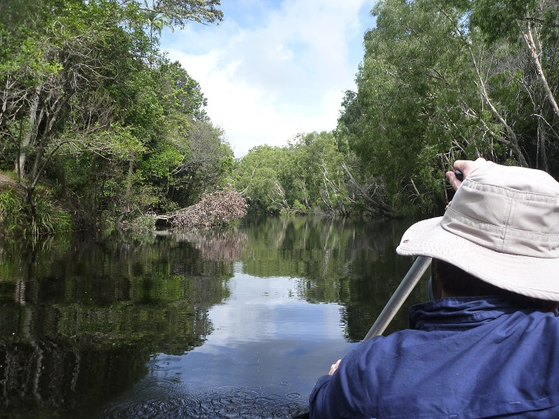
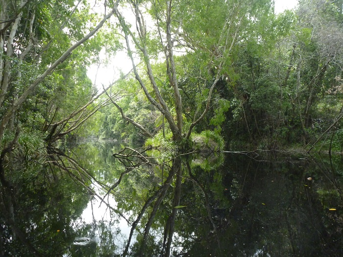
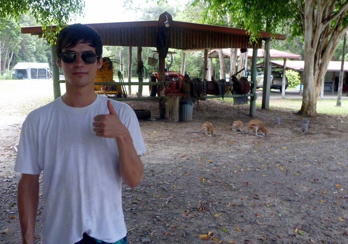
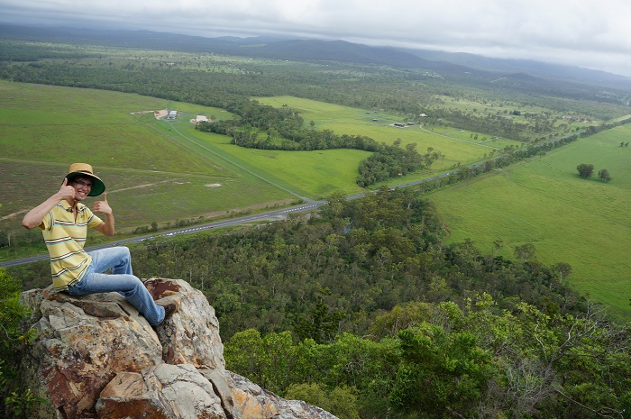
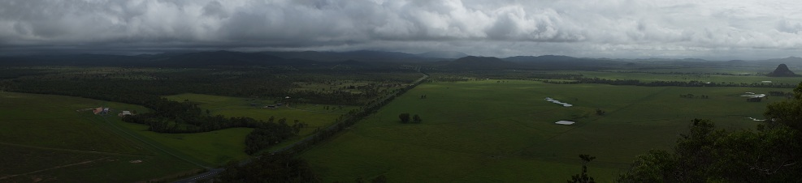

---
categories:
- Travel
date: '2012-03-30'
featured_image: posts/2012/sightseeing-at-home/crocfarm2.jpg
slug: sightseeing-at-home
tags:
- Queensland
- Byfield
- Crocodile
- Koorana
- Rockhampton
title: Sightseeing at Home
---

Before coming down to Brisbane for my new graduate rotation, I wanted to do one last trip to visit all the cool places Rocky has to offer while I still had the chance. When you live somewhere, people never seem to visit the places nearby because it will always be there and there is no pressure resulting from a lack of time in the area. On my last weekend before leaving, Jan, one of my roommates from Switzerland, just happened to be flying into Australia before starting his new graduate rotation for ABB in Melbourne.

To locals, Rocky is thought of as a hole, and it doesn't seem to get too much tourism attention either, so I doubt Jan would have chosen it as a place to visit if I wasn't offering a local tour guide experience. Since pretty much the only people who would read this are from Rocky, it might give you a chance to see some of the cool places nearby that most people haven't bothered visiting in the 20 or so years they have lived there.

Jan flew in Friday and chilled at the gardens before I picked him up after work. We went to my cousin's 18th and Jan got to experience an Aussie BBQ.

## Australia Day

For Australia Day we went to my friend's backyard Hottest 100 party, and considering it was stinking hot, it wouldn't have been complete without a slip-and-slide.

When the water wasn't running the tarp heated up to an crazy temperature, but despite Adrian's attempt it wasn't quite hot enough to cook an egg on it.

Jan made a comment to me about how special the day is where we can be proud of our country. Considering it's past, there is no equivalent day for Germans to just celebrate being German.

In the afternoon we headed down to Yeppoon for the beach party, where Tripod were playing. I have wanted to see Tripod play for a long time and I wasn't let down, they played an excellent gig. Despite the fact that most of the audience were toddlers, they didn't tone down the adult content, just warned them all that they weren't the wiggles. The fireworks were started prematurely and it was pretty spectacular listening to them improvise about the person who probably just blew up their hand with fireworks in the background.

## Koorana Crocodile Farm

The next day Johan from work joined us and we did a tour of the crocodile farm. It had been a long time since I had been to [Koorana](http://www.koorana.com.au/), and they have got some much bigger crocs since when I went as a kid.

## Waterpark Creek

After the croc farm we went to [Ferns Hideaway](http://www.fernshideaway.com.au/) to use the canoes, and paddle up Waterpark Creek.

Afterwards, Jan even got to get up close and personal with some wallabies who were near the camping ground.

## Mt. Jim Crow

Jan went to see the Capricorn Caves. Having been twice I didn't bother paying to go again, and had a quick look at the nearby Etna caves. There wasn't much to see without a guide, as the walking track there was a pretty short path that didn't go anywhere in particular.

We took the back way to the beach, and went for a hike up Mt. Jim Crow along the way.

We got some pineapple from a seller on the side of the road, something that Jan said you don't see in Germany. Apparently it was the freshest he had tasted, but I have had better.

The weather went to crap a bit after that, as can be seen in the clouds in the picture above. The next morning we went up to Farnborough for a surf, where I snapped my leg rope as the waves were just big dumpers. On the plus side, we went the back way so the Suzy got one last strap going off road before I headed off to Brisbane and Jan back to Melbourne.